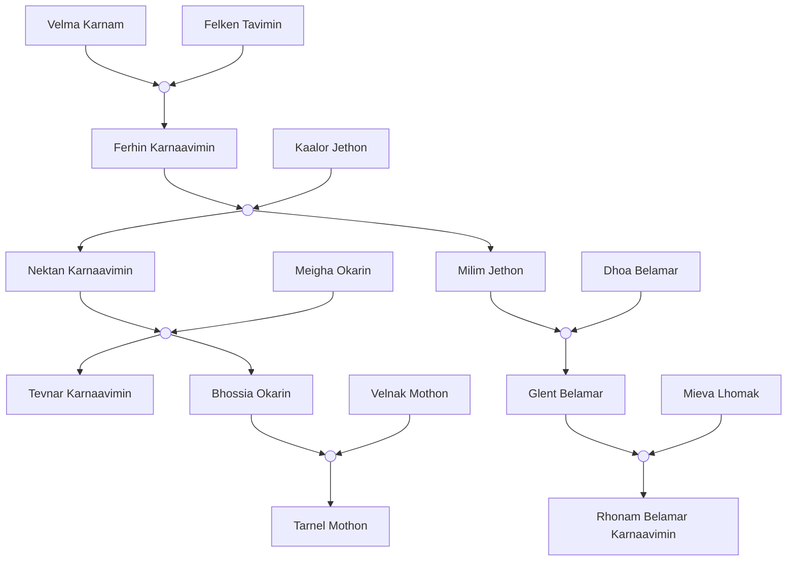

**Velma Karnam :** fe, nokkardas, mère de Ferhin, forgeronne
**Felken Tavimin :** ho, nokkardas, père de Ferhin, mineur chevronné
**Ferhin Karnaavimin :** fe, nokkardas, fondatrice des sabres de Yul (S6)7R
**Kaalor Jethon :** ho, nokkardes
**Nektan Karnaavimin :** ho, nokkardes, 2e chef de guilde (S6)47R, mort à 59r (S6)92R
**Meigha Okarin :** fe, nakkardas
**Milim Jethon :** ho, nokkardas 
**Dhoa Belamar :** fe, nokkardes , mort à 88r (S6)120R
**Tevnar Karnaavimin :** ho, nokkardes
**Bhossia Okarin :** fe, nokkardes , mort à 46r (S6)111R
**Velnak Mothon :** ho, nakkardas
**Glent Belamar :** ho, nokkardes, 3e chef de guilde (S6)92R => dissolution (S6)114R, détestait son père
**Mieva Lhomak :** fe, nakkardas
**Tarnel Mothon :** ho, nakkardas
**Rhonam Belamar Karnaavimin :** fe, nokkardas, 4e chef de guilde (S6)126R, elle rajoute toujours le nom de son arrière grand mère pour la symbolique

(S6) 3R     : X 23r
(S6) 33R   : X 53r   -> Z 0r
(S6) 35R   : X 55r   -> Z 2r                                     + G 0r
(S6) 65R   : X 85r   -> Z 32r (V 00r + B 00r)          + G 30r
(S6) 76R   : X 96r   -> Z 43r (V 11r + B 11r)          + G 41r (T 00r)
(S6) 92R   : X 112r -> Z 59r (V 37r + B 37r u 00r) + G 57r (T 16r)
(S6) 106R : X 126r -> Z Die (V 41r + B 41r u 14r) + G 71r (T 30r m 0r)
(S6) 126R : X 146r -> Z Die (V 61r + B Die u 34r) + G 91r (T 50r m 0r)
() -> gen2, [] --> gen3