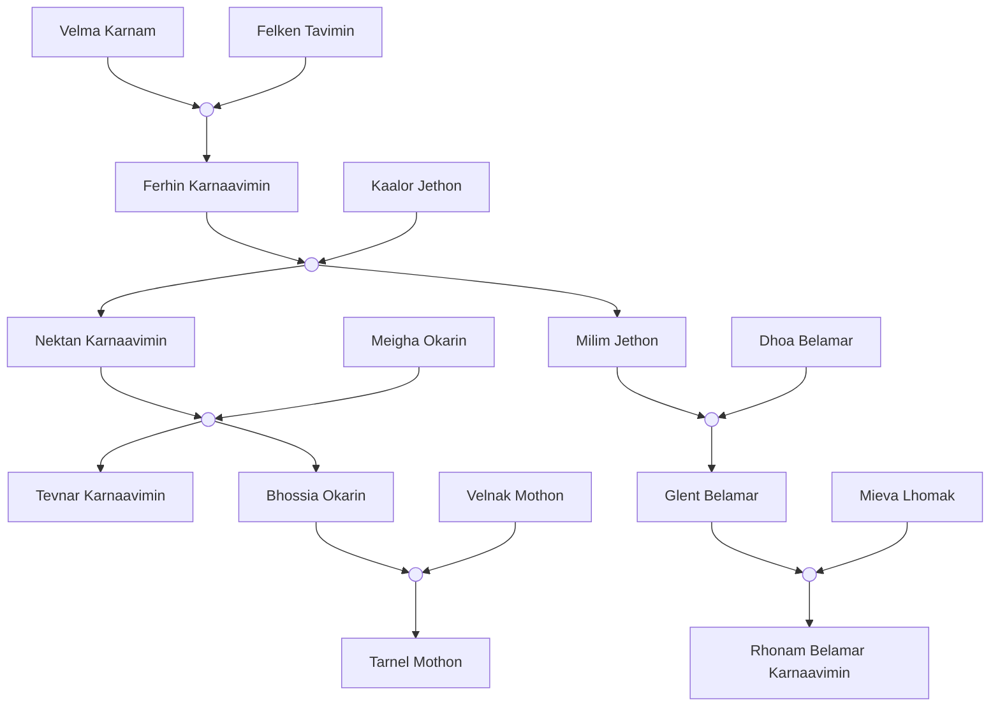

# Histoire random n°1

Maman qui attend son fils en vain, celui-ci étant parti à la guerre avec l'armée Moorhienne, elle apprend sa mort sur un tableau de sa ville, désespérée et déprimée elle décide de lancer une manifestation dans le palais impérial, début d'un procès impérial x peuple.

# Histoire random n°2

bataille [[manhund]] vs [[nakkard]], manhund terrifiant, chants de guerre, lune rouge, bataille dure plusieurs jours non-stop, gagnée par nakkard par utilisation d'armes hors du temps ([[aeter]]), combat singulier entre les deux chefs d'armées. Les deux meurent dans l'attaque avec l'arme hors du temps, le chef nakkard savait mais voulait mourir en guerrier et il se sentait trop vieux pour continuer de diriger une armée.

# Histoire random n°3

Un [[horloger]] [[prophète]] devient immortel après être allé dans le futur et avoir contracté une maladie du voyage temporel, il sait ce qu'il se passe à la fin du temps et devient tout vide, pour lui la vie n'a pas de sens => tout est absorbé par le Noyau, et c'est inévitable.

# Histoire random n°4, Famille Hirinai

Famille Hirinai : famille artisane ayant maîtriser l'art de la forge, première famille à industrialiser leur artisanat, qualité amoindri mais quantité très bonne, famille devenu noble mais restant proche de leur conviction, non corrompu par l'argent, Tatsuki est l'inventeur de la machine qui a permis à l'industrialisation, il inventa 4 machines, pilier de ce qu'on appelle désormais les Machines Hirinai, une machine qui permet grâce à l'arbre via les racines, de chauffer à température le métal, une autre, qui avec cette même énergie permet de façonner en une forme donnée un bloc dur, une autre qui en première version manuel permet d'affuter ou d'affiner des endroits spécifiques grâce à un bras paramétrables, et un dernier qui vient assembler une pièce avec le métal. Au début il ne servait qu'à créer des épées, mais les machines se sont très vite déformé pour créer des outils, et les deux premières machines furent améliorées pour créer de nouvelles formes, jusque-là, très chronophage à réaliser à la main. La famille en dehors des machines ne fut pas retenue dans l'histoire, Machines Hirinai se transforma même au fil des ères pour devenir Machirina, ce nom regroupant ce système d'industrialisation.

# Histoire random n°5

Un [[manhund]] qui a réussi à maîtriser la lune rouge et sa rage, ce qui fait qu'il est devenu un guerrier légendaire, faisant gagner toutes les batailles de son clan. Mais un jour, il se fait abandonner par son clan dans une bataille et il décide de devenir sans-clan. Il se barre sur le continent et rejoint l'armée [[ogahon]], juste avant la peste ombrale, il meurt de la peste par ses frères de cœur qui sont devenus des infectés.

# Histoire random n°6

Un protecteur prophète pète un câble et essaye de détruire tout les prophètes, car ils sont l'hérésie du temps, leurs objectifs étant de le manipuler pour aller dans le futur, il a mis à feu et à sang la cité principale, mais fut arrêté par sa femme qui la tua dans son sommeil, ses suiveurs furent arrêté et juger, ils seront enfermés dans les geôles éternel du temps.

# Histoire random n°7

Un nokkardas qui perd sa femme dans un marché noir [[marcadur]], elle se fait kidnapper car c'est une nokkardas aussi, la dépression l'emporte, il devient alcoolique, il ne fait que penser à elle et la voit partout. Les autorités ne faisant rien à cause de l'emprise des marcadur sur l'économie. Un jour, après s'être bourré la gueule il se rend compte qu'il peut tuer très facilement, il tue presque un sdf. Il se remémore toute sa vie avec sa femme. Il se rend dans le manoir marcadur, et il massacre tout le monde.

# Histoire random n°8

Un nakkardas qui devient bestiale à cause d’un produit qu’on lui injecte. Il n’arrive pas à comprendre ce qui lui arrive, Dr. Jekyll et Mr. Hyde un peu. il chasse ses proies en les fatiguant, il chasse n’importe qui. Il devient une rumeur d’une région, ce qui le rend encore plus schizophrène et paranoïaque car il pense que tout le monde sait que c’est lui.

# Histoire random n°9, Le frère déserteur

Deux [[nakkard]], aussi proches que des frères, sont enrôlés dans l’armée en même temps. Au bout de quelques batailles et de quelques frères morts au combat, ils sont choisis pour un dernier assaut, et ils sont aussi choisis pour tester une arme de guerre. Alors qu’il faisait l’assaut final, il se font toucher par une explosion adverse et l’un deux et sur le point de mourir, alors que l’autre fait tout pour le garder en vie, le mourant se résilie et lui annonce “Fait en sorte que ce ne soit pas ton dernier”, le survivant au bord des larmes, se lève avec un appareil en main, se retourne et fuit dans une vitesse fulgurante. Ses pas de course sont comme lumineux, il atteint des vitesses exceptionnelles. Quand il fut assez loin du champ de bataille, il actionna l’appareil, et dans une lumière aveuglante tout le champ de bataille fut réduit à néant, le bruit mit du temps à arriver. A genou, et désespéré par ce qu’il a fait, l’armée l’encercle, il est emmené devant le roi, et est condamné à “mort”, il est envoyé dans les terres secrètes de l’armée où il est désormais testé et mutilé par des scientifiques avides de connaissances et des politiques avide de pouvoir.

# Histoire random n°10, La vérité

ère 19 : l’Atlas fut retrouvé par un adolescent [[felire]]. Lors d’un urbex avec ses amis ils tombèrent sur une porte en mauvaise état. à l’intérieur se cachait une sorte d’ascenseur toujours en fonctionnement, alors avec un autre ami ils descendirent. Il y avait beaucoup de chose en désordre, mais au milieu d’une pièce il découvrit une sorte de bouquin au sol, l’adolescent le prit dans ses mains et ses figea. Tout le savoir Felire venait de rentrer en lui, des milliers d’années de savoir et des centaines d’années de savoir perdu et que l’on pensait irretrouvable. Au bout de quelques secondes il tomba dans les pommes, son ami avec lui n’ayant pas vu la scène fuit la scène lorsqu’il entendit le bruit du corps de son ami qui tombe.

#Les Sabres de Yul

## La famille Karnaavimin

**Velma Karnam :** fe, nokkardas, mère de Ferhin, forgeronne
**Felken Tavimin :** ho, nokkardas, père de Ferhin, mineur chevronné
**Ferhin Karnaavimin :** fe, nokkardas, fondatrice des sabres de Yul (S6)7R
**Kaalor Jethon :** ho, nokkardes
**Nektan Karnaavimin :** ho, nokkardes, 2e chef de guilde (S6)47R, mort à 59r (S6)92R
**Meigha Okarin :** fe, nakkardas
**Milim Jethon :** ho, nokkardas 
**Dhoa Belamar :** fe, nokkardes , mort à 88r (S6)120R
**Tevnar Karnaavimin :** ho, nokkardes
**Bhossia Okarin :** fe, nokkardes , mort à 46r (S6)111R
**Velnak Mothon :** ho, nakkardas
**Glent Belamar :** ho, nokkardes, 3e chef de guilde (S6)92R => dissolution (S6)114R, détestait son père
**Mieva Lhomak :** fe, nakkardas
**Tarnel Mothon :** ho, nakkardas
**Rhonam Belamar Karnaavimin :** fe, nokkardas, 4e chef de guilde (S6)126R, elle rajoute toujours le nom de son arrière grand mère pour la symbolique

(S6) 3R     : X 23r
(S6) 33R   : X 53r   -> Z 0r
(S6) 35R   : X 55r   -> Z 2r                                     + G 0r
(S6) 65R   : X 85r   -> Z 32r (V 00r + B 00r)          + G 30r
(S6) 76R   : X 96r   -> Z 43r (V 11r + B 11r)          + G 41r (T 00r)
(S6) 92R   : X 112r -> Z 59r (V 37r + B 37r u 00r) + G 57r (T 16r)
(S6) 106R : X 126r -> Z Die (V 41r + B 41r u 14r) + G 71r (T 30r m 0r)
(S6) 126R : X 146r -> Z Die (V 61r + B Die u 34r) + G 91r (T 50r m 0r)
() -> gen2, [] --> gen3

## Les sabres de Yul

Ferhin kidnapping = -12 rayons avant l'[[ère 6]]

Ferhin libération = +3 halos après l'ère 6

Ferhin formation de la guilde = +7 halos après l'ère 6

Rhonam formation du groupe = -3 rayons avant l'[[ère 7]]

### Arbre généalogique
[[La famille Karnaavimin]]
Karnaavimin est le nom de famille créé par Ferhin. Quand elle fut kidnappée à ses 8r, elle portait le nom de sa mère, Karnam. Mais lorsqu'à ses 20 rayons elle se libéra, c'était le moment de choisir son nom. Alors, ne voulant pas effacer de l'histoire les noms de familles de ses parents, elle décida de fusionner les deux. Karnam pour sa mère et Tavimin pour son père, ce qui donne Karnaavimin, elle se présentera depuis toujours comme Ferhin Karnaavimin, fille de Velma Karnam et de Felken Tavimin.
### L’histoire
Ferhin, une femme nokkardas voit son village se faire anéantir par un groupe de sans-cornes contrôlant des esprits. Elle fut capturée et esclavagée, car son espèce est très rare. Après 12 rayons de torture et de servitude auprès des sans-cornes, elle rencontre un homme nokkardas, fraîchement capturé. Après quelques mois, ensemble, ils ébauchent un plan pour se libérer. Dans le camp, il y a une cloche protégée par deux sans-cornes 24h/24h, mais durant le roulement de garde un passage de 30 secondes est faisable. Ils ne savent pas ce qui est gardé, mais il est dit que c'est une arme.
La nuit du passage à l'acte, tout ne se passe pas comme prévu, les gardes sont là plus tôt, ce qui fait que l'homme Nokkardas se fait tuer devant elle, mais dans un dernier effort, il fait tomber la cloche au sol, ce qui la fend. Les sans-cornes semblent effrayer et commencent à crier pour de l'aide. Ferhin saute sur l'occasion et s'approche de la cloche pour asséner un coup de pied qui brise la cloche. Une vague magique puissante repoussa tout le monde en arrière. Ferhin, au sol, apeurée par ce qui était devant elle. Un esprit d'un guerrier légendaire nokkardes apparut devant elle. Le guerrier semblait libéré d'une étreinte et prêt à en découdre contre ses assaillants. Il remarqua la nokkardas au sol et vint lui offrir un marché, car il ne pouvait atteindre que son plein potentiel sous forme physique. Le marché fut le suivant, il lui offrait sa force et elle devait libérer toutes ces âmes de leurs tourments. Elle accepta sans réfléchir, et commença par se déchaîner dans le camp pour venger son ami. Afin de répondre à la demande de l'esprit, elle forma une guilde : les sabres de Yul. Yul étant le nom de l'esprit guerrier.
Trois générations (123 rayons) passèrent, plus de 95% des esprits furent renvoyés, il restait un groupuscule de sans-cornes traînant dans les alentours de la capitale. Ce dernier groupe pourrait permettre à Yul de remettre la main sur son frère. Les sabres de Yul s'étaient dissous il a de ça 10 rayons, mais sous la contrainte de Yul, une des descendantes de Ferhin, Rhonam Belamar Karnaavimin, reforma un tout petit groupe, avec les plus puissants guerriers de la guilde lors de sa dissolution. Après trois rayons de recherche, ils trouvèrent enfin l'île céleste et à l'aide du dernier groupuscule Sans Cornes, les sabres de Yul recomposés, passèrent un portail les menant directement sur l'île céleste.
Le dernier groupuscule était éloigné des prétentions de ses prédécesseurs. Ils étaient "passif", aider les Sabres de Yul est un petit pas vers une rédemption. Un combat rude et sans merci s'engagea contre le Cercle de la sève. Rhonam s'occupa de leur leader, confirmé être le traître de frère de Yul. Le combat se termina lorsque Rhonam dans un dernier élan, brisa la goutte de sève cristallisée. L'île céleste, n'ayant plus de source d'énergie, s'écrasa, mais Yul et son frère continuèrent de se battre. Yul comprit qu'ils étaient dans les derniers esprits existant sur ce plan, ce qui n'était pas bon signe. Lorsqu'une sorte de brèche apparut à côté d'eux et qu'une main immense s'en dégagea, Yul vint tenir son frère le plus fermement possible. La main les attrapa tous les deux, les écrasant même, et s'engouffra dans la brèche comme si de rien n'était.
Malgré ce qu'on pourrait penser, Rhonam est toujours vivante. Lorsqu'elle brisa la goutte de sève dans son dernier élan, elle s'effondra au sol juste à côté. Dans la chute de l'île, une petite goutte de sève tomba sur son œil. Elle se réveilla hurlant de douleur mais elle n'était plus sur l'île, son œil était devenu aveugle. En se retournant, elle pu observer l'île tomber, fendant les nuages. Par instinct de survie, elle courut loin, elle se sentait bizarrement plus rapide et plus endurante. La sève, au prix d'une brûlure, lui permit d'absorber encore plus de lumière et plus efficacement, d'où l'obsession pour le Culte de la Sève envers elle. Seulement, les effets s'estompent.
### La scène en animation
[[Une dernière goutte]]