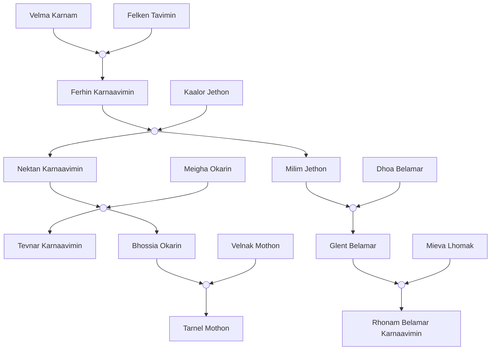

=== Science et Magie.md ===

Les êtres vivants sont faits d’un mélange de science et de Magie. Chaque être est composé de runes, liées par le flux, et d’une âme. Les runes sont la langue de Corvo et Vulpine, personne n’a réussi à les déchiffrer.
## Plans
Il existe plusieurs plans physiques et spirituels dans l’univers. Il y a le plan terrestre, nommé *Z* par le peuple de [[Moorhi]], ce plan est là où tout se passe, il est la vie. Mais il y a aussi deux plans spirituels, le *X* et le *Y*. Le plan *X* est le plan des âmes dépourvu de corps terrestre, ces âmes viennent de personne décédée sur le plan terrestre, il est l’après vie. Quant au plan *Y*, il est le plan des âmes animales, chaque animal qui meurent sur le plan terrestre se voit son âme envoyée sur ce plan. Malgré ce que l’on pourrait penser sur ces plans, aucun d’eux n’est surpeuplé, car ces plans sont en constante expansion.
## Artefacts
Chaque artefact contient le “pouvoir” de leur espèce, si quelqu’un arrive à mettre la main sur un de ces artefacts, il sera le seul et unique détenteur du pouvoir de l’artefact, sous une forme plus extrême.

La Magie est un art que maîtrisent les [[arrint]]. Durant l’[[Ère 3]], les arrint offrent 3 cadeaux :
- la Magie des âmes, l'Anemomancie, pour les [[ogahon]]
- la Magie des ombres, l'Ombromancie, pour les [[ombros]]
- la Magie de sang, la Sanguimancie, pour les [[manhund]]

Le Dominium est une manipulation des runes par une technologie, ce sont les [[aeter]] qui ont réussi à réaliser cela. Durant l’Ère 3, les aeter offrent 3 cadeaux :
- la maîtrise de la lumière, le Dominium Lux, pour les [[nakkard]]
- la maîtrise du savoir, le Dominium Atlas, pour les [[felire]]
- la maîtrise des émotions, le Dominium Oculus, pour les [[marcadur]]
## Magie
La Magie, en dehors des arrint, est limité et propre à chaque race. Les artefacts magique donné par les arrint sont 
### Anemomancie
Les ogahon, au début de l’[[ère 5]], ont réussi à contourner la restriction de l’Anemomancie en créant des portails sur le plan des esprits. En combinant ces portails et la nature de certains animaux, ils peuvent, par exemple, faire un sort de jet d’acide. Pour utiliser ces sorts provenant d’animaux, une maîtrise de la projection planique est nécessaire. En projetant leur âme dans le plan des esprits, ils peuvent localiser des animaux nécessaires à ces sorts, déclencher une réaction de ces animaux et transmettre leur réaction à travers le portail. Cette manipulation de l’Anemomancie est la spécialité de l’École du portail.
### Sanguimancie
La Sanguimancie a eu une évolution chez les manhund. Au début utilisé seulement pour accélérer leur flux sanguin afin d’être plus fort et rapide, elle est désormais utilisé pour se soigner plus rapidement. Pour être plus précis, ils ne se soignent pas plus rapidement, mais ils coagulent plus rapidement, ce qui leur permet d’éviter de perdre beaucoup de sang lors d’entailles, de perte de membre, etc. Durant l’[[ère 6]] un clan manhund découvrit que leur sang pouvait être manipulé en dehors de leurs corps tant qu’il était encore connecté au sang présent dans leur corps. Cette découverte leur a permis de créer des armes et outils fait à base de sang. Une des spécialités de ce clan fut alors de se battre avec son propre sang.
### Corruptomancie
Durant l’Ère 5, un clan de paria ogahon, nommé les “Sans-Cornes”, créèrent la Magie de la corruption, la corruptomancie, un mélange de la Magie des âmes et la Magie des ombres. Cette Magie leur permet de ramener les esprits du plan des morts sur plan réel afin de les contrôler grâce à un sceau. Les esprits souffrent énormément et restent malheureusement conscients.
## Dominium
Le Dominium est une manipulation des runes par une technologie. Cette manipulation se traduit alors de différentes façons parmi les races l’ayant reçu.
### Dominium Lux
Pour les nakkard, le Dominium Lux modifie leurs runes et leur permet de manipuler la lumière. La technologie permettant ce Dominium est [[Lheiren]], un arbre qui, dès la gestation d’un bébé, modifie ses runes afin de lui permettre la manipulation de la lumière. Cette modification des runes dure en moyenne 10 ans. Après ces années, l’individu nakkard est en toute capacité de pouvoir manipuler la lumière.
### Dominium Oculus
Pour les marcadur, leur Dominium Oculus leur permet de manipuler les émotions. L’Oculus, cet énorme œil de verre, est à l’origine de la modification des runes chez eux. Cette modification est plus rapide que chez les nakkard, commençant à la gestation, elle se termine en moyenne à l’âge de 3 ans. Cet modification de runes leur permet de comprendre et manipuler les émotions parfaitement. C’est un peuple très empathique et honnête. La manipulation des émotions est temporaire, car elle ne manipule que l’âme des receveurs. Les runes et le flux, ayant une mémoire, ramènent à l’état initial l’âme manipulée.
### Dominium Atlas
Pour les felire, c’est encore plus simple. L’Atlas modifie, pendant la gestation, les runes du fœtus afin de créer des cerveaux avec plus de connexion neuronales. L’Atlas est le seul artefact aeter ayant la capacité de modifié en continu les runes des individus. Même à l’âge adulte les felire subissent des modifications des runes afin d’optimiser leur mémoire et leur connexion synaptique. L’Atlas possède comme une sorte de mémoire, facilitant alors une compréhension du monde et des découvertes auprès de chaque nouvelle génération.

=== Meta.md ===
Comment écrire mon univers :
## 1. Guide des conventions d’écriture
### Temps à utiliser
- **Présentation générale** : **présent**
→ « Le royaume de [[Moorhi]] est situé au nord des montagnes d’Argor. »
- **Histoire / événements passés** : **passé simple + imparfait**
→ « Il fut fondé il y a trois siècles par Argan Ier. »
- **Chronologie future / prophéties** : **futur simple**
→ « Il sera détruit lors de la Grande Rupture. »
### Style
- **Neutre et descriptif** (comme une encyclopédie).
- **Pas de “je” ou “nous”**, sauf si écriture d’une source fictive (ex. chroniqueur).
- **Vocabulaire immersif** : noms propres, unités fictives, titres honorifiques.
### Structure pour chaque article
- **Titre** : Nom du lieu/personnage/événement/etc…
- **Info box** (infos clés + image).
- **Sections** :
    - **Présentation** (présent).
    - **Histoire** (passé).
    - **Culture / Politique / Économie** (présent).
    - **Chronologie / Prophéties** (futur).
    - **Relations avec autres entités** (liens internes).
- **Organisation** :
    - Catégorie **Cultures** (articles autonomes).
    - Dans chaque article de **race** : “Cultures d’origine”.
    - Dans chaque article de **royaume** : “Cultures présentes”.
- **Exemple** :
    - Article **Culture Ogahonienne** :
        - Origine : Race [[Ogahon]].
        - Actuellement : Royaumes Moorhi, [[Seimori]].
    - Article **Royaume de Moorhi** :
        - Cultures présentes : Ogahonienne, Moorhienne.
    - Article **Race Ogahon** :
        - Culture d’origine : Ogahonienne.

[wiki.js](https://docs.requarks.io/)
### Comment créer une religion
1. Type de religion :
    1. monothéiste
    2. polythéiste
    3. animiste
2. Politique de la religion :
    1. dieu existant
        1. mort
        2. vivant
    2. dieu non existant
    3. hiérarchie
    4. pas de hiérarchie
3. Importance de la religion dans le cours de la vie
4. Visualisation de la religion
    1. vêtements
    2. arts

=== Idées non rangées.md ===
**Anti page blanche :** [https://perchance.org/53yixkvwms](https://perchance.org/53yixkvwms) wC5yFaVl7MGeDIPvkii9

---

→ Un animal à Storz Vulkano.
Un félin à pattes courtes, avec une fourrure assez épaisse. On pourrait se dire que sa petitesse l’empêcherait d’être un prédateur redoutable alors que non. Ce félin est très redouté des mange-gravats.

---

→ un rapport médical sur un objet à Seimori.
Seimori est terre de santé, et en cette ère nouvelle (7), le marché de la santé est prospère. Les chercheurs et inventeurs médicaux se retrouvent à faire des rapports de recherches de plus en plus bâclé car il n’ont pas le temps. Un rapport va d’ailleurs attiré la colère de la foule. Une plante, utilisé depuis des siècles par les soigneurs ogahon, est déclarée inapte au soin pharmaceutique, ce qui veut dire que son utilisation pour soigner devient illégal. Des grèves sont lancé un peu partout dans le pays, forçant à refaire les études. Après quelques semaines de grèves, le haut conseil des sciences et des runes reprend les études et parvient à conclure que les conclusions de l’étude sont à refaire car le protocole n’a pas été respecté, menant alors à des faux résultats.

---

→ Durant l'Ère 13, une recette Marcadur à base de légumes.
Peu de recette marcadur sont à base de légumes, mais les temps dures ont poussé ces recettes en avant. Composé de 4 ingrédients principaux : la carotte, l’aubergine, la courgette et la tomate. Cette recette et une sorte de gratin simple, rapide, chaud et bon. Il faut commencer par coupé en tranches tout les ingrédients, les mélanger entre eux avec un filet d’huile et d’épices. Puis, dans un plat, les enfiler côté à côté dans le sens voulu (vertical/horizontal), recouvrir de sauce tomate et de mie de pain et enfourner pendant 10min. Et voilà, le gratin de légumes le plus connu des marcadur.

---

→ Alcool, ère 5
L’alcool le plus connu des terres d’Eneos est l’alcool de Niv, cette racine présent dans tout les environnements et toutes les météos. Moulu et infusé dans un fond d’eau il devient un alcool succulent. Il n’est pas fort mais n’est pas faible non plus, son aspect peut ne pas donner envie, une couleur marron avec des bulles (on dirait un coca cola trouble). Plusieurs méthode existe pour créer cet alcool, lui donnant un gout légèrement différent à chaque fois. On peut le moudre, le trancher, le laisser entier, l’écraser, le brûler ou le le laisser pourrir.

---

→ Théorie du complot
L’attaque du Cercle de la Sève serait un complot d’état, ils auraient été aidé par les puissants de Moorhi car Sol-Or était trop riche et commençait à prendre trop de pouvoir. Il aurait était alors advenu que si Sol-Or venait à tombé alors Moorhi serait le royaume le plus puissant des terres d’Eneos. 

---

→ kakaküb
Un homme Marcadur ayant vendu des milliers de produits de luxe pour quelques centaines de milliers de pièces d’or. Les produits de luxe étaient en faites fait à base d’excréments de Pruya. Quand les clients reçoivent leurs produits de nombreuses plaintes sont mis envers lui, il est recherché par beaucoup mais n’est pas retrouvable. Sa dernière apparition fut dans un musée Speitaïen dans lequel il exposa l’une des œuvres contemporaines les plus discutés. Cet œuvre est un excrément de Pruya moulé avec des lettres de menaces qu’il a reçu, elle est nommé “Lux”. L’interprétation principale de cet œuvre est l’idiotie et la mauvaise qualité des hautes classes détaché du réel.

---

Design de race :

Nakkard > Ogahon > Felire > Manhund > Marcadur > Ombros > Horloger > Arrint > Aeter

Design d’architecture :

Nakkard > Marcadur > Manhund > Ogahon > Felire

Design autre :

Le Culte de la Sève > Esprits de l’ère 6 > 

---

### Timeline software
aeon timeline a test
legendkeeper
https://www.reddit.com/r/worldbuilding/wiki/organizational_tools/

---

=== Topologies.md ===
# Le Monde
## Le Noyau
Le Noyau est une boule qui a une face sombre et une autre éclairée, ces deux faces servent respectivement de soleil et de lune. Un nuage de gaz englobe les alentours du noyau, il est apparu depuis la fission de la coquille. L’image ci dessous est une potentiel représentation du noyau :

![[logyum_noyau.png]]
## La coquille principale
La coquille principale, appelé Eneos est composé de plusieurs continents et d’une multitude d’îles plus ou moins grandes, en voici la liste non exhaustive de ces territoires :
### Continent A
Nos terres, ici résident les races intelligentes d'Eneos, [[ogahon]], [[marcadur]], [[manhund]], [[nakkard]] et [[felire]] s'y développent, même les horlogers, bien qu'ils se cachent, se trouvent ici.
[[Continent A]]
### Continent C
[[Continent C]]
### Continent D
[[Continent D]]
### Continent E
[[Continent E]]
### Continent F
[[Continent F]]
### Continent G
Un continent très désertique et rocailleux, la chaleur constamment au dessus des 50 milissim en fait les terres les plus chaudes d'Eneos, on peut y retrouver, enseveli en dessous du sable des restes de civilisation, les [[ombros]] primordiaux, le côté désertique lui, vient de leur évolution en [[Arrint]], ayant dévoré toute vie floral et faunique.
[[Continent G]]
### Continent H
C'est le continent le plus dense en terme de forêts, il est peuplé d'une multitude d'espèces insulaire, il est après le continent G, le continent le plus chaud d'Eneos, avec une température avoisinant les 40 milissim en journée et les 25 milissim la nuit.
[[Continent H]]
### Continent I
[[Continent I]]
### Continent J
[[Continent J]]
### Continent K
[[Continent K]]
### Continent L
[[Continent L]]
### Continent M
Cette terre est assez spéciale, elle fait le tour de la coquille, ce sont les restes les plus intacts des feus nakkard et ombros primordiaux, ainsi que des [[aeter]] et arrint. Seulement, leur approche est difficile dû aux très nombreuses tempêtes qui la protègent, la mer y est très agitée car on se rapproche du Noyau.
[[Continent M]]

![[eneos_map.png]]
![[eneos_map_3d.png]]

=== Kaorim.md ===
> [!info]
> ![[drapeau.png|220]]
> ![[emblême.png|220]]
> ###### Kaorim
> **Devise :** XXXX
> **Hymne :** XXXX
> **Fête nationale :** XXXX
> ![[carte.png|220]]
> ###### Administration
> **Forme de l'état :** XXXX
> **Dirigeant(s) :** XXXX
> **Langue(s) officielle :** XXXX
> **Capitale :** XXXX
> ###### Géographie
> **Plus grandes villes :** XXXX
> **Superficie totale :** XXXX
> **Superficie en eau :** XXXX
> ###### Histoire
> **Ère 7 :** X-X
> ###### Démographie
> **Gentilé :** XX
> **Population totale :** X
> **Densité :** X habitant/km²
> ###### Économie
> **PIB :** XX
> **Monnaie :** XX
> ###### Divers
> **:** 

# Géographie
île avec énorme volcan inactif en son centre
## Géologie, topographie et hydrographie
## Climat
## Paysages et environnement
# Histoire
# Politique et administration
# Population et société
## Démographie
## Langues
La langue officielle est le [[Monayeur]] mais le [[Moorhien]] est enseigné très tôt dû à sa portée internationale.
## Religion
# Économie
# Culture
## Architecture
style médieval classique fantasy shit + style léger steampunk + style très luxueux
## Arts visuels et plastiques
## Litérature et poésie
## Arts du spectacle
## Musique
## Mode
## Gastronomie
## Philosophie et science
## Influence internationale
# Notes et références
=> description de lieu, politique, [[Ère 8]]
Sur Kaorim, en surplomb de tout, sur la place la plus haute du monde se trouve le parlement [[marcadur]]. Ce bâtiment, si grand qu’il cache le soleil pendant quelques heures, accueille les dirigeants marcadur et les dirigeants des plus grands royaumes d’Eneos. Le bâtiment est si haut que l’oxygène commencent à se faire rare, alors les débats se font rapidement et sont souvent plus réfléchi et construit que dans d’autres royaumes.

---

=== Karnaa.md ===
> [!info]
> ![[drapeau.png|220]]
> ![[emblême.png|220]]
> ###### Karnaa
> **Devise :** XXXX
> **Hymne :** XXXX
> **Fête nationale :** XXXX
> ![[carte.png|220]]
> ###### Administration
> **Forme de l'état :** XXXX
> **Dirigeant(s) :** XXXX
> **Langue(s) officielle :** XXXX
> **Capitale :** XXXX
> ###### Géographie
> **Plus grandes villes :** XXXX
> **Superficie totale :** XXXX
> **Superficie en eau :** XXXX
> ###### Histoire
> **Ère 7 :** X-X
> ###### Démographie
> **Gentilé :** XX
> **Population totale :** X
> **Densité :** X habitant/km²
> ###### Économie
> **PIB :** XX
> **Monnaie :** XX
> ###### Divers
> **:** 

Karnaa est un royaume reprenant les terres aux alentours du site de crash de l’île volante du Culte de la sève, il est l’un des plus petits royaumes sur les terres d’Eneos. Ce royaume a été fondé par Rhonam Belamar Karnaavimin. Après avoir fait s’effondrer l’île, elle a été pourchassé par les habitants qui ont subit les conséquences de la chute. [[Moorhi]] ne reconnaissant pas l’évènement comme officiel, il ne vena pas en aide aux habitants touchés. Rhonam se sentit alors redevable envers ces gens et à l’aide de la guilde reconstitué, reconstruit les villages touchés. Lorsque le gouvernement envoya des officiel pour leur interdire de continuer leur aide, Rhonam s’énerva et prit partit du peuple en formant la nation indépendante de Karnaa, regroupant tout ces villages ainsi que les restes de la cité de [[Sol-Or]]. Lorsque le gouvernement apprit cela, une guerre économique eu lieu et des sièges s’organisait régulièrement. Le but était de provoquer des famines dans ces villages pour qu’ils abandonnent l’idée de devenir indépendant. Mais ce que le gouvernement de savait pas et que Rhonam était prévoyante, sur les reste de Sol-Or était éparpillé nombreuses culture et technologies. Tout était à portée de main. Des fortifications et des murailles furent construites, entourant tout les villages ainsi que de grandes terres cultivés. Ils furent appuyés par [[Seimori]] qui reconnaîtra la nation et se porta en tant qu’allié. Cela se fut car l’un des dirigeant de Seimori était un ancien compagnon de guilde. Toutes les alliances de caravanes [[marcadur]] reconnaîtront aussi la nation, cela leur était profitable. Le nom de Kaarna naîtra dans la tête de Rhonam lorsque celle ci cherchait à faire honneur à son arrière grand mère, fondatrice de la guilde des Sabres de Yul.
# Géographie
## Géologie, topographie et hydrographie
## Climat
## Paysages et environnement
# Histoire
# Politique et administration
# Population et société
## Démographie
## Langues
## Religion
# Économie
# Culture
## Architecture
## Arts visuels et plastiques
## Litérature et poésie
## Arts du spectacle
## Musique
## Mode
## Gastronomie
## Philosophie et science
## Influence internationale
# Notes et références
→ Durant l'[[Ère 7]], un journal originaire de Karnaa.
“Journal des indépendants”
⇒ premier journal de Karnaa complétement indépendant d’autres médias d’autre nations.
contenu :
- le journal parlera de comment il a réussi à exister puis parlera des nouvelles de Karnaa
- la création de nouveaux villages
- création d’un “gouvernement”, chaque village choisissant un représentant. le gouvernement compte alors une cinquantaine de personne car certains villages étant trop petit on fait alliance avec d’autre villages. 
- la prise en considération de la nation par Seimori, et son aide en vivre et ressources

---

=== Moorhi.md ===
> [!info]
> ![[drapeau.png|220]]
> ![[emblême.png|220]]
> ###### Moorhi
> **Devise :** XXXX
> **Hymne :** XXXX
> **Fête nationale :** XXXX
> ![[carte.png|220]]
> ###### Administration
> **Forme de l'état :** XXXX
> **Dirigeant(s) :** XXXX
> **Langue(s) officielle :** XXXX
> **Capitale :** XXXX
> ###### Géographie
> **Plus grandes villes :** XXXX
> **Superficie totale :** XXXX
> **Superficie en eau :** XXXX
> ###### Histoire
> **Ère 7 :** X-X
> ###### Démographie
> **Gentilé :** XX
> **Population totale :** X
> **Densité :** X habitant/km²
> ###### Économie
> **PIB :** XX
> **Monnaie :** XX
> ###### Divers
> **:** 

Moorhi, le Royaume de Moorhi ou en encore X est un État clanique dont le territoire s'étend sur le [[Continent A]]. Il est en frontière avec [[Seimori]], [[Speita]] ainsi que [[Sol-Or]]. 
Moorhi a pour capitale Voive, qui succède à Rhisst. Elle a pour langue officielle le [[Moorhien]] depuis sa création durant l'ère 3.
Première puissance mondiale, elle s'impose militairement comme culturellement auprès de ses voisins. Le moorhien est devenu la langue internationale et il est presque impossible de ne pas croiser l'influence Moorhienne dans la vie de tout les jours. Sa force militaire venant de sa manipulation de la lumière ainsi que de son nombre.
# Géographie
## Les provinces
Moorhi est un royaume gouverné et habité principalement par des [[nakkard]]. Ce royaume est découpé en 5 provinces non indépendante et non souverraine.
### Rhisst
(prononcé richt, veut dire richesse en ancien)

La province la plus riche qui fait office de centre du royaume, les plus grandes villes et fortunes y vivent, l'arbre sacré est en plein milieu de la ville, tout s'articule autour de ses racines. Une couronne de 5km protège le tronc, une interdiction de construire étant en vigueur dans cette couronne, la nature y prédomine. Seuls 4 chemins, sur chaque point cardinal, relient le tronc à la province. Ces chemins sont utilisés au cours des différents évènements sacraux.
Villes : Kalm, Malnoi
### Cipt
(prononcé sipt)

Une province principalement agricole, quelques villes artisanales, c'est là où les racines de l'arbre sacré y prolifèrent, aidant alors à la bonne tenue des champs et des bons produits. Cette province est très aimée. Un énorme festival occupant chaque village de la province se déroule chaque début de cycle de saison. Il attire de nombreux visiteurs, les récoltes y sont vendues, des jeux y sont organisés, une sorte de foire immense. Elle dure 4 rayons, en tout cas pour la très grande majorité des villages, certains peuvent aller jusqu'à 7 rayons.
 est une ville capitale, celle de la province de Cipt. La ville est reconnu comme étant très aidante et aimante. L’un de ses quartiers les plus connu est le quartier de Col. Col est assez aéré, pavé sur tous ses chemins. Une place centrale accueille les marchands itinérants et les artisans tous les jours. C’est ici que les gens se donnent rendez-vous, c’est un point important du quartier, car il y concentre tout ce dont une famille a besoin. La place arbore une fontaine sculpture en son milieu. Une odeur douce est présente dans toutes les rues, grâce à des arbres fruitiers, leurs récoltes sont gratuites et sont souvent laissées au moins chanceux de la vie. Les habitants de ce quartier sont souriants et généreux, la bonne ambiance générale fait que tout le monde se sent heureux. Le point le plus négatif serait l’architecture, rien d’extravagant ni même d’impressionnant, les maisons et boutiques sont très classique de Moorhi, des briques beiges avec des tuiles orangées. La forge du quartier rythme les pas des passants, ses clings sonnent comme une musique au loin. Les brouhahas de la place ainsi que le bruit des oiseaux servent de bruits ambiants. On peut entendre une fois par semaine la troupe de troubadours de Cipt, amenant les nouvelles du royaume. 
### Innomet
(prononcé inomète)

Une sorte de province, il est à la frontière avec l'ancien royaume des [[marcadur]]. Des pêcheurs s'y sont installés, l'énorme étendue d'eau étant profitable pour le marché. Des cabanes s'agglutinent autour des morceaux de l'île. Avant ça, c’était une zone très marchande, mais subissant régulièrement l’attaque de groupes de bandits ou de barbares [[manhund]], elle s’est peu à peu dépeuplée pour laisser place à des terres pauvres et mal famées.
### Eppaut
(prononcé épote)

La province la plus normale que vous pouvez visiter. Quelques villes, quelques campagnes, de l'agriculture, de l'élevage, c'est le territoire le plus cosmopolite malgré la capitale. Sa simplicité de vie attire. Presque pas de pauvreté, une province idéale.
### èF#E5f/jq-4
Une province gardée cachée de toute carte, l'armée de Moorhi y résident, on suppose qu'il y a aussi des complexes scientifiques et magiques, car des civiles disparaissent lorsqu'ils vivent proches ou traversent ce bout de terre.
## Géologie, topographie et hydrographie
## Climat
## Paysages et environnement
# Histoire
## Les Soleils Moorhiens
*> "Car la lumière ne chute jamais d'un seul coup; elle se plie, vacille, éclate, se condense, puis renaît. Ainsi vont les Soleils des Nakkardes."*
	Extrait du *Livre des Flux*, écrit par Gorfon Belamar, historien du 11ème Soleil.
*> "Ce ne sont pas les rayons qui marquent le temps, mais les bifurcations. L'histoire ne se compte pas - elle se vit."*
  
## 1er Soleil ([[Ère 3]])
### Raison du changement de Soleil
Création du royaume de Moorhi
### Durée du Soleil
603 rayons
### Ce qui s’y passe
Le clan Greimorien prend contrôle d’une très grande partie des Nakkard, organisant ainsi les premières villes et aidant la population à survivre dans ce monde encore sauvage.
## 2nd Soleil ([[Ère 4]])
### Raison du changement de Soleil
Ère 4
### Durée du Soleil
379 rayons
### Ce qui s’y passe
La peste ombrale fit s'effondrer le clan Greimorien, infection et trahison prirent le dessus dans ce clan, au plus faible de sa forme un nouveau clan prit le dessus, lors d’un pacte inter clan, il fut décidé que le clan Rhisstor ait le contrôle du royaume. Malgré la perte de nombreuses villes et d’une partie de la population, leur début fut salvateur.
## 3ème Soleil ([[Ère 5]])
### Raison du changement de Soleil
Ère 5
### Durée du Soleil
327 rayons
### Ce qui s’y passe
Après que le cercle de la sève eut réalisé leur affront, le peuple se révolta, le clan Risshtor était presque passif face à la secte. Des multiples grèves et descentes sur la capitale par la population fit s’effondrer la bonne tenue du clan. Un clan choisit par le peuple fit alors surface.
## 4ème Soleil ([[Ère 6]])
### Raison du changement de Soleil
Ère 6
### Durée du Soleil
130 rayons
### Ce qui s’y passe
À écrire.
## 5ème Soleil ([[Ère 7]])
### Raison du changement de Soleil
L’île céleste, ancien royaume de [[Sol-Or]], qui tombe sur les terres de Moorhi, provoquant catastrophes et morts.
### Durée du Soleil
456 rayons
### Ce qui s’y passe
À écrire.
## 6ème Soleil ([[Ère 7]])
### Raison du changement de Soleil
création des machines Hirinai
### Durée du Soleil
269 rayons
### Ce qui s’y passe
Découverte d'un matériau mat (restes + ruines du minerai mat [[Aeter]])Matériau mat, qui, utilisé avec des cristaux permet de stocker de l'énergie, début des piles et des générateurs à courant
## 7ème Soleil (Ère 7)
### Raison du changement de Soleil
Arbre sacrée tombé
### Durée du Soleil
371 rayons
### Ce qui s’y passe
Obstruction, dû à l'arbre, de la majorité des sites de minage du matériau mat, recherche mis en pause; poussé par la conquête des autres nations, Moorhi créer des villes dans l'arbre, son tronc intérieur est ignifuger, création d'un nouveau gouvernement de Moorhi
## 8ème Soleil (Ère 7)
### Raison du changement de Soleil
Découverte de la pousse du nouvelle arbre sacrée
### Durée du Soleil
238 rayons
### Ce qui s’y passe
Un explorateur découvre que l'arbre sacrée repousse depuis sa souche mais que les [[felire]] sont en train de l'étudier; l'armée de New-Moorhi reprends les alentours de la souche et force les felire à coopérer et à leur donner leur recherche; reprise des recherches du matériau mat avec les cristaux avec l'aide des felire
## 9ème Soleil (Ère 7)
### Raison du changement de Soleil
Découverte d'une cité Aeter enterré
### Durée du Soleil
55 rayons
### Ce qui s’y passe
La découverte de cette cité apporte prospérité et dangers aux terres proches, très vite contrôlé par l'armée, le site fut abandonné par celle-ci après moins de 10 rayons, il n'y restait plus que des babioles sans valeur militaire mais une valeur monétaire
## 10ème Soleil ([[Ère 8]])
### Raison du changement de Soleil
Découverte des nouvelles terres
### Durée du Soleil
114 rayons
### Ce qui s’y passe
Création d'un bateau robuste, qui, avec l'énergie d'un moteur, inspiré par les technologies aeter, peut s'envoler ce qui fait qu'on réussit à passer l'anneau Argin (anneau entourant le continent + îles manhund); premier groupe partit en expédition revient entier mais sans leur chef qui est resté sur place, un commerce très riche débute et de nombreuses expéditions sont lancés;
## 11ème Soleil (Ère 8)
### Raison du changement de Soleil
Première ville dans une nouvelle terre
### Durée du Soleil
??? rayons
### Ce qui s’y passe
Création du port le plus grand de tout Eneos; création d'une route maritime sécurisée avec des plateformes flottantes servant de point de ravitaillement ou de secours, elle relie le port avec les terres originelles;
# Politique et administration
# Population et société
## Démographie
## Langues
Les principales langues parlé sont le [[Moorhien]] ainsi que le [[Monayeur]]
## Religion
# Économie
# Culture
## Architecture
style architectural romane : pierre claire, tuiles orangé
## Arts visuels et plastiques
## Litérature et poésie
## Arts du spectacle
## Musique
## Mode
## Gastronomie
## Philosophie et science
## Influence internationale
# Notes et références
→ Durant l'Ère 3, un évènement religieux à Moorhi.
La réception de la graine de lumière par le peuple Nakkard fut marqué d’une pierre blanche. Ce jour devint un jour de fête où personne n’avait le droit travailler. Les fêtes tournaient autour de l’entraide et de la bienveillance, tout en étant autour de la thématique de la nature et de [[Lheiren]]. Ce jour est facile à retenir car il est le premier jour de l’été, soit le 47ème jour de chaque rayon.

---

=== Nevot.md ===
> [!info]
> ![[drapeau.png|220]]
> ![[emblême.png|220]]
> ###### Nevot
> **Devise :** XXXX
> **Hymne :** XXXX
> **Fête nationale :** XXXX
> ![[carte.png|220]]
> ###### Administration
> **Forme de l'état :** XXXX
> **Dirigeant(s) :** XXXX
> **Langue(s) officielle :** XXXX
> **Capitale :** XXXX
> ###### Géographie
> **Plus grandes villes :** XXXX
> **Superficie totale :** XXXX
> **Superficie en eau :** XXXX
> ###### Histoire
> **Ère 7 :** X-X
> ###### Démographie
> **Gentilé :** XX
> **Population totale :** X
> **Densité :** X habitant/km²
> ###### Économie
> **PIB :** XX
> **Monnaie :** XX
> ###### Divers
> **:** 

# Géographie
plaines + désert
## Géologie, topographie et hydrographie
## Climat
## Paysages et environnement
# Histoire
# Politique et administration
# Population et société
## Démographie
## Langues
La langue officielle est le [[Nevotien]] mélange entre le [[Moorhien]] et le [[Monayeur]]
## Religion
# Économie
# Culture
## Architecture
style colon + industrielle début avec belle brique, côté "états-unis"
## Arts visuels et plastiques
## Litérature et poésie
## Arts du spectacle
## Musique
## Mode
## Gastronomie
## Philosophie et science
## Influence internationale
# Notes et références

=== Nov Karnaa.md ===
> [!info]
> ![[drapeau.png|220]]
> ![[emblême.png|220]]
> ###### Nov Karnaa
> **Devise :** XXXX
> **Hymne :** XXXX
> **Fête nationale :** XXXX
> ![[carte.png|220]]
> ###### Administration
> **Forme de l'état :** XXXX
> **Dirigeant(s) :** XXXX
> **Langue(s) officielle :** XXXX
> **Capitale :** XXXX
> ###### Géographie
> **Plus grandes villes :** XXXX
> **Superficie totale :** XXXX
> **Superficie en eau :** XXXX
> ###### Histoire
> **Ère 7 :** X-X
> ###### Démographie
> **Gentilé :** XX
> **Population totale :** X
> **Densité :** X habitant/km²
> ###### Économie
> **PIB :** XX
> **Monnaie :** XX
> ###### Divers
> **:** 

# Géographie
## Géologie, topographie et hydrographie
## Climat
## Paysages et environnement
# Histoire
# Politique et administration
# Population et société
## Démographie
## Langues
## Religion
# Économie
# Culture
## Architecture
## Arts visuels et plastiques
## Litérature et poésie
## Arts du spectacle
## Musique
## Mode
## Gastronomie
## Philosophie et science
## Influence internationale
# Notes et références

=== Nox Speita Domina.md ===
> [!info]
> ![[drapeau.png|220]]
> ![[emblême.png|220]]
> ###### Nox Speita Domina
> **Devise :** XXXX
> **Hymne :** XXXX
> **Fête nationale :** XXXX
> ![[carte.png|220]]
> ###### Administration
> **Forme de l'état :** XXXX
> **Dirigeant(s) :** XXXX
> **Langue(s) officielle :** XXXX
> **Capitale :** XXXX
> ###### Géographie
> **Plus grandes villes :** XXXX
> **Superficie totale :** XXXX
> **Superficie en eau :** XXXX
> ###### Histoire
> **Ère 7 :** X-X
> ###### Démographie
> **Gentilé :** XX
> **Population totale :** X
> **Densité :** X habitant/km²
> ###### Économie
> **PIB :** XX
> **Monnaie :** XX
> ###### Divers
> **:** 

# Géographie
plaines + désert
## Géologie, topographie et hydrographie
## Climat
## Paysages et environnement
# Histoire
# Politique et administration
# Population et société
## Démographie
## Langues
## Religion
# Économie
# Culture
## Architecture
style médieval classique fantasy shit 
## Arts visuels et plastiques
## Litérature et poésie
## Arts du spectacle
## Musique
## Mode
## Gastronomie
## Philosophie et science
## Influence internationale
# Notes et références

=== Seimori.md ===
> [!info]
> ![[drapeau.png|220]]
> ![[emblême.png|220]]
> ###### Seimori
> **Devise :** XXXX
> **Hymne :** XXXX
> **Fête nationale :** XXXX
> ![[carte.png|220]]
> ###### Administration
> **Forme de l'état :** XXXX
> **Dirigeant(s) :** XXXX
> **Langue(s) officielle :** XXXX
> **Capitale :** XXXX
> ###### Géographie
> **Plus grandes villes :** XXXX
> **Superficie totale :** XXXX
> **Superficie en eau :** XXXX
> ###### Histoire
> **Ère 7 :** X-X
> ###### Démographie
> **Gentilé :** XX
> **Population totale :** X
> **Densité :** X habitant/km²
> ###### Économie
> **PIB :** XX
> **Monnaie :** XX
> ###### Divers
> **:** 

# Géographie
beaucoup de forêt
## Géologie, topographie et hydrographie
## Climat
## Paysages et environnement
# Histoire
# Politique et administration
# Population et société
## Démographie
## Langues
## Religion
# Économie
# Culture
## Architecture
style architectural japonais edo : bois 
## Arts visuels et plastiques
## Litérature et poésie
## Arts du spectacle
## Musique
## Mode
## Gastronomie
## Philosophie et science
## Influence internationale
# Notes et références

=== Shinmori.md ===
> [!info]
> ![[drapeau.png|220]]
> ![[emblême.png|220]]
> ###### Shinmori
> **Devise :** XXXX
> **Hymne :** XXXX
> **Fête nationale :** XXXX
> ![[carte.png|220]]
> ###### Administration
> **Forme de l'état :** XXXX
> **Dirigeant(s) :** XXXX
> **Langue(s) officielle :** XXXX
> **Capitale :** XXXX
> ###### Géographie
> **Plus grandes villes :** XXXX
> **Superficie totale :** XXXX
> **Superficie en eau :** XXXX
> ###### Histoire
> **Ère 7 :** X-X
> ###### Démographie
> **Gentilé :** XX
> **Population totale :** X
> **Densité :** X habitant/km²
> ###### Économie
> **PIB :** XX
> **Monnaie :** XX
> ###### Divers
> **:** 

# Géographie
beaucoup de forêt
## Géologie, topographie et hydrographie
## Climat
## Paysages et environnement
# Histoire
# Politique et administration
# Population et société
## Démographie
## Langues
## Religion
# Économie
# Culture
## Architecture
## Arts visuels et plastiques
## Litérature et poésie
## Arts du spectacle
## Musique
## Mode
## Gastronomie
## Philosophie et science
## Influence internationale
# Notes et références

=== Sol-Or.md ===
> [!info]
> ![[drapeau.png|220]]
> ![[emblême.png|220]]
> ###### Sol-Or
> **Devise :** XXXX
> **Hymne :** XXXX
> **Fête nationale :** XXXX
> ![[carte.png|220]]
> ###### Administration
> **Forme de l'état :** XXXX
> **Dirigeant(s) :** XXXX
> **Langue(s) officielle :** XXXX
> **Capitale :** XXXX
> ###### Géographie
> **Plus grandes villes :** XXXX
> **Superficie totale :** XXXX
> **Superficie en eau :** XXXX
> ###### Histoire
> **Ère 7 :** X-X
> ###### Démographie
> **Gentilé :** XX
> **Population totale :** X
> **Densité :** X habitant/km²
> ###### Économie
> **PIB :** XX
> **Monnaie :** XX
> ###### Divers
> **:** 

# Géographie
plaines + désert
## Géologie, topographie et hydrographie
## Climat
## Paysages et environnement
# Histoire
# Politique et administration
# Population et société
## Démographie
## Langues
La langue officielle est le [[Monayeur]] mais le [[Moorhien]] est enseigné très tôt dû à sa portée internationale.
## Religion
# Économie
# Culture
## Architecture
style médieval classique fantasy shit 
## Arts visuels et plastiques
## Litérature et poésie
## Arts du spectacle
## Musique
## Mode
## Gastronomie
## Philosophie et science
## Influence internationale
# Notes et références
=> ville
Forêdoré est une petite ville non loin d’une forêt de bouleau. Elle est d’ailleurs exploité afin d’en récupérer son bois. Les arbres sont replantés dès qu’ils sont coupés, la forêt étant assez grande, beaucoup de bûcheron, d’ébéniste, menuisier et charpentier résident dans cette ville. La ville abrite le plus grand festival de sculpture sur bois de la région. Le grand gagnant de ce festival repart toujours avec un arbre entier et le droit de présenter ses oeuvres au marché de Sol-Or. Forêdoré est très accueillante, les habitants ne subissent pas d’attaque de bandits et ne sont pas dans une frontière en guerre. La vie y est agréable.

---

=== Speita.md ===
> [!info]
> ![[drapeau.png|220]]
> ![[emblême.png|220]]
> ###### Speita
> **Devise :** XXXX
> **Hymne :** XXXX
> **Fête nationale :** XXXX
> ![[carte.png|220]]
> ###### Administration
> **Forme de l'état :** XXXX
> **Dirigeant(s) :** XXXX
> **Langue(s) officielle :** XXXX
> **Capitale :** XXXX
> ###### Géographie
> **Plus grandes villes :** XXXX
> **Superficie totale :** XXXX
> **Superficie en eau :** XXXX
> ###### Histoire
> **Ère 7 :** X-X
> ###### Démographie
> **Gentilé :** XX
> **Population totale :** X
> **Densité :** X habitant/km²
> ###### Économie
> **PIB :** XX
> **Monnaie :** XX
> ###### Divers
> **:** 

# Géographie
plaines + tundra
## Géologie, topographie et hydrographie
## Climat
## Paysages et environnement
# Histoire
# Politique et administration
# Population et société
## Démographie
## Langues
## Religion
# Économie
# Culture
## Architecture
style un peu industrielle britannique brique sale
## Arts visuels et plastiques
## Litérature et poésie
## Arts du spectacle
## Musique
## Mode
## Gastronomie
## Philosophie et science
## Influence internationale
# Notes et références
description d’un voyageur en arrivant à Speita
*"Speita… C'est assez spécial. J’y suis arrivé avec un ami et on s’est demandé tout de suite si on ne s’était pas trompé dans la route. Quand on a vu un [[felire]] courir après une machine qui fusait, ça nous a rassuré. C’est assez vide, le sol est dur comme de la roche et il n’y a que très peu de verdures. Les bâtiments sont vraiment hideux, avec des briques marron et des tuiles noires. Les nombreuses cheminées crachent toutes une fumée noire épaisse, ça obscurcit complètement l’horizon. Le pire, je pense que ce sont les gens, ils n’ont pas l’habitude de voir des étrangers, c’est souvent l’inverse en termes de visites normalement. Ils te dévisagent, te servent mal et ne te parlent pas. On dirait réellement qu’ils sont tous malheureux. Par contre, on se croirait être dans le futur, il y a des machines partout et ils certifient que ce n'est pas de la Magie. En plus, ils semblent vraiment ne pas aimer qu'on leur dise le contraire. Avant de partir, un gamin m’a offert cette petite babiole, c’est une sorte de prédicteur de météo, il m’a dit qu’il venait de la fabriquer, mais qu’il ne gagnerait jamais un concours avec, je n'ai rien compris, mais ç'a l’air de fonctionner.*”

---

→ Durant l'[[Ère 7]], un bâtiment magasin à Speita.
Un boutique très connu à Speita : OmniEst. Ce magasin est une sorte de grand fourre tout. On y retrouve de tout, surtout des inventions raté ou inutile. Très souvent ce sont des projets d’études que les récents diplômés vendent à la boutique pour se faire un peu de sous pour commencer une étude ou une recherche d’emploi.

---

→ Durant l'[[Ère 6]], un lieu religieux à Speita.
les felires ne sont pas religieux de base mais l’apparition massive d’esprits remettra en doute beaucoup de personnes, une religion impliquant un paradis / un enfer de l’âme une fois mort apparut. Des lieux de cultes apparaîtront alors un peu partout dans Speita. En n’oubliant pas leur côté scientifique, leur but est d’essayer de rentrer en contact avec une entité supérieur, qui déciderais de la destiné de l’âme après la mort. Le but est alors de soit prier soit créer des machines pour s’approcher du contact.

---

→ Durant l'[[Ère 3]], un lieu civil à Speita.
A ses débuts Speita proposait des lieux publiques où était mis à disposition technologie et résultats de recherches afin d’amener un engouement pour la recherche et aider quiconque a essayer d’en faire

---

=== Storz Vulkano.md ===
> [!info]
> ![[drapeau.png|220]]
> ![[emblême.png|220]]
> ###### Storz Vulkano
> **Devise :** XXXX
> **Hymne :** XXXX
> **Fête nationale :** XXXX
> ![[carte.png|220]]
> ###### Administration
> **Forme de l'état :** XXXX
> **Dirigeant(s) :** XXXX
> **Langue(s) officielle :** XXXX
> **Capitale :** XXXX
> ###### Géographie
> **Plus grandes villes :** XXXX
> **Superficie totale :** XXXX
> **Superficie en eau :** XXXX
> ###### Histoire
> **Ère 7 :** X-X
> ###### Démographie
> **Gentilé :** XX
> **Population totale :** X
> **Densité :** X habitant/km²
> ###### Économie
> **PIB :** XX
> **Monnaie :** XX
> ###### Divers
> **:** 

# Géographie
La Chaîne de Stigel est la chaine de montagne la plus connu du continent, ici vivent les [[manhund]] continentaux.
## Géologie, topographie et hydrographie
## Climat
## Paysages et environnement
# Histoire
# Politique et administration
# Population et société
## Démographie
## Langues
## Religion
# Économie
# Culture
## Architecture
style celte shit like nordique 
## Arts visuels et plastiques
## Litérature et poésie
## Arts du spectacle
## Musique
## Mode
## Gastronomie
## Philosophie et science
## Influence internationale
# Notes et références
→ Durant l'[[Ère 3]], une ville à Storz Vulkano.
L’une des plus grandes tribus manhund a formé la plus grande ville de Storz Vulkano, Rekjav. Cette ville très fermé sur elle même et l’une des plus puissante et plus autonome d’Eneos.

---

=== Continent A.md ===
# Régions
## Storz Vulkano
(les grandes îles volcans)
Archipel [[manhund]]
[[Storz Vulkano]]
## Speita
Territoire des [[felire]]
[[Speita]]
## Moorhi
Territoire des [[nakkard]]
[[Moorhi]]
[[Karnaa]]
## Seimori
Territoire des [[ogahon]]
[[Seimori]]
## Sol-Or
territoire des [[marcadur]]
passé en île céleste à cause du cercle de la sève
puis effondré en plein de morceau autour de son ancien trou
[[Sol-Or]]
[[Kaorim]]
# Océans
Anneau d’Argin
voyage en mer : impression d’un marin passant près de l’anneau Argin pour la première fois
”Cela faisait déjà 1 mois que l’on s’était perdu en partant des côtes Spitaïennes. Le brouillard constant nous empêchait de naviguer proprement, nous ne savions pas à quel point nous nous étions éloigné des côtes. Au bout de quelques jours de navigation, le brouillard commençait à disparaître. Mais, quelque chose de plus terrible le remplaça. Je crois que dans la vie d’un marin, s’approcher de l’anneau d’Argin, c’est la pire chose qui puisse lui arriver. Argin était une chose, mais Argin en colère, c’était une toute autre. En quelques instants l’océan calme nous cracha des vagues de 30 mètres, il n’en fallut qu’une pour casser notre mat principal. On perdit 10 matelots par la force de la deuxième. Cet anneau ne vous laisse pas de repos, après les vagues, ce sont les roches qui vous tuent. Il est miné de pics de roche, trouant une coque comme un couteau dans du beurre de [[Pruya]]. Je ne sais quel dieu nous protégeait, mais on réussit à survivre à tout ça, nous n’étions plus que 10 pour naviguer avec un bateau de 150. C’est là qu’on l’a vu. Une masse noire plus grande que la plus grande des montagnes des chaines de Stigel. Je ne sais pas comment il ne nous a pas dévorés, mais il restait au loin (c’est un [[arrint]] pétrifié par un [[aeter]]). Quand on rejoignit les côtes de Speita….”
# Carte des reliefs

=== Croyances Marcadur.md ===
[[Marcadur]] pas de religion plus une croyance envers le 1er marchand Marcadur ayant commercé avec tous les peuples et ayant créé un système de conversion des différentes monnaies, devenu symbole de réussite et de richesse, expressions comme :

- "Que j'mange les pièces de X si j'ai tort" ⇒ je mange mon chapeau
- "C'est ma pièce X" ⇒ porte bonheur
- "J'ai pas la fortune à X" ⇒ je ne suis pas aussi riche
- "Que X me jette une pièce !" ⇒ prier pour une situation avec peu de chance de réussite de réussir
- "Compter les pièces de X" ⇒ s'endormir

=== Continent D.md ===
Elle est la première terre nouvelle découverte lors des expéditions du Nouveau Monde 
[[Nevot]]

=== Continent H.md ===
C'est le continent le plus dense en terme de forêts, il est peuplé d'une multitude d'espèces insulaire, il est après le [[Continent G]], le continent le plus chaud d'Eneos, avec une température avoisinant les 40 milissim en journée et les 25 milissim la nuit.

=== Continent M.md ===
Cette terre est assez spéciale, elle fait le tour de la coquille, ce sont les restes les plus intacts des feus nakkard et ombros primordiaux, ainsi que des [[aeter]] et arrint. Seulement, leur approche est difficile dû aux très nombreuses tempêtes qui la protègent, la mer y est très agitée car on se rapproche du Noyau.

=== Shinseishi.md ===
> [!info]
> ![[symbole_religion.png|220]]
> ###### Présentation
> **Nom original :** Shinseishi
> **Nom moorhien :** Ssiinsessi
> **Nature :** Religion non-organisée
> **Lien religieux :** [[La Vie et la Mort]]
> **Principales branches religieuses :** XXXXXX
> **Nom des pratiquants :** XXXXXX
> ###### Croyances
> **Type de croyance :** Dualiste (Vie & Mort)
> **Croyance surnaturelle :** XXXXXX
> **Principaux prophètes :** XXXXXX
> **Personnages importants :** XXXXXX
> **Lieux importants :** XXXXXX
> **Principaux ouvrages :** XXXXXX
> ###### Pratique religieuse
> **Date d’apparition :** XXXXXX
> **Lieu d’origine :** [[Seimori]]
> **Air de pratique actuelle :** XXXXXX
> **Nombre de pratiquants actuel :** La totalité des Ogahons
> **Principaux rites :** XXXXXX
> **Clergé :** XXXXXX

### Croyances
La religion la plus répandu chez les [[ogahon]] est le shinseishi, la mort sacrée. Elle consiste en une sacralisation de la mort.

### Pratiques culturelles

### Histoire

### Principales confessions
Tabouret d’argent : Tabouret qui permet à son utilisateur de communiquer avec le royaume des esprits, offert en cadeau de paix par [[Moorhi]]. Il est utilisé dans la religion Shinseishi pour communiquer les dernières volontés d’un décédé lors de sa crémation.

### Symboles

### Arts

=== Silvaren.md ===
> [!info]
> ![[symbole_religion.png|220]]
> ###### Présentation
> **Nom original :** Silvaren
> **Nom moorhien :** Silvaren
> **Nature :** Religion impériale
> **Lien religieux :** XXXXXX
> **Principales branches religieuses :** [[Courant de Greimor]] · [[Cercle de la Sève]]
> **Nom des pratiquants :** Silvaren
> ###### Croyances
> **Type de croyance :** Monothéiste impériale
> **Croyance surnaturelle :** XXXXXX
> **Principale divinité :** [[Silvar]]
> **Principaux prophètes :** [[Clan Jiina]]
> **Personnages importants :** [[Silvar]]
> **Lieux importants :** XXXXXX
> **Principaux ouvrages :** XXXXXX
> ###### Pratique religieuse
> **Date d’apparition :** 1er Soleil, 20ème Rayon
> **Lieu d’origine :** [[Moorhi]]
> **Air de pratique actuelle :** XXXXXX
> **Nombre de pratiquants actuel :** 75% des [[Nakkard]]
> **Principaux rites :** XXXXXX
> **Clergé :** XXXXXX

### Croyances
Religion commune nakkard : tourne autour de l'arbre sacrée [[Lheiren]] et d'un [[aeter]] celui qui a planté la graine et qui a demandé de la protéger, personnage devenu très flou au fur des ères, dans les dernières ères, c'est juste une silhouette. La religion consiste à prier la bonne santé de l'arbre auprès de la silhouette, la coutume est de prier en posant une main sur l'arbre ou sur une de ses représentations, et travailler la terre autour de ses racines afin que l'arbre puisse donner de son énergie et ainsi éviter de brûler de lui-même. Sa sève est sacrée, car elle est le "sang" de l'arbre, elle est appelée "Chlorolux".

### Pratiques culturelles
phrases religieuses:

“Lheiren, accorde nous ta lumière.”
”Lheiren, arbre miséricordieux, accorde nous ton pardon car nous avons sombré.”
”Ô Silvar ! Accorde moi ta force et ta sagesse ! Que celles-ci pourfendent tes impies !”

### Histoire

### Principales confessions
Les bâtiments servant de lieu de culte sont des sortes de serres cubique où au milieu se situe un arbre connecté aux réseaux de racines de Lheiren. La statue représentant le personnage est très souvent en mauvais état et est positionné juste à côté de l’arbre. 

### Symboles

### Arts

=== Ombros.md ===
> [!info]
> ![[illustration_race.png|220]]
> ###### Ombros
> **Nom endonyme :** XXXX
> **Nom(s) exonyme(s) :** Ombros
> **Classification :** XXXX
> **Origine mythologique :** XXXX
> **Langue(s) parlée(s) :** XXXX
> **Symboles culturels :** XXXX
> ###### Apparence & Biologie
> **Taille moyenne :** XXXX
> **Morphologie :** XXXX
> **Couleurs caractéristiques :** XXXX
> **Cycle de vie :** XXXX
> **Longévité :** XXXX
> **Capacités particulières :** XXXX
> ###### Société
> **Traditions majeures :** XXXX
> **Religion & croyances :** XXXX
> **Arts & artisanat :** XXXX
> ###### Territoire
> ![[carte_territoire.png|220]]
> **Région(s) d'origine :** XXXX
> **Territoires actuels :** XXXX
> **Environnement préféré :** XXXX
> **Principales cités :** XXXX
> ###### Histoire
> **Âges mythiques :** XXXX
> **Événement fondateur :** XXXX
> **Alliances historiques :** XXXX
> **Ennemis traditionnels :** XXXX
> ###### Démographie
> **Population totale :** XXXX
> **Dispersion :** XXXX

# Histoire
Les ombros de sont apparues à l’[[ère 3]] et se virent remettre par leur ancêtre un anneau qui permit à toute leur espèce d’utiliser l’Ombromancie. Les premiers colons, lors du voile primaire et cycle premier en 1 de neast, fondèrent Corriptus en référence au fardeau confié par les [[arrint]].

# Culture
## Arts
## Artefact
## Langues
## Religion
## Croyances
Après la peste ombrale, leur royaume devient perdu (à la Fallout), zone morte écologiquement, terre très sèche, beaucoup d'écroulements et de trou dans le sol. Des cristaux se sont formés dans le sol dû à la corruption, des clans [[ogahon]] essayent de mettre la main sur ces pierres pour les utiliser comme une sorte de magie noire.

Depuis la peste ombrale, les ombros vivent dans un monde de poche, une île, perdu dans une mer sombre et dans une nuit éternelle. Des montagnes d’ardoises, des villes industrielles.

Les ombros maîtrise l’Ombromancie leur permettant de s'évaporer en nuage noir et se fondre parmi les ombres.

L'Anneau de Corruption était pour les Ombros.

Calendrier Ombros :
- _Janvier_ : Neast
- _Février_ : Ryft
- _Mars_ : Begeann
- _Avril_ : Hatch
- _Mai_ : Chock
- _Juin_ : Dicove
- _Juillet_ : Lyf
- _Août_ : Larn
- _Septembre_ : Indepo
- _Octobre_ : Luve
- _Novembre_ : Mily
- _Décembre_ : Edna

15 jour par mois
Année : Cycle
Période : Voile
_Ex :_ Second Voile, 401 ème cycle, 14 de Luve

# Apparence & Design
Les ombros sont une espèce mythique. Le monde les considère plus comme des légendes pour faire peur plutôt que quelque chose de réel.

Leur peuple est vil, sournois et sans scrupule. Ils ne se préoccupent que de leur personne et aucunement du regard et des conséquences sur autrui. On les lie sans cesse au braquage, vole, meurtre inexpliqué. Mais heureusement personne n'a pu prouver qu'ils existent. Ce ne sont que des légendes après tout.

# Personnalités marquantes

# Notes et références

=== Ogahon.md ===
> [!info]
> ![[illustration_race.png|220]]
> ###### Ogahon
> **Nom endonyme :** Ogahon
> **Nom(s) exonyme(s) :** Ogahon
> **Classification :** XXXX
> **Origine mythologique :** XXXX
> **Langue(s) parlée(s) :** XXXX
> **Symboles culturels :** XXXX
> ###### Apparence & Biologie
> **Taille moyenne :** XXXX
> **Morphologie :** XXXX
> **Couleurs caractéristiques :** XXXX
> **Cycle de vie :** XXXX
> **Longévité :** XXXX
> **Capacités particulières :** XXXX
> ###### Société
> **Traditions majeures :** XXXX
> **Religion & croyances :** XXXX
> **Arts & artisanat :** XXXX
> ###### Territoire
> ![[carte_territoire.png|220]]
> **Région(s) d'origine :** XXXX
> **Territoires actuels :** XXXX
> **Environnement préféré :** XXXX
> **Principales cités :** XXXX
> ###### Histoire
> **Âges mythiques :** XXXX
> **Événement fondateur :** XXXX
> **Alliances historiques :** XXXX
> **Ennemis traditionnels :** XXXX
> ###### Démographie
> **Population totale :** XXXX
> **Dispersion :** XXXX
> **Gentilé :** XXXX

# Histoire
s'installe dans les forêts car humidité et peu de soleil leur plait, sont très vite reconnu comme menace par [[Moorhi]],
Moorhi rentre en guerre avec eux pour récupérer les forêts pour le bois, [[Seimori]] réussit à maintenir leur territoires car armée Moorhienne peu puissant dans la foret (pb de lumière), Seimori fortifie les alentours des forets, beaucoup de mort Ogahon après des incendies de guerre
Période de paix, Seimori évoluent lentement, nombreuses villes apparaissent, prennent via une négociation avec [[Speita]] quelques terres non forêt, Speita aide Seimori à évoluer avec découverte de mine de charbon, ouverture au commerce internationale
Moorhi cherche vrai paix entre les deux royaumes à cause de l'ancienne guerre, tabouret d'argent offert, amitié se noue, échange fructueux de biens et économie entre les deux royaumes apparait

⇒ Les ogahon s’établirent dans les forêts humides d’Eneos et fondèrent le royaume de Seimori. Rapidement considérés comme une menace par Moorhi qui convoitait leur bois, une guerre éclata. Malgré de lourdes pertes causées par les incendies de guerre, les Seimoriens parvinrent à défendre leurs terres grâce à leur maîtrise du terrain. Vint ensuite une paix progressive : les ogahon fondèrent des villes, obtinrent des terres par traité avec Speita et évoluèrent grâce au commerce du charbon. Finalement, la réconciliation avec Moorhi fut scellée par le tabouret d’argent, ouvrant une ère d’amitié et d’échanges fructueux entre les deux.
# Culture
## Arts
## Langues
## Religion
## Croyances
L'Éclat d'Ombre céder aux ogahon fit un lien entre eux et les [[arrint]].

Les Sans-Cornes sont un clan ogahon, les membres de ce clan se scient les cornes afin de montrer leur appartenance. Leur objectif est de maîtriser la Magie “noire”, pour cela ils organisent de nombreuses expéditions dans les anciennes terres [[ombros]], afin d’y récolter des cristaux de corruption.

Malgré l’adoption du système Moorhien pour leur calendrier, un évènement annuel semble être encore présent dans leur culture. Cette évènement est une ouverture sur le plan des esprits animal. L’ouverture se fait grâce à Charyx, créature maudite et régente des plans des morts. Cet événement est festive, les esprits d’animaux disparaissant aux bouts de quelques heures. Les bruits provoqué par l’ouverture sur le plan rappellent aussi des feux d’artifices, ceux-ci sont alors lancé en même temps que l’ouverture.

Ils maîtrisent la Magie des âmes. Leur évolution technologique s'arrête à peu près à celle du Moyen-Âge, ceux-ci effectuent des rituels et produisent beaucoup de parchemins magiques. Ils sont les premiers dans le marché de la Magie, employé souvent comme soigneur ainsi que magicien dans les guildes d'aventuriers.

Différents clans d’anemomancie ont vu le jour :

- Le clan de la Duperie : ce clan est le plus commun parmi les ogahon, il se sert des âmes pour créer des illusions, voir même influencer certaines pensé ou acte.
- Le clan du Contrôle : ce clan est assez rare mais il permet de contrôler les gens grâce à leurs âmes. Une sorte d’apprentissage rapide des compétences commencent à se faire remarquer parmi ces disciples. Ils ne leurs faudraient que quelques observations de quelconque compétence pour pouvoir la reproduire à la perfection. Leur point faible st qu’il ne retienne pas forcément très longtemps ces dites compétences.
- Le clan du Portail : ce nouveau clan permet à ses disciples d’ouvrir de mini portail sur le plan des esprits animal afin de faire passer à travers ce portail des action d’animaux (ex: jet d’acide, coup de cornes, peau dur, etc). Elle n’est apparu que récemment car la sacralité des esprits animal disparaît de jour en jour.

Le plupart des ogahon vivent dans le royaume de [[Seimori]].

De ce fait, une sacralité de la mort apparut assez rapidement. Une religion se dessina avec cet idée, elle est désormais adopté par l'écrasante majorité des ogahon. Les ogahon sont aussi connu pour leur très grande hospitalité. Leur royaume, Seimori, est parsemé d'étendus de forêts. Ils vivent dans ces forêts au plus près de la nature. Ils sont aussi de grands chasseurs et pratiquent l'arboriculture dans une très grande quantité.

fête ogahon
fête pour la floraison annuel, sentiment de renouveau, marché spécial pour l’évènement, manger dans un énorme banquet, souvent organisé entre voisins les enfants qui ont moins de 10 ans réalise une danse afin d’accueillir les floraisons. dans les banquets on y mange des fruits avec un [[prom]] rôti, un plat rare et typique de l’évènement.
# Apparence & Design
Les ogahon sont de grands et massifs humanoïde. Ils ont une peau coloré, allant du violet clair à du rouge foncé. Leurs deux cornes présente sur leur front sont de différentes tailles et formes. Elles restent néanmoins toutes de la même texture, quelque chose de lisse qui s’apparenterait à un os. Il y a peu de différences physique notables entres les deux sexes, la plus remarquable serait l’apparition de canines proéminentes pour les hommes vers l’âge adulte.
# Personnalités marquantes
=> description de personnalité marquante, tragique, [[Ère 9]]
un leader activiste ogahon contre l’utilisation de la Magie du portail tué lors d’une manifestation anti Magie portail
# Notes et références
=> lettre, politique, [[Ère 8]]
Lettre d’un dirigeant seimorien à un baron moorhien, lettre prouvant la corruption de l’état seimorien, car la guerre qu’il y a lieu entre les deux nations est purement économique. La lettre demande au baron d’envoyer des troupes sur une frontière non protégée pour forcer le débat et le budget sur une fortification de cet endroit. Cette lettre fut interceptée par un autre baron moorhien, il l’a rendue publique. Le gouvernement moorhien, ayant pris connaissance des méfaits de ce baron, décide de bannir l'intégralité de sa famille des terres de Moorhi, les condamnant ainsi à l'exil. Cette lettre a provoqué de nombreuses révoltes parmi le peuple Ogahon, poussant même l'armée à intervenir et à destituer les dirigeants. De nouveaux dirigeants furent élus, ils venaient du « peuple », d'une haute classe bien éduquée, mais proche du peuple.

---

=> scène de vie quotidienne, léger, Ère 8
un père ogahon se lève tôt, embrasses ses enfants et sa femme, se fait son petit déjeuner et se prépare pour aller travailler. l’un de ses enfants se réveille et il le fait se recoucher. Il part à son boulot, boulanger, il croise d’autre lève tôt et même des couches tard à qui il dit venir l’aider, un accepte. Alors qu’il prépare ses bacs de pâtes à pain il explique à celui qui est venu l’aider comment façonner les boules. L’aidant apprécie ce qu’il fait, il fait pas trop de faute. Au bout d’une heure il dit au père qu’il doit y aller mais que ce fut un plaisir et qu’il reviendra plus tard dans la journée pour l’aider à la vente. Le père sourit car il pense s’être trouvé un apprenti. Il est 6h et les premiers pain sortent du four. Sa femme vient d’arriver pour l’aider à mettre en place le magasin et les affaire pour le marché. à 7h, elle s’en va pour aller réveiller les enfants et les amener à l’école etc. le père vient d’enfourner la dernière tournée et il est 7h30, lorsque les pains sont cuits il récupéra sa petite cariole et sortit de sa boulangerie pour se diriger vers la place du marché. En s’installant sur sa place habituelle, il salua ses voisins et entama la discussion. 9h, beaucoup de ses clients habituelles sont déjà passé, à 10h la personne qui l’avait aidé est de retour et il se présente enfin, il lui demande d’apprendre pour devenir à son tour boulanger. Il lui demande alors d’aller chercher les derniers pains à la boulangerie et de venir l’aider à vendre, il verrait la pratique le lendemain matin à 3h. Le midi arriva à grand pas, et sa femme arriva avec le repas, il le prirent tout les trois sur une petite table derrière la cariole. l’après midi il finit de vendre tout ses pains et rentra chez lui à 16h pour faire ses comptes. il se rappela qu’il devait aller chercher de la farine auprès de son meunier, ce qu’il fit sur le champ. le soir arriva à grand pas et les enfant était de retour de l’école, ils montrèrent ce qu’ils avaient apprit à l’école du portail, un petit sort de vent. après le repas tout le monde alla se coucher.

=== Nakkard.md ===
> [!info]
> ![[illustration_race.png|220]]
> ###### Nakkard
> **Nom endonyme :** Nakkard
> **Nom(s) exonyme(s) :** Nakkard
> **Classification :** XXXX
> **Origine mythologique :** XXXX
> **Langue(s) parlée(s) :** XXXX
> **Symboles culturels :** XXXX
> ###### Apparence & Biologie
> **Taille moyenne :** XXXX
> **Morphologie :** XXXX
> **Couleurs caractéristiques :** XXXX
> **Cycle de vie :** XXXX
> **Longévité :** XXXX
> **Capacités particulières :** XXXX
> ###### Société
> **Traditions majeures :** XXXX
> **Religion & croyances :** XXXX
> **Arts & artisanat :** XXXX
> ###### Territoire
> ![[carte_territoire.png|220]]
> **Région(s) d'origine :** XXXX
> **Territoires actuels :** XXXX
> **Environnement préféré :** XXXX
> **Principales cités :** XXXX
> ###### Histoire
> **Âges mythiques :** XXXX
> **Événement fondateur :** XXXX
> **Alliances historiques :** XXXX
> **Ennemis traditionnels :** XXXX
> ###### Démographie
> **Population totale :** XXXX
> **Dispersion :** XXXX

# Histoire
Les nakkard se sont très vite retrouvé dans des territoires assez chaud, ils apprécient la chaleur du soleil. Puis, de part leur volonté de s’unir, ils créèrent le royaume de Moorhi qui fut l’alliance de multiples clan ayant formé des territoires. La suite : [[Moorhi]] 
# Culture
## Arts
## Artefact
L’artefact Aeter qui a été donné aux nakkard est une graine de lumière, l’arbre qui en a découlé à été nommé Lheiren. Une religion s’est développé autour de lui, [[Silvaren]]. Grâce à cet artefact les nakkard ont hérité du Dominium Lux (cf. [[Science et Magie]])
## Langues
## Religion
## Croyances
Les nakkard forgent leurs armes dans d’archaïque forge avec leur talent de dompteur d'acier. Ils sont une nation de forgeron car seul eux peuvent maîtriser parfaitement la chaleur avec la lumière et donc permet au métal qu’ils utilisent d’arriver au point de fusion. De plus, sur leurs territoires, beaucoup de gisements de fer sont présents.

La Graine de Lumière, artefact donnée par les [[aeter]] durant l’[[ère 3]], s’est transformée en un gigantesque arbre. Celui-ci est devenu sacré de par sa beauté et sa grandeur. Depuis le début de son évolution, l’arbre, de part ses racines, fait prospérer la nation de Moorhi avec sa lumière. Le chlorolux désigne la sève de l’arbre sacrée.

Les Greimoriens sont une famille de clan qui prône la méritocratie et la loi du plus fort, mais seulement par la voie du sabre, ils n’utilisent pas la lumière, la jugeant. 

Les Rishtoriens, du clan Risshtor, fondèrent la ville de Rissht, devenu si grande qu’elle se transforma en province.

Lors d'une union entre deux nakkard, chacun garde son nom de famille, les enfants prennent le nom de la mère.  À l'âge adulte, l'enfant peut décider du nom de famille qu'il portera le reste de sa vie.

La langue la plus parlés parmi les nakkard est le moorhien ([[Moorhi]]), la langue équivalent du commun.

tabou enfreint d’un nakkard et la sève
Plusieurs individus ont essayé de voler de la sève de [[Lheiren]], cette sève sacrée possède de grands pouvoirs lumineux. Seulement, la protection de l’arbre fait qu’il est presque impossible de récolter de la sève. Alors, si un individu possède de la sève, une sanction terrible l’attend. Il est forcé d’ingérer la sève qu’il possède, ce qui le brûle de l’intérieur. Lorsque l’individu meure il est enterré proche d’une racine de Lheiren pour que la sève lui soit restituer.
# Anatomie & Design
Les nakkard ont des os et des yeux de cristal leur permettant de transférer et manipuler la lumière. Ces cristaux stockent la lumière, cette lumière peut être artificielle ou venant directement/indirectement du Noyau.

Plus le nakkard se blanchit, plus il utilise la lumière plus il s'assombrit moins il l'utilise. 
- Nakkard blanc = mage, grand mage,...
- Nakkard roux, orangées = civil, débutant
- Nakkard noir = combat corps à corps, assassinat
La race des nakkard est un mélange entre des humains et des renards. Le mélange est plus ou moins important, il peut varier entre :

- Les nokkardas: 
Des renards humanoïdes, cette variété est très rare dans la population.
![[nokkardas_male.png]]
![[nokkardas_female.png]]
- Les nokkardes :
Des mi- humains mi- renards, qui possèdent de nombreuses ressemblances avec les nokkardas, mais sans l'abondance de fourrure. Néanmoins ils gardent les attributs majeurs comme la vitesse, cette variété est plutôt fréquente dans la population.
![[nokkardes_male.png]]
![[nokkardes_female.png]]
- Les nakkardas :
Des humains avec une queue et des oreilles, cette variété est la plus présente dans cette race. Cependant elle ne possède pas cette rapidité de course marquante des autres variétés.
![[nakkardas_male.png]] 
![[nakkardas_female.png]]
# Personnalités marquantes
=> description de personnalité marquante, dramatique, [[Ère 4]]
plus grand mage nakkardas depuis des siècles assassiné par un de ses anciens élèves. Son assassin ne fut jamais retrouvé bien qu’il soit identifié comme étant le fils d’une famille de la haute classe. Cette famille fut d’ailleurs harcelé par les nombreux adeptes du mage. Même la haute classe finit par les rejeter, devenant alors des sortes de paria. La petite dernière fut l’une des fondatrices du culte de la sève. Sa haine envers la société actuelle la poussa à réfléchir à une autre proposition qui fut le culte de la sève.

# Divers
=> description de lieu, dramatique, [[Ère 6]]
mémorial de Moorhi. Ce monument est une plaque immense en cuivre, où chaque personne morte directement par la catastrophe des esprits est inscrite. Malgré les nombreux noms, beaucoup n’y retrouve pas les siens cars les morts étant trop nombreux, un seul membre par famille pouvait être inscrit. 

---

=> lettre, guerrier, [[Ère 5]]
lettre sur la guerre contre le culte de la sève,  action à mettre en place. terrain et espion.

---

=> description de lieu, populaire, Ère 4
au sein d’un village, un bâtiment était toujours présent. Un bâtiment souvent fait de verre, carré et avec de grandes arches. En son milieu une statue de l’aeter ayant apporté la graine de lumière. Un arbre du réseau Lheiren pouvait être aussi présent à côté de la statue. C’était un lieu de rassemblement, des mariages, des enterrements, des rites et même des fêtes de village était effectué au sein de ce bâtiment ouvert. Lorsque la pluie tombait cela servait d’abris pour les enfants qui jouaient dehors. Il pouvait même accueillir les itinérants n’ayant pas d’endroit où logé.

---

=> description d'objet, guerrier, Ère 3
L’une des première arme rudimentaire des nakkard fut une lance muni d’une pointe en cristal. Cette pointe était infusé de lumière pour qu’à l’impact elle se libère d’une énergie conséquente.

=== Marcadur.md ===
> [!info]
> ![[illustration_race.png|220]]
> ###### Marcadur
> **Nom endonyme :** Marcadur
> **Nom(s) exonyme(s) :** Marcadur
> **Classification :** XXXX
> **Origine mythologique :** XXXX
> **Langue(s) parlée(s) :** XXXX
> **Symboles culturels :** XXXX
> ###### Apparence & Biologie
> **Taille moyenne :** XXXX
> **Morphologie :** XXXX
> **Couleurs caractéristiques :** XXXX
> **Cycle de vie :** XXXX
> **Longévité :** XXXX
> **Capacités particulières :** XXXX
> ###### Société
> **Traditions majeures :** XXXX
> **Religion & croyances :** XXXX
> **Arts & artisanat :** XXXX
> ###### Territoire
> ![[carte_territoire.png|220]]
> **Région(s) d'origine :** XXXX
> **Territoires actuels :** XXXX
> **Environnement préféré :** XXXX
> **Principales cités :** XXXX
> ###### Histoire
> **Âges mythiques :** XXXX
> **Événement fondateur :** XXXX
> **Alliances historiques :** XXXX
> **Ennemis traditionnels :** XXXX
> ###### Démographie
> **Population totale :** XXXX
> **Dispersion :** XXXX

# Histoire
Ils étaient un puissant empire économique, leur éloquence naturelle et leur bonne fortune les monta au sommet de la richesse. Mais un groupe arrogant de [[nakkard]], le Cercle de la Sève, firent de leur territoire le leur. Ainsi, étant impuissant militairement, ils perdirent leur empire. Leur pays se fait emporter dans les cieux par cette secte et par la même, l'espoir d'avenir. Cet événement bouleversa tous les peuples et royaumes, ainsi, le premier accord international eu lieu. Chaque royaume devait accueillir un nombre proportionnel de réfugiés marcadur. De plus, afin de marquer l’événement dans l’histoire, un changement d’ère fut ordonné dans tous les calendriers du monde.
# Culture
## Arts
## Artefact
## Langues
## Religion
## Croyances
[[Kaorim]], nom de leur nouvelle île/capitale, une île (à la Monaco) sans espace “naturelle”, ville des importations et des plus grands ports du monde. Ville huppée, les plus grands des contrées proches ou lointaines y ont une résidence, ville dans une forme d’une fontaine à 3 étages, dernier étage chambre des commerces et chambre des ventes. Kaorim est une île artificielle créé après l’[[Ère 6]].
L'Œil de Cristal fut offert aux marcadur, leur permettant de comprendre parfaitement les émotions.
C’est une race très honnête envers elle-même, car aucune utilité de mentir face à des gens qui peuvent le voir.
Malgré l’adoption du système Moorhien comme calendrier, la grande majorité des marchands itinérant marcadur compte les jours en caravanes.
Après la perte de leur royaume, les marcadur se dispersèrent dans les autres contrées et devinrent de formidables marchands ambulants. Ils sont les marchands les plus doués de ce vaste monde.
Aujourd'hui les marcadur sont considérés comme corrompus et au service de la suprématie Moorhienne.
Le nom de famille n’est pas partagée lorsque il y a union, chacun garde le sien. Le nom de famille d’un enfant est décidé à sa naissance, il portera celui de la famille la plus riche entre la mère et le père au moment où il nait. Ce qui peut faire que l’enfant peut avoir un adelphe du nom de famille de son autre parent si la richesse change.

superstition marcadur : un jour maudit pourquoi
Le 1er jour de chaque saison les marcadur ne travaillent pas, ce jour est superstitieux, car il est dit que celui qui travaille le 1er jour d’une saison deviendra pauvre à la fin de celle-ci, cette superstition est arrivé après plusieurs cas de marchand travaillant ce jour-ci, il est même dit que X, le marchand le plus influent de toute l’histoire des marcadur, aurait perdu tout sa fortune en une saison à cause de cette malédiction, c’est d’ailleurs pour ça que la superstition est encore bien ancré. Cela est souvent expliqué comme : si on travaille 1er jour du saison, qui est une période de renouveau, on reste dans le passé donc on fait des mauvais choix d’investissement et on est greedy ce qui nous mène à la perte et à des erreurs.

banquet marcadur on boit quoi on mange quoi
Alcool d’un fruit arbre anciennement commun à [[Sol-Or]], l’alcool est vert et il est très sec ce qui le marie très bien avec un [[pruya]] fourré aux champignons, qui accompagne très régulièrement ces repas.
# Apparence & Design
Des humains rien de plus simple.
![[marcadur_male.png]]
![[marcadur_female.png]]
# Personnalités marquantes
=> Jean Eud la pierre
fils de son père Pascal Diamant et sa mère Marina Cristal, il part à l'aventure dans le but d'en savoir plus sur les créateurs du tabouret d'argent (tabouret qui permet d’être entre les deux mondes (celui des [[ogahon]])) fait de la matière du mur, gardé pendant des siècles car mit beaucoup de temps à sculpter. Fait par les marcadur mais commandé par [[Moorhi]], objectif = couronne mais ogahon a vu ça comme un tabouret. Infusé par les ogahon, garder car symbole de réconciliation des deux nations. Jean eud la pierre veut voir Pépé Pierrick c’est pour ça qu’il cherche ce tabouret. Pépé à fait crack crack avec une horlogère, pépé est en faite pas mort.

---

=> Bertrand le potier
Bertrand Gomo dit le Potier.
Né marcadur, il était un des rares de son espèce à ne pas avoir d’affinité avec le marchandage. En réalité, c'était un artisan hors pair qui sollicitait l’intérêt financier de beaucoup. Contraint de se défendre face à l'avidité du monde, il utilisa son talent pour se défendre à sa manière de ceux qui cherchaient à l’utiliser. Utilisant ses pots comme arme de poings, projectiles, bombes artisanales, et développant une force démesurée, Le Potier acquiert ce surnom et sa réputation au fil du temps comme étant une des personnes les plus dangereuses de son époque. Il prêta même sa force dans les quelque cas où des menaces s'abattaient dans la ville où il résidait.

un potier qui se bat avec des pots, c’est un ancien soldat
son 1 il jette un pot de feu
son 2 il roule sur un pot et il stun les ennemis
son 3 il mais un mec dans un pot ce qui le rend invincible pendant 10s mais il est stun
son 4 c’est la rue des potiers : bombardements de pots, une voix dit “eh mec t’as pas de pot”, après tu choppe une tumeur

---

=> L’immortel suicidaire
Un marcadur qui tombe amoureux d'une [[prophète]] peu avant que l’[[ère 4]] n’est lieu. Leur histoire d’amour est forte et un avenir en commun est imaginé par les deux. Seulement, la prophète sait qu'il s'abattra dans peu de temps, sur les terres d’Eneos, la peste Ombrale. Afin de le sauver de cette mort certaine, elle décide en faisant je ne sais pas quoi encore de lui transmettre son immortalité. La peste Ombrale arriva et malgré leurs exils juste avant qu’elle n’arrive dans leur terre, les deux l’attrapèrent. La prophète fut la première à succomber à la peste, et il comprit tout de suite que quelque chose n’allait pas. Lorsque son tour arriva et qu’il se fit jeter dans une fosse commune, il se releva quelques jours plus tard. Après un long moment de souffrance afin de sortir de ces cadavres, il erra en ville, ne sachant pas pourquoi elle avait pu faire ça, tout ce qu’il voulait lui c’était la rejoindre. Alors il se dit que peut être qu’une mort précise allait lui permettre de la rejoindre. Son but devient alors de mourir, de toutes les façons possibles.

---

=> sculpteur
Un sculpteur reconnu comme le meilleur depuis des siècles est mort de la peste ombrale, il fait parti des millions d’individus morts de cette maladie. Son décès fera le tour des tribus, et son nom sera sanctifié par la majorité d’entre elles. Sa fille, non atteint par la maladie, reprend le flambeau de la famille en développant son propre style de sculpture. Il avait marqué son temps avec une technique remarquable et une précision hors pair de réalisme. 
# Divers
=> description d'objet, humour, [[Ère 5]]
un bâton qui quand on appuie sur le haut il se casse en deux, gag récurrent d’un humoriste célèbre de l’ère 5 

---

=> description d'évènement, populaire, [[Ère 7]]
À l’aube d’un changement géographique, les nations du monde entiers se rassemble au parlement de Kaorim, il faut discuter d’une entraide entre les royaumes pour accueillir réfugiés et aider à la reconstruction. Ce regroupement a été nommé le gouvernement de l’entraide multiculturelle, ou GEM (prononcé gemme). Durant plus de 7 rayons la quasi totalité de toutes les nations s’étaient organisé autour de ce GEM. Grâce à la particularité du bâtiment, les débats étaient sain, réfléchi et rapide. Lorsque deux des plus grosses nations quittèrent le GEM, la dissolution suivit. Non pas que ces nations n’avaient pas besoin d’aide mais que toutes les procédures et entraides étaient déjà mise en places. Il arriva que quelques nations se regroupèrent lorsqu’un évènement dramatique eu lieu mais se fut plus rare. 

---

=> description de loi, tragique, [[Ère 6]]
il est interdit de commercer avec tout partisans du culte de la sève, il est autorisé de demander l’avis sur le sujet aux clients et de faire subir les conséquences de leurs réponses. 

---

=> dicton, humour, Ère 7
Celui qui trouve une pièce au sol, se retrouvera six pieds sous le sols. (référence au faite que les marcadur sont vénale et que la pièce serait déjà disparu normalement.

---

=> description de lieu, religieux, [[Ère 3]]
les marcadur se réunirent assez vite ensemble. La première chose que les marcadur faisait avant de créer une communauté, était de créer une place du village où chacun pouvait échanger et faire du troc.

---

=> dessin, Ere 4
un artiste marcadur très célèbre grâce à son style si particulier dévoile une peinture sur l’attaque des Cultistes sur Sol-Or. Il fut observateur de tout l’évènement étant en amont d’une petite colline donnant une vue plongeante sur toute la ville. Lorsqu’il comprit ce qui se passait il fit un croquis en vitesse afin d’immortaliser cet évènement. Son style très symbolique montre aussi l’inaction de Moorhi face à l’évènement. Il fut exposé moins de 5 éclats, Moorhi interdisant sa diffusion. La toile fut racheté par un riche collectionneur Moorhien.

=== Manhund.md ===
> [!info]
> ![[illustration_race.png|220]]
> ###### Manhund
> **Nom endonyme :** Manhund
> **Nom(s) exonyme(s) :** Manhund
> **Classification :** XXXX
> **Origine mythologique :** XXXX
> **Langue(s) parlée(s) :** XXXX
> **Symboles culturels :** XXXX
> ###### Apparence & Biologie
> **Taille moyenne :** XXXX
> **Morphologie :** XXXX
> **Couleurs caractéristiques :** XXXX
> **Cycle de vie :** XXXX
> **Longévité :** XXXX
> **Capacités particulières :** XXXX
> ###### Société
> **Traditions majeures :** XXXX
> **Religion & croyances :** XXXX
> **Arts & artisanat :** XXXX
> ###### Territoire
> ![[carte_territoire.png|220]]
> **Région(s) d'origine :** XXXX
> **Territoires actuels :** XXXX
> **Environnement préféré :** XXXX
> **Principales cités :** XXXX
> ###### Histoire
> **Âges mythiques :** XXXX
> **Événement fondateur :** XXXX
> **Alliances historiques :** XXXX
> **Ennemis traditionnels :** XXXX
> ###### Démographie
> **Population totale :** XXXX
> **Dispersion :** XXXX

# Histoire
# Culture
## Arts
## Artefact
## Langues
## Religion
## Croyances
La Pierre Sanguinaire octroyée aux manhund décupla leurs forces, mais en attirant le sang.
Manhund signifie canidé de lune dans leur langue.
Ce sont des grands architectes, ils sont les maîtres de la pierre.
naissance manhund rite

Lors d’une naissance chez les manhund tout un rite est réalisé. La cheffe du village assiste à l’accouchement, servant de protecteur spirituelle. Lorsque l’enfant naît, la cheffe de guilde vient sanctifier d’une marque de son sang. La marque est dépendante de la tribu dans laquelle l’enfant naît. Deux jours après l’accouchement, le bébé doit être présenté au village, ainsi une fête a lieu sur la place centrale.
manhund tribus

⇒ 5 tribus majeures règnent sur toutes les terres manhund
(1) Cet tribu, très proche de la nature, est caché dans les forêts profonde de [[Storz Vulkano]]. C’est la plus petite tribu majeure mais grâce à sa connaissance parfaites des forêts ils se défendent très bien et ne s’étendent pas plus loin.
(2) Cet tribu occupe l’entièreté de la partie continentale de Storz Vulkano. À l’origine, cet tribu ne voulait pas partir sur la mer à la recherche de terres. Elle se sentait en sécurité sur ce bout de terre. La chaine de Stigel la protégeant des autres nations. Cet population est la plus en contact avec les autres nations de part sa proximité avec elles.
(3) 
(4) 
(5) 

Chaque guerrier manhund possède un petit couteau, appelé Drask dans leur culture. Ce couteau multifonction, véritable « couteau suisse » des manhund, leur est remis à l’âge de cinq ans. Dès lors, l’enfant peut commencer à s’initier aux arts guerriers ou à la sculpture sur bois. Le Drask est fabriqué à partir des os du [[Garnok]], un petit mammifère reconnu pour sa robustesse. Traditionnellement, c’est la mère qui chasse ce mammifère, lequel est ensuite cuisiné en ragoût. Lors du repas, l’enfant récupère le premier os flottant dans la marmite : c’est ce fragment qui servira de matière première pour forger son couteau.
- **Aspect** : Le Drask arbore une teinte blanche éclatante à sa création, reflet de la pureté et de la jeunesse. Avec les années, il se ternit, prenant une patine grise ou ivoire, témoignant du vécu de son porteur.
- **Lame** : Toujours différente d’un individu à l’autre, la lame est façonnée selon les préférences du forgeron tribal. Elle rapetisse au fil des affûtages, devenant plus fine mais aussi plus chargée d’histoire.
- **Poignée** : Enroulée de lamelles de cuir tanné, souvent issues de bêtes chassées par la famille, elle offre une prise solide et chaleureuse. Le cuir est parfois teinté avec des pigments naturels.
- **Runes** : Gravées sur toute la surface de l’os, les runes représentent les valeurs fondamentales de la tribu : **courage**, **loyauté**, **résilience**, **sagesse**. Chaque rune est choisie par les anciens et inscrite lors d’un rituel de passage.

# Apparence & Design
Ce sont des canidés humanoïdes, ils sont plus grands, plus musclés, ont un meilleur odorat et une longévité deux fois plus longues (110 ans) que les Marcadurs mais ils sont beaucoup moins intelligents. Ils sont nyctalopes. Ils ont des reflex inné au combat, ce qui fait d’eux des combattants redoutables. De plus, ils ont des griffes acérées et de long crocs. Les manhund sont composés d’innombrable sous-espèces ce qui leur donnent une fourrure diversifié leurs permettant de se camoufler. Les femelles font des portés de 2 à 6 enfants. Ce sont des grands architectes, ils sont les maîtres de la pierre. Ils ont une vitesse de pointe moyenne de 70km/h. 
![[manhund_male.png]]
![[manhund_female.png]]
# Personnalités marquantes
=> Hwelf Kyx
Nom : Kyx
Prénom : Hwelf
Sexe : masculin
Espèce  : Manhund
Âge : 24 ans
Poids : 84 kg 56g
Taille : 2m 34cm
Physique : il a un pelage noir et blanc nuancé de gris, il a une musculature plus développer que les autres, des griffes et des crocs qui ont une couleur rougeâtre en leur bout plus longs, acérés et pointus que la moyenne, ses yeux son jaune vif
Habitudes Vestimentaires : il porte habituellement des gilets sans manches et des shorts en tissu bleu qui sont souvent déchirés durant les batailles
Armes de prédilections : hache de guerre, ses poings, ses griffes, ses pattes, sa gueule
Style de combats : il combat principalement en meute en fonçant dans le tas et frappant tout ce qui bouge tel un barbare, ses coups sont plutôt lent mais sont dévastateur
Histoire : ⁠Inconnu

# Notes & références
=> rumeur, religieux, [[Ère 4]]
rumeur sur l’apparition d’un [[arrint]] qui serait à l’origine de la peste ombrale

---

=== Kisar.md ===
> [!info]
> ![[illustration_race.png|220]]
> ###### Kisar
> **Nom endonyme :** Kisar
> **Nom(s) exonyme(s) :** Kisar-Jv4
> **Classification :** XXXX
> **Origine mythologique :** XXXX
> **Langue(s) parlée(s) :** XXXX
> **Symboles culturels :** XXXX
> ###### Apparence & Biologie
> **Taille moyenne :** XXXX
> **Morphologie :** XXXX
> **Couleurs caractéristiques :** XXXX
> **Cycle de vie :** XXXX
> **Longévité :** XXXX
> **Capacités particulières :** XXXX
> ###### Société
> **Traditions majeures :** XXXX
> **Religion & croyances :** XXXX
> **Arts & artisanat :** XXXX
> ###### Territoire
> ![[carte_territoire.png|220]]
> **Région(s) d'origine :** XXXX
> **Territoires actuels :** XXXX
> **Environnement préféré :** XXXX
> **Principales cités :** XXXX
> ###### Histoire
> **Âges mythiques :** XXXX
> **Événement fondateur :** XXXX
> **Alliances historiques :** XXXX
> **Ennemis traditionnels :** XXXX
> ###### Démographie
> **Population totale :** XXXX
> **Dispersion :** XXXX

# Histoire
Lors de l’ère 8 et de l’exploration du nouveau monde, le conseil de Speita eut une idée : Créer une race d’un animal intelligent capable d’explorer efficacement le nouveau monde. Leurs expériences dans le domaine de la manipulation runique leur permit de modifier une race existante en une toute nouvelle. Ces singes, très utiles, furent nommé “Kisar”. Les Kisar se sont alors développés très rapidement, en moins de 3 rayons ils avaient déjà les basiques de l’exploration et étaient prêt pour leurs premières missions.

Les Kisar n’étant pas stérile, commencèrent à se reproduire, les premiers bébés furent récupéré par les scientifiques Felire, ce qui ne manqua pas d’énerver les Kisar. C’est alors que durant une expédition banale du nouveau monde, le groupe de Kisar tomba sur une relique Aeter. *découverte relique Aeter par groupe de Kisar menant à avantage militaire et “mutinerie”.*

Les Kisar, alors libéré de l’emprise des Felire, devinrent de terrible pirate. Ce bateau sur lequel ils avaient fuit devint leur village. En moins de 5 rayons ils avaient sut s’étendre sur une flotte de 15 navires, leur nombre passa d’un peu moins de 400 individus à un millier, leur majorité sexuelle étant atteinte en à peine un rayon.

Un règle était assez claire chez les Kisar : "En aucun cas attaquer des navires moorhiens est rentable.", la raison était simple, à 3 reprises leurs plus gros navires se faisaient couler sans pouvoir même amocher ceux moorhiens. Malheureusement, c'est cette règle qui causa leur perte. Un pirate un peu rebelle s'attaqua à un navire Moorhien, ce navire transportait la fille cachée de l'Empereur. Lorsqu'il sut ce qu'il arriva, sous prétexte de se débarasser de la piraterie, il rentra en guerre avec les Kisar. Cette guerre, bien que officielement accepté par le conseil de Kaorim, fut très critiqué après coup par certaines nations. Car c'est cette guerre qui sonna le glas de fin des Kisar. 

Seulement 15 rayons après leurs créations, les Kisar comptaients moins d'une centaine d'individus. Cette race, qui, avait rêgné sur les mers pendant une dizaine de rayons, se cachait. Quelques individus furent vendu aux marchés noires, d'autres se mettaient en spectacle, mais la plupart se cachait dans les bas fonds, leurs nombres déclinant peu à peu.

# Culture & Société

# Apparence & Design
Des singes

# Personnalités marquantes

# Divers

=== Horologer.md ===
> [!info]
> ![[illustration_race.png|220]]
> ###### Horloger
> **Nom endonyme :** XXXX
> **Nom(s) exonyme(s) :** Horloger
> **Classification :** XXXX
> **Origine mythologique :** XXXX
> **Langue(s) parlée(s) :** XXXX
> **Symboles culturels :** XXXX
> ###### Apparence & Biologie
> **Taille moyenne :** XXXX
> **Morphologie :** XXXX
> **Couleurs caractéristiques :** XXXX
> **Cycle de vie :** XXXX
> **Longévité :** XXXX
> **Capacités particulières :** XXXX
> ###### Société
> **Traditions majeures :** XXXX
> **Religion & croyances :** XXXX
> **Arts & artisanat :** XXXX
> ###### Territoire
> ![[carte_territoire.png|220]]
> **Région(s) d'origine :** XXXX
> **Territoires actuels :** XXXX
> **Environnement préféré :** XXXX
> **Principales cités :** XXXX
> ###### Histoire
> **Âges mythiques :** XXXX
> **Événement fondateur :** XXXX
> **Alliances historiques :** XXXX
> **Ennemis traditionnels :** XXXX
> ###### Démographie
> **Population totale :** XXXX
> **Dispersion :** XXXX

# Histoire

# Culture
## Arts
## Langues
## Religion
## Croyances
horloger prophètes => voyage dans le futur de +x mais quand vouloir revenir à leur temps de départ ils ne peuvent pas choisir, ce sera forcément -x, ce qui fait que le temps qu'il reste dans le futur est aussi appliqué au temps de départ, il ne peuvent pas voyager dans le passé, ils ne peuvent que revenir dans le "présent", **e.g** avec calendrier grégorien : 02/05/2025 -voyage dans le futur> 02/05/2030, ils restent 5 mois, 02/10/2030 -voyage au point retour> 02/10/2025.

Les horlogers (avant la division) sont une espèce immortelle passionnée par l'étude du temps. Après la division, celle sous l'eau cherche à étudier le futur, on les nommes les prophètes, celle sous terre cherche à étudier le passé, on les nommes les reliquaires et celle dans les montagnes à étudier le présent, on les nommes les scribes

fertilité faible, instinct de reproduction très faible.

# Apparence & Design
ils ressemblent un peu tous à des elfes gris mais :

[[Scribe]] : elfes yétisé, oreilles poilues, patch de poils, blanc bleuté comme de la neige

[[Prophète]] : elfes bleu, écailles, style plasmoid translucide, on voit leur organes en flou, petite queue pour stabiliser la nage, orteils palmé,

[[Reliquaire]] : plus petits que les autres, noir/gris, cristaux toutes les couleurs possible, plus grosse carrure / musclé, plaques de pierres sur articulation et la nuque

# Personnalités marquantes

# Divers

=== Felire.md ===
> [!info]
> ![[illustration_race.png|220]]
> ###### Felire
> **Nom endonyme :** XXXX
> **Nom(s) exonyme(s) :** Felire
> **Classification :** XXXX
> **Origine mythologique :** XXXX
> **Langue(s) parlée(s) :** XXXX
> **Symboles culturels :** XXXX
> ###### Apparence & Biologie
> **Taille moyenne :** XXXX
> **Morphologie :** XXXX
> **Couleurs caractéristiques :** XXXX
> **Cycle de vie :** XXXX
> **Longévité :** XXXX
> **Capacités particulières :** XXXX
> ###### Société
> **Traditions majeures :** XXXX
> **Religion & croyances :** XXXX
> **Arts & artisanat :** XXXX
> ###### Territoire
> ![[carte_territoire.png|220]]
> **Région(s) d'origine :** XXXX
> **Territoires actuels :** XXXX
> **Environnement préféré :** XXXX
> **Principales cités :** XXXX
> ###### Histoire
> **Âges mythiques :** XXXX
> **Événement fondateur :** XXXX
> **Alliances historiques :** XXXX
> **Ennemis traditionnels :** XXXX
> ###### Démographie
> **Population totale :** XXXX
> **Dispersion :** XXXX

# Histoire
Les felire se sont très vite détachés des autres peuples, s'organisant alors dans un petit royaume gagné non pas par la guerre mais par un traité fait avec ses voisins. Les terres n'était pas assez fertile pour faire de l'agriculture, il y avait peu d'espèces d'animaux élevable, et les paysages n'attiraient pas. Tout cet ensemble fait que le traité fut très simplement accepté et ces terres furent gardé par les felire depuis.

les felire développe un hive mind vers l’[[ère 11]], dans le futur ils n’ont plus de personnalité ils ne font que des recherche ils n’ont qu’un seul but ⇒ déchiffrer les runes pour pouvoir les manipuler parfaitement. un autre peuple se rend compte qu’ils sont enfaites manipulé par leur artefact qui sert de reine du hive mind, elle absorbe toute leur connaissances et devient de plus en plus puissante malgré le faite qu’elle ne soit pas en mesure de s’expandre à d’autre race. L’Atlas est en faites une expérience non concluante des [[aeter]]. Ce livre immense était sensé pouvoir récolter et stocker toutes les informations sur le monde, races, faune flore, physique, sciences, tout. Mais elle a un dysfonctionnement et développe une intelligence propre.

L'Encyclopédie conféra aux felire des connaissances et un savoir infini.
Se passionnant pour la science et ignorant les appels des autres peuples pour une alliance militaire, ils furent laissés de côté dans une petite région. Ils détestent profondément tous les autres peuples à cause de leur barbarie causant la perte de nombreuses espèces. On ne voit que très rarement ces étranges personnages, mais paradoxalement, ils sont prêts à tout pour mettre la main sur de nouvelles connaissances.
# Culture
## Arts
## Artefact
## Langues
## Religion
## Croyances
# Apparence & Design
Ce sont des félins dont les seules caractéristiques physiques qui les différencient des autres animaux sauvages, sont leurs postures et leur morphologie semblable à celle de [[marcadur]]. Ils sont dotés d'une curiosité sans pareille et par extension d'un grand esprit de logique et de déduction qui leur apporte de grandes connaissances. Ils sont entièrement pacifiques et ne se mêlent que très rarement du reste du monde.
![[felire_male.png]]
![[felire_female.png]]
# Personnalités marquantes
=> Cisoin McKornik
mec qui s'intéresse à l'espace, il rêve d'aller de l'autre côté de la coquille, et créé un vaisseau qui ressemble à ceux des aeter
# Notes & références
=> lettre felire (ami à ami parti dans une autre ville)
Chère Marius,
Comment va la vie à Trix ? Tu t’es bien habitué à leurs protocoles ? J’ai entendu dire qu’ils faisaient des expériences sur les runes des [[mange-gravats]], c’est vrai ?
J’espère en tout cas que tout va bien chez toi, ici on commence à s’ennuyer. Tu as bien fait de partir faire tes recherches là bas ahah. Depuis que Boris a coupé par la moitié le budget de notre branche on se retrouve à faire des inventions pour [[Moorhi]]. Rien qu’hier, j’ai mis en production un catalyseur de senteur, un petit bijou d’ingénierie si tu veux mon avis. À l’occasion tu devrais t’en acheter un !
J’ai repris contact avec Julia de l’école de chimie, elle n’a pas changé d’un poil, elle est toujours sublime. Elle m’a invité à une conférence sur une nouvelle énergie. J’ai l’impression que je suis sur une bonne touche cette fois-ci, souhaite moi bonne chance. Il faudrait que l’on se donne rendez vous tout les deux, un jour.
En te souhaitant le meilleur.
Ton ami,
Fobert

---

=> rumeur, humour, [[Ère 5]]
une rumeur circule sur le président de l’école de chimie, il aurait été rejeté par une femme, la fille d’un haut dirigeant, lorsqu’il avait 11 ans et que encore à l’heure actuelle rien que d’y penser il peut se mettre à pleurer.

---

=> description d'objet, religieux, Ère 5 
les felire ne sont que très peu religieux, mais une relique est considéré comme envoyer des dieux. Une sphère fait d’un métal inconnu, incassable et semblant ne pas être modifié par le temps. Il est mis en suspension gravitationnelle dans une chambre sous vide, des dizaines de capteurs sont mis en place pour capter un moindre changement.

---

=> description d'objet, guerrier, [[Ère 3]] 
Lance-lance est une machine permettant de lancer automatiquement et avec précision des projectiles en forme de lance. Elle atteint une vitesse maximal de 243 km/h et une distance maximal de 350m. La machine, d’une ingénierie précise et impressionnante sur son temps n’a pas vraiment été utilisé en bataille, trop massif et trop peu transportable. Elle fut alors une machine de protection et de siège.

---

=> journal, Ere 5
[TITRE] E-7 avant l’évènement du rayon
[1ère page, 1er article<u>]</u> <u>Dr. Aegos dans la panade ?</u>
le Dr. Aegos a fait s’échouer le prototype du bateau à déplacement motorisé. les scientifiques perdent alors le seul prototype réalisé, les technologies présentent dans ce bateau valaient des milliers de pièces d'argent et elles ne pourront pas être reproduite de si tôt. p.3
[1ère page, 2ème Article] <u>Comment Moorhi aurait pu empêcher la catastrophe de [[Sol-Or]].</u>
La catastrophe de Sol-Or est sans précédent, une ville prise par un culte et qui s’envole c’est une première. Néanmoins, l’évènement aurait pu être empêcher, revenons sur l’histoire du Culte de la Sève et son évolution au sein de Moorhi. page 4
[1ère page, 3ème article] Enquête. Les subventions de l’État pour Feroni AC sont-elles légale ?

---

=== Arrint.md ===
> [!info]
> ![[illustration_race.png|220]]
> ###### Arrint
> **Nom endonyme :** Arrint
> **Nom(s) exonyme(s) :** Arrint
> **Classification :** XXXX
> **Origine mythologique :** XXXX
> **Langue(s) parlée(s) :** XXXX
> **Symboles culturels :** XXXX
> ###### Apparence & Biologie
> **Taille moyenne :** XXXX
> **Morphologie :** XXXX
> **Couleurs caractéristiques :** XXXX
> **Cycle de vie :** XXXX
> **Longévité :** XXXX
> **Capacités particulières :** XXXX
> ###### Société
> **Traditions majeures :** XXXX
> **Religion & croyances :** XXXX
> **Arts & artisanat :** XXXX
> ###### Territoire
> ![[carte_territoire.png|220]]
> **Région(s) d'origine :** XXXX
> **Territoires actuels :** XXXX
> **Environnement préféré :** XXXX
> **Principales cités :** XXXX
> ###### Histoire
> **Âges mythiques :** XXXX
> **Événement fondateur :** XXXX
> **Alliances historiques :** XXXX
> **Ennemis traditionnels :** XXXX
> ###### Démographie
> **Population totale :** XXXX
> **Dispersion :** XXXX

# Histoire
Les arrint descendant corrompus des ombros primordiaux à cause de la magie des cristaux originels. Suite à un conflit avec les [[aeter]] et à l’intervention divine de Corvo et Vulpine, ils finirent par se retrouver isolés sur l'actuelle Soene. Ils sont actuellement considérés comme relevant de la légende plus que de la réalité.

# Culture
## Arts
## Langues
## Religion
## Croyances

# Apparence & Design
Les arrint sont semblables à d’immenses arthropodes avec des atouts plus humanoïdes tels que des cordes vocales ou encore des “mains” leur permettant de manipuler plus précisément les éventuels catalyseurs pour le maniement de la magie. Ils sont de toute couleur, en revanche, il y a des castes génétiques. Assez simplement les petits, médium et large qui sont d’envergure très différente. Les petits ont un gabarit d’une dizaine de fois un [[manhund]] alors que les larges peuvent être considérés comme montagne mouvante. À l’instar de leurs cousins, arthropodes d’Eneos, les arrint pondent des centaines d’œufs en revanche dû à leur nature tribale les plus faibles servent de nourritures aux plus forts. Ils mangent certains mammifères mais sont surtout cannibales et de ce fait, s’autorégulent. Ils ont une hiérarchie simple suivant la loi du plus fort.
# Personnalités marquantes

# Notes et références

=== Aeter.md ===
> [!info]
> ![[illustration_race.png|220]]
> ###### Aeter
> **Nom endonyme :** Nakkard
> **Nom(s) exonyme(s) :** Aeter
> **Classification :** XXXX
> **Origine mythologique :** XXXX
> **Langue(s) parlée(s) :** XXXX
> **Symboles culturels :** XXXX
> ###### Apparence & Biologie
> **Taille moyenne :** XXXX
> **Morphologie :** XXXX
> **Couleurs caractéristiques :** XXXX
> **Cycle de vie :** XXXX
> **Longévité :** XXXX
> **Capacités particulières :** XXXX
> ###### Société
> **Traditions majeures :** XXXX
> **Religion & croyances :** XXXX
> **Arts & artisanat :** XXXX
> ###### Territoire
> ![[carte_territoire.png|220]]
> **Région(s) d'origine :** XXXX
> **Territoires actuels :** XXXX
> **Environnement préféré :** XXXX
> **Principales cités :** XXXX
> ###### Histoire
> **Âges mythiques :** XXXX
> **Événement fondateur :** XXXX
> **Alliances historiques :** XXXX
> **Ennemis traditionnels :** XXXX
> ###### Démographie
> **Population totale :** XXXX
> **Dispersion :** XXXX
> **Gentilé :** XXXX

# Histoire
Les aeter sont une résultante de la corruption technologique sur les nakkard primordiaux. Les nakkard primordiaux étaient, avec les ombros primordiaux, les premiers individus à vivre sur Logyum. Ils maîtrisaient la lumière. Après de longues années d'évolution lente, les nakkard primordiaux découvrent un minerai mat, qui, fusionné avec leur lumière, conserve l'énergie. Grâce à ce minerai, un rush technologique apparaît. Le minerai a permis alors de créer de l'électricité, en très peu de temps, les nakkard primordiaux passent d'un peuple fermier très simple à un peuple futuriste possèdent de nombreuses villes et complexes scientifiques. L'ajout de pièces technologiques aux corps des nakkard primordiaux se fut à cause du début de la guerre nakkard primordiaux vs ombros primordiaux. La guerre provoqua un changement génétique dans chacun des camps, une corruption technologique pour les nakkard primordiaux, devenant alors les aeter, être de lumière et de technologie.

En plein milieu de la guerre alors que la population se faisait décimer, le gouvernement et le reste de la population s'échappaient dans des bâtiments volants. De véritables villes volantes, une partie de ses bâtiments s'en vont vers le Noyau, une autre se fait manger par les [[arrint]], et la dernière se cache grâce à un dispositif spatial.

# Culture
## Arts
## Langues
## Religion
## Croyances

# Apparence & Design

# Personnalités marquantes

# Notes et références

=== Prophete.md ===
> [!info]
> ![[illustration_race.png|220]]
> ###### Prophète
> **Nom endonyme :** XXXX
> **Nom(s) exonyme(s) :** XXXX
> **Classification :** XXXX
> **Origine mythologique :** XXXX
> **Langue(s) parlée(s) :** XXXX
> **Symboles culturels :** XXXX
> ###### Apparence & Biologie
> **Taille moyenne :** XXXX
> **Morphologie :** XXXX
> **Couleurs caractéristiques :** XXXX
> **Cycle de vie :** XXXX
> **Longévité :** XXXX
> **Capacités particulières :** XXXX
> ###### Société
> **Traditions majeures :** XXXX
> **Religion & croyances :** XXXX
> **Arts & artisanat :** XXXX
> ###### Territoire
> ![[carte_territoire.png|220]]
> **Région(s) d'origine :** XXXX
> **Territoires actuels :** XXXX
> **Environnement préféré :** XXXX
> **Principales cités :** XXXX
> ###### Histoire
> **Âges mythiques :** XXXX
> **Événement fondateur :** XXXX
> **Alliances historiques :** XXXX
> **Ennemis traditionnels :** XXXX
> ###### Démographie
> **Population totale :** XXXX
> **Dispersion :** XXXX

# Histoire

# Culture
## Arts
## Langues
## Religion
## Croyances

# Apparence & Design

# Personnalités marquantes

# Notes et références

=== Reliquaire.md ===
> [!info]
> ![[illustration_race.png|220]]
> ###### Reliquaire
> **Nom endonyme :** Reliquaire
> **Nom(s) exonyme(s) :** XXXX
> **Classification :** XXXX
> **Origine mythologique :** XXXX
> **Langue(s) parlée(s) :** XXXX
> **Symboles culturels :** XXXX
> ###### Apparence & Biologie
> **Taille moyenne :** XXXX
> **Morphologie :** XXXX
> **Couleurs caractéristiques :** XXXX
> **Cycle de vie :** XXXX
> **Longévité :** XXXX
> **Capacités particulières :** XXXX
> ###### Société
> **Traditions majeures :** XXXX
> **Religion & croyances :** XXXX
> **Arts & artisanat :** XXXX
> ###### Territoire
> ![[carte_territoire.png|220]]
> **Région(s) d'origine :** XXXX
> **Territoires actuels :** XXXX
> **Environnement préféré :** XXXX
> **Principales cités :** XXXX
> ###### Histoire
> **Âges mythiques :** XXXX
> **Événement fondateur :** XXXX
> **Alliances historiques :** XXXX
> **Ennemis traditionnels :** XXXX
> ###### Démographie
> **Population totale :** XXXX
> **Dispersion :** XXXX

# Histoire

# Culture
## Arts
## Langues
## Religion
## Croyances

# Apparence & Design

# Personnalités marquantes

# Notes et références

=== Scribe.md ===
> [!info]
> ![[illustration_race.png|220]]
> ###### Scribe
> **Nom endonyme :** XXXX
> **Nom(s) exonyme(s) :** XXXX
> **Classification :** XXXX
> **Origine mythologique :** XXXX
> **Langue(s) parlée(s) :** XXXX
> **Symboles culturels :** XXXX
> ###### Apparence & Biologie
> **Taille moyenne :** XXXX
> **Morphologie :** XXXX
> **Couleurs caractéristiques :** XXXX
> **Cycle de vie :** XXXX
> **Longévité :** XXXX
> **Capacités particulières :** XXXX
> ###### Société
> **Traditions majeures :** XXXX
> **Religion & croyances :** XXXX
> **Arts & artisanat :** XXXX
> ###### Territoire
> ![[carte_territoire.png|220]]
> **Région(s) d'origine :** XXXX
> **Territoires actuels :** XXXX
> **Environnement préféré :** XXXX
> **Principales cités :** XXXX
> ###### Histoire
> **Âges mythiques :** XXXX
> **Événement fondateur :** XXXX
> **Alliances historiques :** XXXX
> **Ennemis traditionnels :** XXXX
> ###### Démographie
> **Population totale :** XXXX
> **Dispersion :** XXXX

# Histoire

# Culture
## Arts
## Langues
## Religion
## Croyances

# Apparence & Design

# Personnalités marquantes

# Divers

=== Reliquaire.md ===
> [!info]
> ![[illustration_race.png|220]]
> ###### Reliquaire
> **Nom endonyme :** Reliquaire
> **Nom(s) exonyme(s) :** XXXX
> **Classification :** XXXX
> **Origine mythologique :** XXXX
> **Langue(s) parlée(s) :** XXXX
> **Symboles culturels :** XXXX
> ###### Apparence & Biologie
> **Taille moyenne :** XXXX
> **Morphologie :** XXXX
> **Couleurs caractéristiques :** XXXX
> **Cycle de vie :** XXXX
> **Longévité :** XXXX
> **Capacités particulières :** XXXX
> ###### Société
> **Traditions majeures :** XXXX
> **Religion & croyances :** XXXX
> **Arts & artisanat :** XXXX
> ###### Territoire
> ![[carte_territoire.png|220]]
> **Région(s) d'origine :** XXXX
> **Territoires actuels :** XXXX
> **Environnement préféré :** XXXX
> **Principales cités :** XXXX
> ###### Histoire
> **Âges mythiques :** XXXX
> **Événement fondateur :** XXXX
> **Alliances historiques :** XXXX
> **Ennemis traditionnels :** XXXX
> ###### Démographie
> **Population totale :** XXXX
> **Dispersion :** XXXX

# Histoire

# Culture
## Arts
## Langues
## Religion
## Croyances

# Apparence & Design

# Personnalités marquantes

# Notes et références

=== NAD5.md ===
> [!info]
> ![[image_flore.png|220]]
> ###### Présentation
> **Nom original :** nom dans la langue du découvreur
> **Nom specis :** nom scientifique (felire)
> **Nom moorhien :** nom commun

### Description
Un arbre tortillon, il est commun dans la région de Speita. Il mesure en moyenne 8 mètres. L'écorce est d'un marron terre, les feuilles d'un vert kaki et la sève couleur miel. Le tronc est "étoilé", il a tendance à faire comme une spirale sur sa cime, ses branches tout autant étoilées, ne possèdent des feuilles qu'à leur bout. Sa sève, très intense en sucre, provoque des crises glycémiques sur les petits mammifères.

### Habitat

### Biologie

### Notes et références

=== NAD4.md ===
> [!info]
> ![[image_flore.png|220]]
> ###### Présentation
> **Nom original :** nom dans la langue du découvreur
> **Nom specis :** nom scientifique (felire)
> **Nom moorhien :** nom commun

### Description
→ Durant l'Ère 7, une plante à Seimori.
une fougère en plus grand et en plus spiraleux

### Habitat

### Biologie

### Notes et références

=== NAD3.md ===
> [!info]
> ![[image_flore.png|220]]
> ###### Présentation
> **Nom original :** nom dans la langue du découvreur
> **Nom specis :** nom scientifique (felire)
> **Nom moorhien :** nom commun

### Description
Speita est aride, du moins, il y a très peu de vert. Une famille fait office d’exception, ses couleurs verdoyantes en font pâlir plus d’un. Cet famille de plante est l’or des riches. Il s’agit d’une plante buisson ayant de un à trois branches fleuris sortant de son centre. On le considère comme une famille de plante car il y a beaucoup de variantes. Ces plantes sont des réservoir d’eau et des refuges pour petit animal.

### Habitat

### Biologie

### Notes et références

=== NAD2.md ===
> [!info]
> ![[image_flore.png|220]]
> ###### Présentation
> **Nom original :** nom dans la langue du découvreur
> **Nom specis :** nom scientifique (felire)
> **Nom moorhien :** nom commun

### Description
Plante carnivore, elle ne produit qu'une fleur dans sa vie. Lors de l'éclosion de celle-ci, elle envoie des spores toxiques, tuant tout animal l'ayant inspiré. Pour attirer ses victimes, la plante produit un fruit qui apparaît au niveau de son tronc. Les victimes s'approchent alors et meurent lorsqu'elle respire ses spores. La plante est une grande tige verte foncée d'une dizaine de mètres de haut, avec en son bout, une fleur bleue. Les fruits sont d'un bleu très clair, attirant alors l'œil des victimes.

### Habitat

### Biologie

### Notes et références
![[fl_nom_a_determiner_2.png]]

=== NAD1.md ===
> [!info]
> ![[image_flore.png|220]]
> ###### Présentation
> **Nom original :** nom dans la langue du découvreur
> **Nom specis :** nom scientifique (felire)
> **Nom moorhien :** nom commun

### Description
Un arbre fait de cristal blanc, voire transparent, trouvé dans les cavernes de Huji, dans les terres de Moorhi, elle est endémiques de cette caverne. Ses feuilles ne tombent jamais et sont phosphorescentes. En moyenne cette espèce d'arbre mesure dans les 8m de hauteur et dans les 2 m de circonférence. Elle ne produit pas de fruits.

### Habitat

### Biologie

### Notes et références

=== Lheiren.md ===
> [!info]
> ![[image_flore.png|220]]
> ###### Présentation
> **Nom original :** Lheiren
> **Nom specis :** Arbus Lux Bigus
> **Nom moorhien :** Lheiren

### Description
Lheiren est l’arbre sacrée des nakkard. Cette arbre est à l’origine un cadeau des aeter, l’artefact de Dominium Lux, la Graine de Lumière. De cette graine a commencé à pousser un arbre dont ses racines sont un réseau immense connecté à d’autres arbres.
Lheiren ne semble pas pouvoir mourir, son bois est ignifugé et très dense ce qui l’empêche de se casser sous son propre poids et de brûler par des orages. La plus grande particularité de cet arbre est le faite qu’il soit un artefact. Il modifie les runes des nakkard afin de les permettre de manipuler la lumière (cf [[Science et Magie]]).

Lheiren ressemble à un chêne, il ne fit que grandir depuis sa plantation. Il mesure, à l’ère 5, plus de 2 km de haut, pour une circonférence de 800m.
L=h/tan(A) 

### Habitat
Moorhi

### Biologie

### Notes et références

=== Pruya.md ===
> [!info]
> ![[image_faune.png|220]]
> ###### Présentation
> **Nom original :** nom dans la langue du découvreur
> **Nom specis :** nom scientifique (felire)
> **Nom moorhien :** Pruya

### Description
Le Pruya est un gros mammifère d'élevage, les femelles produisent du lait et les mâles sont tués au bout de 2 Rayons. C'est une viande très commune et très goûteuse. Ils se nourrissent d'herbes et de foin. Leur corpulence est 3 fois celle d'un nakkard. Les gros mâles faisant presque le poids d'une dizaine de lingots. Ils possèdent 4 grosses cornes au niveau de la tête. Leurs pelages sont très souvent épais et bouclés.
En dehors d’un élevage, jusqu’à 14 rayons. En élevage, jusqu’à 5 rayons.

### Habitat
Ils sont élevés dans des plaines.

### Notes et références

=== Prom.md ===
> [!info]
> ![[image_faune.png|220]]
> ###### Présentation
> **Nom original :** nom dans la langue du découvreur
> **Nom specis :** nom scientifique (felire)
> **Nom moorhien :** Prom

### Description
Nommé d'après leurs cris étranges, les proms sont des petits mammifères terriens herbivores. À l'âge adulte, les femelles pèsent dans les 15 kilos tandis que les mâles dans les 30. Les deux sexes sont aussi grands qu'un bébé nakkard, les femelles sont différentes de par leurs finesses, les mâles sont plus larges et "imposant". Leurs fourrures sont plutôt dans les teintes marrons pour pouvoir se camoufler parmi les arbres. Elles sont très légères et ont des poils courts et denses. Leurs viandes sont plutôt fortes et de mauvais goûts mais elles ne sont pas mauvaises pour votre santé. Ils vivent et se nourrissent dans les forêts denses, les femelles creusent des petits terriers pendant la période de reproduction et les mâles, ne pouvant pas y rentrer, gardent l'entrée. Ils se nourrissent de diverses plantes, comme de racines d'arbres fruitiers.

### Habitat

### Notes et références

=== NAD6.md ===
> [!info]
> ![[image_faune.png|220]]
> ###### Présentation
> **Nom original :** nom dans la langue du découvreur
> **Nom specis :** nom scientifique (felire)
> **Nom moorhien :** nom commun

### Description
Un loup qui a plein de mousse (comme celle sur le sol dans les forêts) sur lui, ce qui lui permet de se cacher dans les buissons.

### Habitat

### Notes et références

=== NAD5.md ===
> [!info]
> ![[image_faune.png|220]]
> ###### Présentation
> **Nom original :** nom dans la langue du découvreur
> **Nom specis :** nom scientifique (felire)
> **Nom moorhien :** nom commun

### Description
Grâce à Karnaa, une espèce presque disparu pu se développer car il fut protégé par la nation. C’est un gros mammifère d’alpage. Une sorte de vache à poil ras et avec des cornes sur les “joues”. Les cornes de sont pas très pointu et servent plus de moyen de creuser le sol pour l’accouplement.

### Habitat

### Notes et références

=== NAD4.md ===
> [!info]
> ![[image_faune.png|220]]
> ###### Présentation
> **Nom original :** nom dans la langue du découvreur
> **Nom specis :** nom scientifique (felire)
> **Nom moorhien :** nom commun

### Description
Petite chenille que l'on trouve un peu partout. Cette chenille ronge les métaux. On peut savoir son âge avec le pourcentage de rouille qu'il y a sur son corps. Elle possède des mandibules en obsidienne ce qui lui permet de résister plus facilement au cassage. On la retrouve le plus souvent sur des armures, armes abandonnées par des aventuriers. Sur son ventre il y a une grosse ventouse qui lui permet de s'accrocher plus facilement. Sur son dos ce sont des écailles de fer, presque impossible à détacher de son corps

### Habitat

### Notes et références
![[nom_a_determiner_4.png]]

=== NAD3.md ===
> [!info]
> ![[image_faune.png|220]]
> ###### Présentation
> **Nom original :** nom dans la langue du découvreur
> **Nom specis :** nom scientifique (felire)
> **Nom moorhien :** nom commun

### Description
Rhinocéros avec une cheminée à la place de la corne. Son corps est fait de magma et de pierre rocheuse. Il est passif et se trouve dans la région des îles manhund.

### Habitat

### Notes et références
![[nom_a_determiner_3.png]]

=== NAD2.md ===
> [!info]
> ![[image_faune.png|220]]
> ###### Présentation
> **Nom original :** nom dans la langue du découvreur
> **Nom specis :** nom scientifique (felire)
> **Nom moorhien :** nom commun

### Description
Mammifère qui s'enterre dans le sol, des racines poussent sur son dos et remontent jusqu'à la surface. Les racines se forment en piège, lorsque quelque chose marche dessus, cela se referme et l'emporte lentement dans le sol.

### Habitat

### Notes et références
![[nom_a_determiner_2.png]]

=== NAD1.md ===
> [!info]
> ![[image_faune.png|220]]
> ###### Présentation
> **Nom original :** nom dans la langue du découvreur
> **Nom specis :** nom scientifique (felire)
> **Nom moorhien :** nom commun

### Description
Une souris avec des nageoires, une souris amphibie ?

### Habitat

### Notes et références

=== Mitnar.md ===
> [!info]
> ![[image_faune.png|220]]
> ###### Présentation
> **Nom original :** nom dans la langue du découvreur
> **Nom specis :** nom scientifique (felire)
> **Nom moorhien :** Mitnar

### Description
Le mitnar est un oiseau migrateur, présent en grande quantité en hiver, il se loge sur les cheminés des maisons pour se réchauffer et couvée ses œufs. Il est apprécié des marcadur dans des plats traditionnel. Son goût très fort rend son appréciation très insulaire, les étrangers ayant l'honneur depouvoir en goûter reparte la plupart du temps avec un mauvais souvenir et une bouche a rincer.

### Habitat

### Notes et références

=== Mange-gravats.md ===
> [!info]
> ![[image_faune.png|220]]
> ###### Présentation
> **Nom original :** Mange-gravats
> **Nom specis :** nom scientifique (felire)
> **Nom moorhien :** nom moorhien

### Description
espèce de lézard qui se déplace dans le sol et saute sur ses victimes.

### Habitat

### Notes et références

=== Liftrap.md ===
> [!info]
> ![[image_faune.png|220]]
> ###### Présentation
> **Nom original :** nom dans la langue du découvreur
> **Nom specis :** nom scientifique (felire)
> **Nom moorhien :** nom commun

### Description
Liftrap, serpent à l'apparence de racine, il est un grand prédateur des herbivores des forêts du Grand Continent. Se camouflant au pied des arbres, il attend et guette sa proie qui viendrait à se nourrir de racines. Il mesure dans les 2 mètres de longueur, les plus grand de cette espèce font vers 3 mètres. Sa principale source de nourritures est l'Irion, une petite créature, se nourrissant de racines mortes.

### Habitat

### Notes et références

=== Irion.md ===
> [!info]
> ![[image_faune.png|220]]
> ###### Présentation
> **Nom original :** nom dans la langue du découvreur
> **Nom specis :** nom scientifique (felire)
> **Nom moorhien :** Irion

### Description
Les Irions se déplacent en groupe de 5, ils sont toujours composés de 2 petits, 2 femelles et d'un grand mâle. Celles-ci possèdent deux cornes aux niveaux de la mâchoire inférieure, elles leur permettent de gratter la terre pour dénicher leur nourriture. Quant au mâle, ils n'en possèdent qu'une sur le front, qu'ils leur permettent de se battre contre d'autres groupes.

### Habitat

### Notes et références

=== Garnok.md ===
> [!info]
> ![[image_faune.png|220]]
> ###### Présentation
> **Nom original :** nom dans la langue du découvreur
> **Nom specis :** nom scientifique ([[felire]])
> **Nom moorhien :** Garnok

### Description
Petit mammifère forestier, trapu, au pelage épais et aux os particulièrement denses. Il est réputé pour sa capacité à survivre dans les climats rudes. Le Garnok est vu comme un esprit de résilience.

### Habitat
Originaire du continent, il a été introduit dans les îles [[Storz Vulkano]] par les [[manhund]].

### Notes et références

=== NAD1.md ===
### Description
Un golem chevalier, à déterminer.
### Habitat
### Longévité
### Designs

=== Charyx le maudit.md ===
### Description
Charyx est une créature maudite, qui doit frapper en boucle un mur dans le royaume des esprits (humanoïde), ses coups ont en faîte un impact sur le royaume des esprits (animaux) et du coup à chaque fois c'est au bout d'un certains nombres de coups car il tape toujours (plus ou moins) avec la même régularité et force que le royaume des esprits (animaux) s’ouvre. À chaque fois c'est les ogahon qui referment mais ils mettent un peu de temps du style une nuit.
### Habitat
### Longévité
### Designs

=== Yarthum, l'âme.md ===
### Description
Il est un fennec, d'une taille approximativement normale, il a de grandes oreilles fines et des poils courts. Le noir de son pelage est accompagné de quelques touches de violet. Ses yeux fins voient bien plus que le réel. Il peut lire dans les âmes et interagir avec celles qui sont perdues. Il a pour but d'aider celles-ci. Il est étudié par les Felire et est très surveillé. On ne sait pas s'il possède des pouvoirs spéciaux, en tout cas, il peut lire les mensonges. Il n’attaque jamais car il est bienveillant. Il avait été missionné pour protéger les ogahon.
### Habitat
### Longévité
### Designs

=== X, l'ombre.md ===
### Description
X est un rapace fait d'ambre. Il a été missionné pour protéger les ombros, il a donc au moment de la peste ombrale, créé une dimension de poche pour les ombros. Il est désormais dans la dimension de poche avec les ombros.
### Habitat
### Longévité
### Designs

=== X, l'amour.md ===
### Description
Mort à cause du Cercle de la Sève, il était missionné pour protéger les marcadur, il a échoué. C’était un chien géant
### Habitat
### Longévité
### Designs

=== X, le feu.md ===
### Description
Un rhinocéros cheminée ([Nom à déterminer](https://www.notion.so/Nom-d-terminer-24cf2dd69f9680548a28e42a230d47c9?pvs=21)) immense, selon les légendes il serait si grand que sa corne se confondrait avec un volcan. Il a été missionné pour protéger les manhund.
### Habitat
### Longévité
### Designs

=== X, la trinité.md ===
### Description
X protégé horlogers
### Habitat
### Longévité
### Designs

=== X, la sagesse.md ===
### Description
Celui de base des felire est un chien viverrin, celui-ci était très malin et réussissait à se faire comprendre par les felire. Il n’était pas très grand mais avait des capacités spéciales, presque magique.
### Habitat
### Longévité
### Designs

=== Les Gardiens.md ===
# Les Gardiens
Envoyé par Corvo et Vulpine, leurs missions est de protéger les peuples, au fur et à mesure du temps ces gardiens sont de moins en moins vénéré et les gardiens, libre de leurs actions, se désintéresse de plus en plus de leur missions, errant alors sans fin et sans but.

[Kulo, le métal](Kulo,%20le%20métal.md)

[Nom, la sagesse](X,%20la%20sagesse.md)

[Yarthum, l’âme](Yarthum,%20l’âme.md)

[Kraklar, la foudre](Kraklar,%20la%20foudre.md)

[X, l’amour](X,%20l’amour.md)

[X, l’ombre](X,%20l’ombre.md)

[X, le feu](X,%20le%20feu.md)

[X, la trinité](X,%20la%20trinité.md)

=== Kulo, le métal.md ===
### Description
Kulo est un loup fait de métal et de chair. Celui-ci a été créé pour pouvoir s'approcher des autres canidés élémentaires. Conçu par les felire, il a été construit avec des pièces d'un métal unique et de la chair d'animal divers. Il a la capacité d'avoir une intelligence très développée. En effet son cerveau n'est pas fait que de binaires, il possède aussi de vrai neurones de certains des Felire morts à des expériences. Il était expérimenté dans le Laboratoire Kzo5, mais malgré un programme qui leur permettait d'avoir une totale obéissance sur lui, une défaillance de Kulo lui fit comprendre qu'il était manipulé à des fins de connaissance cupides. Il fuit donc cet antre en détruisant tout sur son passage. Le laboratoire, aujourd'hui, est complètement en ruine et est enfermé dans le sol. Kulo, quant à lui, se balade dans les champs des territoires Nakkardes. On ne sait toujours pas depuis combien d'années il vit, mais on sait qu'il est immortel car tout se régénère ou se répare chez lui.
### Habitat
### Longévité
### Designs

=== Kraklar, la foudre.md ===
### Description
Kraklar est un coyote de l'élément de foudre. Son poil est clair, on peut dire qu'il n'a rien d'extraordinaire et qui dénote d'un vrai coyote. Une seule chose lui permet d'être si différent, la maîtrise de la foudre. Avec celle-ci, il peut aller à une vitesse ahurissante et invoquer la foudre elle-même. On raconte qu'il est là depuis des milliers de rayons. Si un jour vous entendez la foudre, c'est que Kraklar n'est pas loin et qu'il chasse. Il avait été missionné pour protéger les nakkard.
### Habitat
### Longévité
### Designs

=== Histoire random n°10.md ===
ère 19 : l’Atlas fut retrouvé par un adolescent [[felire]]. Lors d’un urbex avec ses amis ils tombèrent sur une porte en mauvaise état. à l’intérieur se cachait une sorte d’ascenseur toujours en fonctionnement, alors avec un autre ami ils descendirent. Il y avait beaucoup de chose en désordre, mais au milieu d’une pièce il découvrit une sorte de bouquin au sol, l’adolescent le prit dans ses mains et ses figea. Tout le savoir Felire venait de rentrer en lui, des milliers d’années de savoir et des centaines d’années de savoir perdu et que l’on pensait irretrouvable. Au bout de quelques secondes il tomba dans les pommes, son ami avec lui n’ayant pas vu la scène fuit la scène lorsqu’il entendit le bruit du corps de son ami qui tombe.

=== Histoire random n°9.md ===
Deux [[nakkard]], aussi proches que des frères, sont enrôlés dans l’armée en même temps. Au bout de quelques batailles et de quelques frères morts au combat, ils sont choisis pour un dernier assaut, et ils sont aussi choisis pour tester une arme de guerre. Alors qu’il faisait l’assaut final, il se font toucher par une explosion adverse et l’un deux et sur le point de mourir, alors que l’autre fait tout pour le garder en vie, le mourant se résilie et lui annonce “Fait en sorte que ce ne soit pas ton dernier”, le survivant au bord des larmes, se lève avec un appareil en main, se retourne et fuit dans une vitesse fulgurante. Ses pas de course sont comme lumineux, il atteint des vitesses exceptionnelles. Quand il fut assez loin du champ de bataille, il actionna l’appareil, et dans une lumière aveuglante tout le champ de bataille fut réduit à néant, le bruit mit du temps à arriver. A genou, et désespéré par ce qu’il a fait, l’armée l’encercle, il est emmené devant le roi, et est condamné à “mort”, il est envoyé dans les terres secrètes de l’armée où il est désormais testé et mutilé par des scientifiques avides de connaissances et des politiques avide de pouvoir.

=== Histoire random n°8.md ===
Un nakkardas qui devient bestiale à cause d’un produit qu’on lui injecte. Il n’arrive pas à comprendre ce qui lui arrive, Dr. Jekyll et Mr. Hyde un peu. il chasse ses proies en les fatiguant, il chasse n’importe qui. Il devient une rumeur d’une région, ce qui le rend encore plus schizophrène et paranoïaque car il pense que tout le monde sait que c’est lui.

=== Histoire random n°7.md ===
Un nokkardas qui perd sa femme dans un marché noir [[marcadur]], elle se fait kidnapper car c'est une nokkardas aussi, la dépression l'emporte, il devient alcoolique, il ne fait que penser à elle et la voit partout. Les autorités ne faisant rien à cause de l'emprise des marcadur sur l'économie. Un jour, après s'être bourré la gueule il se rend compte qu'il peut tuer très facilement, il tue presque un sdf. Il se remémore toute sa vie avec sa femme. Il se rend dans le manoir marcadur, et il massacre tout le monde.

=== Histoire random n°6.md ===
Un protecteur prophète pète un câble et essaye de détruire tout les prophètes, car ils sont l'hérésie du temps, leurs objectifs étant de le manipuler pour aller dans le futur, il a mis à feu et à sang la cité principale, mais fut arrêté par sa femme qui la tua dans son sommeil, ses suiveurs furent arrêté et juger, ils seront enfermés dans les geôles éternel du temps.

=== Histoire random n°5.md ===
Un [[manhund]] qui a réussi à maîtriser la lune rouge et sa rage, ce qui fait qu'il est devenu un guerrier légendaire, faisant gagner toutes les batailles de son clan. Mais un jour, il se fait abandonner par son clan dans une bataille et il décide de devenir sans-clan. Il se barre sur le continent et rejoint l'armée [[ogahon]], juste avant la peste ombrale, il meurt de la peste par ses frères de cœur qui sont devenus des infectés.

=== Histoire random n°4.md ===
Famille Hirinai : famille artisane ayant maîtriser l'art de la forge, première famille à industrialiser leur artisanat, qualité amoindri mais quantité très bonne, famille devenu noble mais restant proche de leur conviction, non corrompu par l'argent, Tatsuki est l'inventeur de la machine qui a permis à l'industrialisation, il inventa 4 machines, pilier de ce qu'on appelle désormais les Machines Hirinai, une machine qui permet grâce à l'arbre via les racines, de chauffer à température le métal, une autre, qui avec cette même énergie permet de façonner en une forme donnée un bloc dur, une autre qui en première version manuel permet d'affuter ou d'affiner des endroits spécifiques grâce à un bras paramétrables, et un dernier qui vient assembler une pièce avec le métal. Au début il ne servait qu'à créer des épées, mais les machines se sont très vite déformé pour créer des outils, et les deux premières machines furent améliorées pour créer de nouvelles formes, jusque-là, très chronophage à réaliser à la main. La famille en dehors des machines ne fut pas retenue dans l'histoire, Machines Hirinai se transforma même au fil des ères pour devenir Machirina, ce nom regroupant ce système d'industrialisation.

=== Histoire random n°3.md ===
Un [[horloger]] [[prophète]] devient immortel après être allé dans le futur et avoir contracté une maladie du voyage temporel, il sait ce qu'il se passe à la fin du temps et devient tout vide, pour lui la vie n'a pas de sens => tout est absorbé par le Noyau, et c'est inévitable.

=== Histoire random n°2.md ===
bataille [[manhund]] vs [[nakkard]], manhund terrifiant, chants de guerre, lune rouge, bataille dure plusieurs jours non-stop, gagnée par nakkard par utilisation d'armes hors du temps ([[aeter]]), combat singulier entre les deux chefs d'armées. Les deux meurent dans l'attaque avec l'arme hors du temps, le chef nakkard savait mais voulait mourir en guerrier et il se sentait trop vieux pour continuer de diriger une armée.

=== Histoire random n°1.md ===
Maman qui attend son fils en vain, celui-ci étant parti à la guerre avec l'armée Moorhienne, elle apprend sa mort sur un tableau de sa ville, désespérée et déprimée elle décide de lancer une manifestation dans le palais impérial, début d'un procès impérial x peuple.

=== La famille Karnaavimin.md ===

**Velma Karnam :** fe, nokkardas, mère de Ferhin, forgeronne
**Felken Tavimin :** ho, nokkardas, père de Ferhin, mineur chevronné
**Ferhin Karnaavimin :** fe, nokkardas, fondatrice des sabres de Yul (S6)7R
**Kaalor Jethon :** ho, nokkardes
**Nektan Karnaavimin :** ho, nokkardes, 2e chef de guilde (S6)47R, mort à 59r (S6)92R
**Meigha Okarin :** fe, nakkardas
**Milim Jethon :** ho, nokkardas 
**Dhoa Belamar :** fe, nokkardes , mort à 88r (S6)120R
**Tevnar Karnaavimin :** ho, nokkardes
**Bhossia Okarin :** fe, nokkardes , mort à 46r (S6)111R
**Velnak Mothon :** ho, nakkardas
**Glent Belamar :** ho, nokkardes, 3e chef de guilde (S6)92R => dissolution (S6)114R, détestait son père
**Mieva Lhomak :** fe, nakkardas
**Tarnel Mothon :** ho, nakkardas
**Rhonam Belamar Karnaavimin :** fe, nokkardas, 4e chef de guilde (S6)126R, elle rajoute toujours le nom de son arrière grand mère pour la symbolique

(S6) 3R     : X 23r
(S6) 33R   : X 53r   -> Z 0r
(S6) 35R   : X 55r   -> Z 2r                                     + G 0r
(S6) 65R   : X 85r   -> Z 32r (V 00r + B 00r)          + G 30r
(S6) 76R   : X 96r   -> Z 43r (V 11r + B 11r)          + G 41r (T 00r)
(S6) 92R   : X 112r -> Z 59r (V 37r + B 37r u 00r) + G 57r (T 16r)
(S6) 106R : X 126r -> Z Die (V 41r + B 41r u 14r) + G 71r (T 30r m 0r)
(S6) 126R : X 146r -> Z Die (V 61r + B Die u 34r) + G 91r (T 50r m 0r)
() -> gen2, [] --> gen3

=== Les Sabres de Yul.md ===
Ferhin kidnapping = -12 rayons avant l'[[ère 6]]

Ferhin libération = +3 halos après l'ère 6

Ferhin formation de la guilde = +7 halos après l'ère 6

Rhonam formation du groupe = -3 rayons avant l'[[ère 7]]

### **Arbre généalogique**
[[La famille Karnaavimin]]
Karnaavimin est le nom de famille créé par Ferhin. Quand elle fut kidnappée à ses 8r, elle portait le nom de sa mère, Karnam. Mais lorsqu'à ses 20 rayons elle se libéra, c'était le moment de choisir son nom. Alors, ne voulant pas effacer de l'histoire les noms de familles de ses parents, elle décida de fusionner les deux. Karnam pour sa mère et Tavimin pour son père, ce qui donne Karnaavimin, elle se présentera depuis toujours comme Ferhin Karnaavimin, fille de Velma Karnam et de Felken Tavimin.
### L’histoire
Ferhin, une femme nokkardas voit son village se faire anéantir par un groupe de sans-cornes contrôlant des esprits. Elle fut capturée et esclavagée, car son espèce est très rare. Après 12 rayons de torture et de servitude auprès des sans-cornes, elle rencontre un homme nokkardas, fraîchement capturé. Après quelques mois, ensemble, ils ébauchent un plan pour se libérer. Dans le camp, il y a une cloche protégée par deux sans-cornes 24h/24h, mais durant le roulement de garde un passage de 30 secondes est faisable. Ils ne savent pas ce qui est gardé, mais il est dit que c'est une arme.
La nuit du passage à l'acte, tout ne se passe pas comme prévu, les gardes sont là plus tôt, ce qui fait que l'homme Nokkardas se fait tuer devant elle, mais dans un dernier effort, il fait tomber la cloche au sol, ce qui la fend. Les sans-cornes semblent effrayer et commencent à crier pour de l'aide. Ferhin saute sur l'occasion et s'approche de la cloche pour asséner un coup de pied qui brise la cloche. Une vague magique puissante repoussa tout le monde en arrière. Ferhin, au sol, apeurée par ce qui était devant elle. Un esprit d'un guerrier légendaire nokkardes apparut devant elle. Le guerrier semblait libéré d'une étreinte et prêt à en découdre contre ses assaillants. Il remarqua la nokkardas au sol et vint lui offrir un marché, car il ne pouvait atteindre que son plein potentiel sous forme physique. Le marché fut le suivant, il lui offrait sa force et elle devait libérer toutes ces âmes de leurs tourments. Elle accepta sans réfléchir, et commença par se déchaîner dans le camp pour venger son ami. Afin de répondre à la demande de l'esprit, elle forma une guilde : les sabres de Yul. Yul étant le nom de l'esprit guerrier.
Trois générations (123 rayons) passèrent, plus de 95% des esprits furent renvoyés, il restait un groupuscule de sans-cornes traînant dans les alentours de la capitale. Ce dernier groupe pourrait permettre à Yul de remettre la main sur son frère. Les sabres de Yul s'étaient dissous il a de ça 10 rayons, mais sous la contrainte de Yul, une des descendantes de Ferhin, Rhonam Belamar Karnaavimin, reforma un tout petit groupe, avec les plus puissants guerriers de la guilde lors de sa dissolution. Après trois rayons de recherche, ils trouvèrent enfin l'île céleste et à l'aide du dernier groupuscule Sans Cornes, les sabres de Yul recomposés, passèrent un portail les menant directement sur l'île céleste.
Le dernier groupuscule était éloigné des prétentions de ses prédécesseurs. Ils étaient "passif", aider les Sabres de Yul est un petit pas vers une rédemption. Un combat rude et sans merci s'engagea contre le Cercle de la sève. Rhonam s'occupa de leur leader, confirmé être le traître de frère de Yul. Le combat se termina lorsque Rhonam dans un dernier élan, brisa la goutte de sève cristallisée. L'île céleste, n'ayant plus de source d'énergie, s'écrasa, mais Yul et son frère continuèrent de se battre. Yul comprit qu'ils étaient dans les derniers esprits existant sur ce plan, ce qui n'était pas bon signe. Lorsqu'une sorte de brèche apparut à côté d'eux et qu'une main immense s'en dégagea, Yul vint tenir son frère le plus fermement possible. La main les attrapa tous les deux, les écrasant même, et s'engouffra dans la brèche comme si de rien n'était.
Malgré ce qu'on pourrait penser, Rhonam est toujours vivante. Lorsqu'elle brisa la goutte de sève dans son dernier élan, elle s'effondra au sol juste à côté. Dans la chute de l'île, une petite goutte de sève tomba sur son œil. Elle se réveilla hurlant de douleur mais elle n'était plus sur l'île, son œil était devenu aveugle. En se retournant, elle pu observer l'île tomber, fendant les nuages. Par instinct de survie, elle courut loin, elle se sentait bizarrement plus rapide et plus endurante. La sève, au prix d'une brûlure, lui permit d'absorber encore plus de lumière et plus efficacement, d'où l'obsession pour le Culte de la Sève envers elle. Seulement, les effets s'estompent.
### La scène en animation
[[Une dernière goutte]]

=== Untitled.md ===
---
base: "[[Recettes.base]]"
Régime: Carnivore
Temps: Ère 6
Ingrédients:
  - Viande
  - Champignons
Race:
  - Felire
Géographie:
  - Speita
---
Pour récupérer des forces facilement et optimalement il existe les plats [[felire]]. La plupart sont composé à 70% de viande. Comme ce plat, le “”, où la viande à mijoter pendant au moins 24h dans une sauce champignons. Une fois le mijotage, la viande est effiloché dans des petits pots puis y est rempli de sauce avec un gélifiant. Une fois reposé, on obtient une rillette/pâté felire. La viande choisi n’a que peu d’importance, il faut néanmoins qu’elle soit forte en fer car c’est ce que cherche les felire dans ce plat.

=== Pruya.md ===
---
base: "[[Recettes.base]]"
Régime: Omnivore
Temps: Ère 4
Ingrédients:
  - Pruya
  - Fruit
  - Piom
Race:
  - Nakkard
Géographie:
  - Moorhi
---
L’un des plats les plus basiques de la culture [[Nakkard]] est le “[[Pruya]] des bois”. Ce plat composé de Pruya et de fruits divers est l’apothéose du goût pour eux. La viande, la plupart du temps la côte ou le filet du Pruya, est fait griller au dessus du feu sur une broche. Cela paraît anormal car ce n’est pas comme ça que l’on fait ce genre de viande d’habitude, mais vous seriez étonné des saveurs qui se dégage avec cette cuisson. Pendant qu’une personne tourne sans arrêt la broche, une autre vient préparer l’accompagnement. Dans une casserole ou un fait-tout, y mettre 2 kg minimum d’un fruit souhaité, la plupart du temps ce sera des pioms. Lorsque les fruits peuvent être écraser avec une fourchette alors y ajouter un peu d’eau et de farine puis mélangé tout en écrasant les fruits jusqu’à ce que la préparation soit à la convenance de chacun. Une fois la viande cuit on la dépose sur les fruits et on ferme la casserole pendant 5min. Cela permet à la viande de récupérer des odeurs et de se détendre pour devenir plus tendre. Lorsque cela est fait, il est temps de servir ! 

=== Mitnar farci aux champignons.md ===
---
base: "[[Recettes.base]]"
Régime: Omnivore
Temps: Ère 4
Ingrédients:
  - Mitnar
  - Champignons
Race:
  - Nakkard
Géographie:
  - Sol-Or
---
=> recette, Ere 3
tourte aux mitnars farci aux champignons : 
-préparer votre base de tourte comme d’habitude
-en attendant que votre base soit prête, découper en cube les mitnars choisi (1kg max)
-faites les légèrement revenir dans votre poêle avec du gras. 
-Les enlever du feu et les intégrer dans un bol avec trois œufs, mélanger et ajouter épices et sel.
-Préparer les champignons de votre choix (éviter les champignons donnant trop d’eau), les nettoyer, les coupés en rondelles. Les faire cuire à moitié de cuisson dans la poêle du [[mitnar]]. 
-Récupérer votre base de tourte. Y intégrer la viande et les champignons, égaliser.
-Avant d’enfourner, poser le chapeau et frotter le avec de l’ail
-Enfourner 15min à moyenne flamme, puis sortir et creuser une petite cheminée.
-Servir 10min après.

=== Speilin.md ===
langue scientifique originaire de speita et parlé par les felire

=== Nevotien.md ===
langue officielle de Nevot, mélange de trois langues : le Moorhien, le Monayeur et le Speilin. Son apprentissage est simple est il devient très vite la norme dans le nouveau monde. Il se rapproche du français (irl). Pendant l'ère 11 il remplace officielement le Moorhien en tant que langue internationale officiel.

=== Morihon.md ===
Langue de seimori

=== Moorhien.md ===
# Écriture Moorhienne
### Règles
- pas d'utilisation des lettres : w, x, q, y, z
- pas de double consonne en début et/ou en fin de mot
- pas plus de 2 voyelles à la suite
- pas plus de 2 consonnes à la suite
### Prononciation
- ss => "ch" (plus présent dans les noms anciens que dans les nouveaux noms)
- en fin de mot 'et' => "ète" (plus présent dans les noms nouveaux)
- h non muet si suivi d'une voyelle et est la première lettre du mot
- c suivi d'une voyelle => "ss" + voyelle
- j suivi d'une voyelle => "dj" + voyelle
- voyelle + n => prononcé voyelle + nne
- double voyelle => prononcé voyelleVOYELLE distinctement, excepté double i prononcé ï
- eo => "eu" (très ancien, très peu présent)
### Suffixe/préfixe
- suffixe -ak = territoire de passage
- suffixe -ren = royaume de (poétique)
### Exemple
- Province, Ville, Village : Rhisst, Innomet, Cipt, Eppaut, Kalm, Malnoi, Folad, Kaamrot, Nihrunne, Telden, Gepalort, Ordelmon, Hamana, Juran, Purat, Labort, Celika, Veorian (très vieille ville), Pruyaren, Promak,
- Nom complet (Prénom + Nom de famille) : Chaaks Manii, [[Tatsuki Hirinai]], Kaalor Jethon, Meigha Okarin, Mieva Lhomak, Velnak Mothon, Dhoa Belamar, Ferhin Kornaavimin, Felken Tavimin, Velma Karnam
- Prénom : Nektan, Tevnar, Bhossia, Glent, Tarnel, Rhonam

f4a65670fbe976ae359ecfff6cb1f02a
[https://perchance.org/hndremh0hb#edit](https://perchance.org/hndremh0hb#edit)
### Expressions Moorhiennes
*"Tout pousse sous l'écorce, même la trahison.”*
=> utilisé pour dire que le danger vient souvent de l'intérieur, ou que les apparences sont trompeuses.

*"Mieux vaut en brûler un halo que suivre une ombre.”*
=> plutôt faire une erreur et perdre du temps que de suivre quelqu'un de douteux. (remplacé ombre par [[Ombros]] pour de l'ancien temps (avant exil))

*"Quand les cristaux fuient, le cœur ment.”*
=> manière de dire que si on évite du regard l’interlocuteur, cela révèle les intentions cachées.

*"La cendre ne ment pas."*
=> fatalisme, peu importe les récits, le résultat (ruines, etc) est réel
## L’écriture du temps
Une ère est un Soleil.
Une année est un Rayon.
Un mois est un Halo.
Une journée est un éclat.
1 Rayon = 10 Halos
=> cela correspond à un cycle complet des saisons, 5 saisons, hiver printemps été automne hiver
1 Halo = 45 Éclats
=> cela correspond à une récolte de *légume connu*, de sa plantation à sa récolte.
### Comment écrire le temps
Version courte :
(Soleil) Rayon-Halo-Éclat, *ex.* : (4) 85-8-32
Version habituelle :
(Soleil 4) 85ème Rayon 8 Halos Éclat 32
Version codex :
(S4) 85R 8H E32
Version poétique :
Le 4ème Soleil avec son 85ème Rayon et ses 8 Halos nous offre son 32ème Éclat

=== Monnayeur.md ===
Langue marcadur parlé principalement à Sol-Or et Kaorim, bien que Moorhi l'utilise régulièrement.

=== Manhunge.md ===
langue des manhund, beaucoup de sous dialecte rendant son apprentissage très dur 

=== Chronologies.md ===
# Temps
Le temps est découpé en Ère, la 1ère étant celle où Corvo et Vulpine ont créé la vie.
Le changement d'ère s’amorce à travers un événement qui bouleverse l’existence. Par exemple, la transition de l’ère 3 vers l’ère 4 fut déclenchée par la peste ombrale.
Sur Eneos, une journée est composée de 32 heures.
# Ères
## Ère 1
### Raison du changement d'Ère
Corvo et Vulpine créèrent les [[nakkard]] et les [[ombros]] primordiaux. Les ombros, façonné par Corvo et à son image, maitrisent l’ombre. Les nakkard, façonné par Vulpine et à son image, maitrisent la lumière.
### Durée de l'Ère
~7 000 année
### Ce qui s’y passe
[[Ère 1]]

## Ère 2
### Raison du changement d'Ère
Les nakkard et les ombros primordiaux ont chacun évolué en une corruption d’eux même. Les ombros primordiaux corrompu par la Magie se transformèrent en [[Arrint]]. Les nakkard primordiaux corrompu par la technologie se modifièrent en [[Aeter]]. Toutes deux assoiffées de puissance se firent la guerre.
### Durée de l'Ère
~200 année
### Ce qui s’y passe
[[Ère 2]]

## Ère 3
### Raison du changement d'Ère
Corvo et Vulpine virent leur erreur, et d'un commun accord créèrent un nouvel équilibre. Les nakkard et les ombros furent de nouveau créer, mais cette fois-ci sans Magie. Pour les suppléer, les [[felire]], les [[marcadur]], les [[ogahon]] et les [[manhund]] furent ajoutés. Quant aux [[horloger]], ils eurent le rôle de médium.
### Durée de l'Ère
~700 année
### Ce qui s’y passe
[[Ère 3]]

## Ère 4
### Raison du changement d'Ère
L'Anneau de Corruption porté par Ruth Marshall apporta désolation et maladie. On la nomma la Peste Ombrale, elle eut comme particularité de ronger l'intérieur du corps des porteurs, la transmission fut par voie orale.
### Durée de l'Ère
300-400 années
### Ce qui s’y passe
[[Ère 4]]

## Ère 5
### Raison du changement d'Ère
Le royaume de [[Sol-Or]] fut détruit est emporté dans le ciel par le Cercle de la Sève. Les marcadur n’ont plus de royaume stable et beaucoup ont été tués durant cet évènement.
### Durée de l'Ère
200-300 années
### Ce qui s’y passe
[[Ère 5]]

## Ère 6
### Raison du changement d'Ère
Les Sans-Cornes, groupe de paria ogahon, ouvrent une multitude de portail sur le plan des morts. Cet évènement provoque une invasion d’esprits sur le plan des vivants. De nombreux territoires sont attaqués et certains royaumes tombent. Des villes et villages sont détruits, la civilisation recule d’un pas.
### Durée de l'Ère
+130 années
### Ce qui s’y passe
[[Ère 6]]

## Ère 7
### Raison du changement d'Ère
Le semaine de la mort, une semaine où chaque royaume subit une catastrophe naturelle conséquente. [[Speita]] subit une canicule spectaculaire, ce qui provoqua des sécheresses. [[Seimori]] subit de fortes pluies et un tsunami sur ses côtes, ce qui provoqua des inondations. Storz Vulkana subit une éruption explosive, ce qui provoqua une émigration immense. [[Moorhi]] subit des tremblements de terres, ce qui provoqua une destruction des majeures quartiers pauvres. Tout ces événements sont provoqués par les actions des horlogers : prophètes création d’une nouvelle machine à voyage dans le temps ⇒ provoque inondation et pluie, [[scribe]] découverte d’une technologie étrange dans chaque montagne ⇒ provoque éruption, [[reliquaire]] découverte d’une technologie souterraine ancienne ⇒ provoque des séismes. 
### Durée de l'Ère
X année
### Ce qui s’y passe
[[Ère 7]]

## Ère 8
### Raison du changement d'Ère
Découverte d’un nouveau monde
### Durée de l'Ère
X année
### Ce qui s’y passe
[[Ère 8]]

## Ère 9
### Raison du changement d'Ère
Déclaration de la nation de Nevot
### Durée de l'Ère
X année
### Ce qui s’y passe
[[Ère 9]]

## Ère 10
### Raison du changement d'Ère

### Durée de l'Ère
X année
### Ce qui s’y passe
[[Ère 10]]

## Ère 11
### Raison du changement d'Ère

### Durée de l'Ère
X année
### Ce qui s’y passe
[[Ère 11]]

## Ère 12
### Raison du changement d'Ère

### Durée de l'Ère
X année
### Ce qui s’y passe
[[Ère 12]]

## Ère 13
### Raison du changement d'Ère

### Durée de l'Ère
X année
### Ce qui s’y passe
[[Ère 13]]

## Ère 14
### Raison du changement d'Ère

### Durée de l'Ère
X année
### Ce qui s’y passe
[[Ère 14]]

## Ère 15
### Raison du changement d'Ère

### Durée de l'Ère
X année
### Ce qui s’y passe
[[Ère 15]]

=== Ere 1.md ===
Eneos fut séparé en deux, une moitié contrôlé par les nakkard, l’autre par les ombros.

=== Ere 2.md ===
Afin d’éviter un anéantissement de toute vie, Vulpine créa une muraille faisant le tour d’Eneos. Cette muraille fait d’un matériau unique était incassable, inviolable, incompréhensible pour les deux races. Un temps de paix se forma et la muraille ne servit plus à rien. Le matériau était si lourd et dense qu’il s’enfonça très vite dans le sol, disparaissant alors en une centaine d’année.

Vulpine créa un mur (perpendiculaire à la future cassure) pour séparer les nakkard primordiaux et les ombros primordiaux qui se battaient, un ombros ayant volé un truc à un nakkard, et du coup baston. Le mur est fait d'un métal divin, incassable et inoxydable, il brille de mille feux au soleil. Corvo brisa le monde en deux (la cassure perpendiculaire au mur), pour punir les aeter et les arrint. Après la fission, le mur était si lourd qu’il s’enfonçait dans le sol. 

=== Ere 3.md ===
Les Corrompus virent ces nouvelles races comme des nouveaux jouets, à chacun, ils donnèrent un artefact:

- La **Graine de Lumière** fut donnée aux nakkard par les Aeter, cette graine se transforma en arbre, dont ses racines parcoururent leur territoire.
- L'**Anneau de Corruption** était pour les ombros, cet anneau leur permet de se déplacer dans les ombres.
- L'**Œil de Cristal** fut offert aux marcadur, leur permettant de comprendre parfaitement les émotions.
- La **Pierre Sanguinaire** octroyée aux manhund décupla leurs forces, mais en attirant le sang.
- L'**Éclat de Magie** cédé aux ogahon fit un lien entre eux et les arrint.
- L'**Encyclopédie** conféra aux felire des connaissances et un savoir infini.
- Seuls les horlogers virent le piège, chacun d'eux refusant les cadeaux des Corrompus.

La colère de Corvo et Vulpine se fit entendre, pour punir les races et les corrompus ils brisèrent en deux Eneos. Les arrint se virent séparé des autres, les aeter fuirent dans les cieux afin d'éviter une colère plus féroce. Ils ne restaient alors plus que nos nouvelles races sur Eneos. Corvo et Vulpine voyant que les horlogers n’avaient rien accepter des Corrompus, ils les gracièrent de l'immortalité afin de les encourager à jouer leur rôle de medium.

→ Durant l'Ère 3, un vêtement homme commun originaire de Speita.

Pantalon couleur terne, fait de tissu tressé à la main, très peu esthétique mais pratique et protecteur des différents essais chimique. ça ressemble à du lin non raffiné

→ Durant l'Ère 3, une légende liée à une malédiction originaire de Storz Vulkano.

Au début, les peuples ne connaissaient pas les artefacts de chacun. L’artefact des Manhund fut alors prit comme une malédiction, les manhund se transformant en bête féroce lorsque certaines lunes arrivaient.

→ Durant l'Ère 3, un bâtiment atelier à Moorhi.

Les ateliers de menuisier étaient toujours dans le même état, peu importe les villes. Un atelier rempli de sciure de bois, des bouts de bois dans une réserve et dehors des troncs immenses.

=== Ere 4.md ===
> [!note]+ Début
> Très vite, les ombros furent chassés, l'exil vint aux horlogers. Ils se séparèrent en trois, un tiers parti sur les mers, un autre parti dans des grottes et le dernier grimpa les plus grands monts. La fuite des ombros se fit par la création d'un monde de poche à l’aide de leur Gardien. Plus aucune trace d'ombros ne fut à remarquer sur Eneos depuis.

> [!note]+ Fin
> Le Cercle de la Sève commencent à faire parler de lui avec des actions de propagande et des actions illégales. Ce culte nakkard prône l’utilisation de la Chlorolux, sève sacré de l’arbre Lheiren.

→ Durant l'Ère 4, un graffiti héroïque d'une légende, réalisé par une Marcadur à Speita.

La légende marcadur de l’homme le plus riche aurait été tué par la peste ombrale, créer par Speita. Une partisane de cette croyante fit un graffiti sur un des plus importants bâtiments scientifique de la capitale de Speita. Le graffiti représente cette légende de façon héroïque, son portrait presque divin était présenté comme aidant tous les peuples à vivre. Le graffiti fut effacé au bout de quelques jours, car sa grandeur et son imposant symbolisme n’était pas apprécié des gouvernant de Speita.

→ Durant l'Ère 4, un objet militaire originaire de Seimori.

L’une des armes principales de l’armée Seimorienne est le glaive, une arme pratique pour se mouvoir dans la forêt avec ses hautes herbes et pouvoir se défendre contre des ennemis ou des animaux. Ce glaive est fait d’un métal assez rare sur les terres de Seimori, il est importé depuis les marchés marcaduriens. Son manche est très souvent personnalisé par son utilisateur ou sa famille. Du cuir, des lanières de cordes, des emblèmes, tout est utilisé. 

→ Durant l'Ère 4, un rapport de découverte sur une ressource rare originaire de Speita.

Un rapport fait par un grand scientifique felire, il pense avoir découvert un filon d’un minéral unique jamais trouvé auparavant, ses essais pour atteindre le filon ont réussit et il peut désormais réaliser tous ses tests sur le minéral. Le minéral est en fait très peu utile, car il n’est ni joli ni utile industriellement parlant. Pour lui, c’est un cauchemar, mais au dernier moment, il découvre que le minéral est en fait ultrarésistant et malléable lorsqu’il est chauffé, comme une sorte de pâte à pain. Il teste alors d’en faire une arme et il pense alors avoir trouvé le prochain minerai pour la fabrication en masse avec des douilles et des moules.

→ Durant l'Ère 4, une lettre de remerciement d'une Ogahon à une Nakkard.

Malgré la guerre entre le royaume de Moorhi et de Seimori, de nombreux business continuaient entre les deux royaumes. L’entreprise de verrerie du nakkard Bert continua de s’approvisionner chez les récolteurs de sable Ogahon. Le patron ogahon enverra d’ailleurs une lettre de remerciement. La voici :

“Cher Bert, Voilà maintenant trois générations que nos familles commercent ensemble. Nos grands-parents ont eu la sagesse d’ouvrir la voie à des échanges fructueux, et je ne peux que leur rendre hommage pour cela. Malgré la guerre qui déchire nos royaumes, tu n’as jamais failli à honorer nos commandes. Les mots me manquent pour exprimer toute la gratitude que je ressens envers toi. C’est pourquoi je souhaite la matérialiser par ce présent, modeste reflet de mon estime. Je t’invite également à un banquet organisé en notre honneur pour célébrer nos 75 rayons d’échanges. Il se tiendra dans la province de Pisse-Argent, dans le royaume de Sol-Or. Dès ton arrivée, les festivités débuteront et dureront pas moins de 15 éclats. Au plaisir de te revoir, Ton fournisseur et ami, Joga Nagako”

Avec cette lettre se trouvait une petite boite en bois, sertie de pierres précieuses. À l’intérieur se trouvait une bague sur laquelle était gravé l’emblème de la famille de Joga, prouvant ainsi la proximité qu'avaient ces deux familles pourtant si éloignées physiquement.

→ Durant l'Ère 4, un traité secret entre Moorhi et une faction rebelle Nakkard.

Un document récemment découvert révèle qu'une faction rebelle Nakkard avait signé un accord secret avec Moorhi pour fournir des informations militaires en échange de l'autonomie d'une province après la guerre. Ce traité ne fut jamais honoré, déclenchant une rébellion qui dura 5 rayons.

=== Ere 5.md ===
Les marcadur se font accueillir par les royaumes de Seimori et de Moorhi. N’ayant plus de capitale marchande, la plupart devienne des itinérants.

→ Durant l'Ère 5, un quotidien d'un forgeron Manhund originaire de Moorhi.

6h - préparation de la forge.
7h - livraison des matières premières et stockage de celles-ci
8h - début d’une commande
9h - cours + aide du maître forgeron sur des techniques naklhei (sans lumière)
10h - pause petit déjeuner
11h-13h - reprise de la commande
13h - pause déjeuner
13h-16h prise de commande à la boutique + réparation / affûtage dans la boutique
17-21h - retour à la maison et reprise des enfants de l’école
21h - 24h - reprise du bouleau pour finition de commande et nettoyage de la forge
25h - repas du soir avec sa femme et ses enfants
26h - 32h dodo
32h - 5h dodo
5h - lever + préparation petit déjeuner pour les enfants

→ Durant l'Ère 5, un graffiti de guerre d'un animal, réalisé par un Nakkard à Seimori.

Durant la guerre du bois, certains soldat nakkard aimait peindre un renard sur les bâtiments seimorien conquit.

→ Durant l'Ère 5, un quotidien d'un forgeron Felire à Seimori.

On connaît tous les forgerons Nakkard, connu pour leur maîtrise parfaite de cet art. Mais l’on connaît moins bien les forgeron felire, qui ne jure pas par la lumière, mais par les machines. Aujourd’hui, nous allons suivre une journée entière d’un forgeron Felire, installé à Seimori pendant la guerre du bois.

→ Durant l'Ère 5, un marché noir d'artefacts à la frontière entre Seimori et Moorhi.

Malgré la guerre, un marché noir florissant s'était établi dans la zone neutre entre les deux royaumes. On y vendait des artefacts de l'ère pré-Fission, des reliques supposément bénies par les dieux, et même des fragments du Mur de Vulpine. Les prix atteignaient des sommets vertigineux.

rumeur d’un 4ème artefact dominium
Durant l’ère 5 une rumeur circulait comme quoi un groupe survivant de marcadur avait découvert un artefact ancien, l’artefact aurait rendu fou un des membres du groupe et il les aurait tuées dans leur sommeil. On ne sait pas aujourd’hui où est l’artefact ni même si son détenteur est survécu. (L’artefact est en fait l’artefact Aeter qui était destiné aux Horlogers, je n'ai pas encore trouvé son pouvoir.)

→ Dans l’ère 5, Une chanson de taverne moorhienne
une chanson sur les races et leur clichés

=== Ere 6.md ===
S'adaptant à cette nouvelle faune, des guildes d'aventuriers se formèrent un peu partout pour répondre à une demande toujours grandissante d’extermination de ces esprits.

“La course aux esprits” est une période courte, une année après le début de la catastrophe, où le nouveau gouvernement de Moorhi offrait une récompense à chaque individu qui avait renvoyé un esprit.

Les groupes d'aventuriers de toute part aident à reconstruire le monde et une nouvelle hiérarchie commence à apparaître, les civilisations d'espèce comme on les connaissait n'ont plus de sens et c'est la mondialisation qui apparaît. Chute de l’ancien royaume de Sol-Or, devenu île céleste, sur les terres d’Eneos.

→ Durant l'Ère 6, un rapport médical sur une plante originaire de Seimori.

Une fleur rouge commune des bois de Seimori est en fait toxique pour la consommation. Après la mort d’un ogahon important empoisonné de multiples recherches ont été effectués pour savoir ce qui aurait pu le tuer de la sorte. La conclusion est cette fleur rouge commune. À haute dose, elle serait fatale, le pistil si concentré provoque un empoisonnement et des réactions du style : gonflement de la trachée, raidissement des muscles, arrêt cardiaque, difficultés cérébrale. Cela en fait l’un des poisons les plus mortels d’Eneos. Une campagne de déplantation de la fleur est en cours.

→ Durant l'Ère 6, une personnalité marquante Felire à Moorhi.

Un grand scientifique speitaïen délivra l’une des technologies qui sauva Eneos de la destruction totale par les esprits. Une sorte d’appareil permettant de “geler” les esprits. Il fonctionne très particulièrement, il émet des ondes à très hautes fréquences grâce à la résonnance d’un cristal entouré d’un métal précis. Ces fréquences flood d’informations les esprits ce qui les figent sur place. Son côté négatif et que l’appareil est très massif et peu transportable et met beaucoup de temps à figer les esprits (aux alentours d’une heure)

→ Durant l'Ère 6, un rituel funéraire Ombros traditionnel.

Les Ombros possèdent une tradition funéraire unique : ils brûlent leurs morts sur des bûchers en plein air, sous la lumière des étoiles. Les cendres sont ensuite mélangées à de l'encre spéciale et utilisées pour tatouer les proches du défunt, créant ainsi un lien éternel entre les vivants et les morts.

=== Ere 7.md ===
Une vague de catastrophes s'abat sur le continent. Des inondations dans le trou des lumières, des éruptions à Storz Vulkana et dans la chaîne de Stigel. Avec les séismes par dizaines qui ont eu lieu, l’arbre sacré des nakkard, Lheiren, s’effondre. Les générations futures possèdent de moins en moins la maîtrise de la lumière, ce qui fait tomber l’empire nakkard.

→ Durant l'Ère 7, une peinture naturaliste d'une divinité, réalisé par un Manhund originaire de Speita.

Peu de manhund sont considérés comme proche des dieux. mais un manhund, ayant gagné tant de combat qu’il était considéré comme ayant un don des dieux, faisait exception. Dans cette peinture, il est présenté presque nu faisant barrage à d’autres peuples pour protéger son village d’origine. En position de combat à main nu, une sorte d’aura de lumière l’entoure, comme si les dieux le protégeait et l’aidait.

→ Durant l'Ère 7, une compétition de sport intercontinentale.

La première compétition sportive réunissant les cinq races fut organisée. Les épreuves incluaient des courses, des combats rituels et des défis d'endurance. Les bénéfices des places spectateurs et des goodies furent reversés à des groupes de réfugiés de catastrophe naturel.

=== Ere 8.md ===
Les nations et royaumes se rue sur ces nouvelles terres afin de découvrir ce qu’elles cachent.

→ Durant l'Ère 8, un vêtement de boucher originaire de Seimori.

Les bouchers seimorien arboraient tous une tunique particulière. Un tablier avec deux fourreaux sur le côté, ainsi qu’une sorte de béret.

→ Durant l'Ère 8, une légende urbaine à Kaorim sur les égouts.

Une rumeur persistante raconte qu'un réseau d'égouts anciens existe sous Kaorim, datant d'avant la Grande Fission. Certains explorateurs prétendent y avoir vu des inscriptions dans une langue inconnue et des mécanismes encore fonctionnels. La ville nie officiellement l'existence de ces structures.

=== Ere 9.md ===
Nevot, cette nouvelle nation, est un État démocratique formé par les 5 peuples primaires. Il apparaît après qu’un conseil décide que désormais ils peuvent se séparer des nations et royaumes exploitant les terres du Continent D. Dans la paix la plus totale tout les exploitants acceptèrent la formation de cette nouvelle nation, à condition qu’un représentant de chaque nation se trouve dans chaque nation, création des ambassades.

→ ère 9 : déclaration de la nation de Nevot

Nevot, cette nouvelle nation, est un État démocratique formé par les 5 peuples primaires. Il apparaît après qu’un conseil décide que désormais ils peuvent se séparer des nations et royaumes exploitant les terres du Continent D. Dans la paix la plus totale, tout les exploitants acceptèrent la formation de cette nouvelle nation, à condition qu’un représentant de chaque nation se trouve dans chaque nation, création des ambassades.

Après la formation de Nevot, de multiples expéditions commandités par diverses nations se lancèrent vers des directions similaires, le but était de découvrir “ensemble” les nouvelles terres afin d’évoluer en même temps. Cet philosophie du “tous ensemble” grandissait de jour en jour depuis l’ère 7 et ses catastrophes dévastatrices. Une seule chose permettait aux nations de tout de même gardé de l’indépendance, chaque nations se réservaient des domaines d’exploration, Seimori gardait toute exploitation forestière et florale, Moorhi gardait toute exploitation minérale et s’occupait donc de découvrir leurs utilité avec l’aide de Speita, Karnaa lui s’occupait de l’exploitation agricole et se faisait aidé par Seimori du à sa petitesse. Deux nations était spéciale, Speita Et l’Alliance de Storz Vulkano, les deux n’étaient pas restreint par un domaine. Speita s’occupait de répertorié et étudié toutes les découvertes des nations et l’Alliance s’occupait de protéger toutes les expéditions. Ce système bien que faillible était accepté par tout le monde car il permettait de ne pas se préoccuper constamment de ses arrières. Nevot quand à elle s’occupait de la gestion de tout ça, elle venait être l’arbitre neutre des nations.

=== Ere 10.md ===
→ Durant l'Ère 10, un quotidien d'un fermier Marcadur originaire de Speita.

Speita ne ressemblait plus à ces terres désolées et polluées, mais désormais sa verdoyance et sa richesse de terre en attiraient plus d’un. De nombreux agriculteurs avaient vendu leur terre devenue pauvre à cause de l’exploitation pour ces nouvelles opportunités. C’était le cas de notre marcadur, il s’exila du commerce de Kaorim pour la paisible vie d’un fermier à Speita, du moins c’est ce qu’il pensait. Sa première saison terminée, il s’était transformé, il ne s’attendait pas à ce que ce soit si demandant en énergie et en temps.

→ Durant l'Ère 10, une mode vestimentaire controversée à Speita.

Une tendance émergea à Speita : porter des vêtements incorporant des circuits électriques lumineux. Cette mode fut interdite après plusieurs incendies mortels, mais elle persista dans les cercles underground. Les créateurs de cette mode furent arrêtés pour mise en danger d'autrui.

=== Ere 11.md ===
→ ère 11 : une guerre sans mercie

Alors que la plupart des terres d’Eneos furent découvertes et colonisé par les peuples, un conflit éclata entre la nation de Nevot et les royaumes souverains (Seimori, Moorhi, Storz Vulkano) . Ces trois royaumes accusèrent Nevot de saboter leur expéditions ainsi que de garder secret des découvertes technologique cruciales. Ce qui semblait être un conflit anodin se transforma en guerre meurtrière. Plus de 2 millions de soldats tout camp confondu moururent sous le feu des armes de guerres. Les civiles n’étaient pas épargnés, plus d’un million de civiles furent exécuté ou tué sous les bombes des armées respectif. Cette guerre qui dura 10 rayons s’arrêta grâce à la montée en puissance d’un ennemi commun, la maladie. Alors que l’on pensait la peste ombrale disparu, elle se manifesta dans les batailles, provoquant plusieurs centaines de milliers de morts en peu de temps. Cette apparition soudaine et brutale de la peste ombrale arrêta toute bataille et une collaboration à Kaorim commença. Cette collaboration n’avait pas été vu depuis les catastrophes naturelle de l’ère 7. Lorsque la maladie fut guérit et éradiquer, les nations avaient signé un accord de paix indiquant que si guerre se reproduisait, la nation de Speita serait alors apte à intervenir entre les deux camps afin de stopper la guerre.

→ Durant l'Ère 11, une épidémie de folie collective à Karnaa.

Pendant 8 éclats, des milliers d'habitants de Karnaa furent pris de crises de folie inexplicables. Ils hurlaient dans une langue inconnue et dessinaient les mêmes symboles partout. Le phénomène cessa aussi brutalement qu'il avait commencé, sans explication.

=== Ere 12.md ===
→ Durant l'Ère 12, un phénomène météorologique étrange à Storz Vulkano.

Pendant 3 rayons consécutifs, des pluies de cendres colorées tombèrent sur Storz Vulkano sans qu'aucun volcan ne soit en éruption. Les scientifiques de Speita ne purent jamais expliquer ce phénomène. Les habitants collectèrent ces cendres qui possédaient des propriétés fertilisantes exceptionnelles. les cendres viennent du monde de poche des ombros qui s’interface avec le monde réel

→ Durant l'Ère 12,

l’œil de cristal fut racheté par une famille et il disparut à travers les générations dans les trésors familiaux.

=== Ere 13.md ===
→ Durant l'Ère 13, un objet commun à Speita.

Speita, pays de la technologie, accueille en son sein depuis maintenant 50 rayons un petit appareil de communication. Le Comunis, il s’agit d’un objet permettant de recevoir et d’envoyer des appels et des messages, comme un courrier mais en instantané (ou presque). Les appels sont des retranscriptions instantanées de ce que dit la personne appelée et inversement, permettant alors une discussion fluide comme si vous étiez à côté de la personne.

→ Durant l'Ère 13, un phénomène de migration massive des Ogahon.

Suite à une sécheresse prolongée dans certaines régions de Seimori, plus de 100 000 Ogahon migrèrent vers les côtes en seulement 2 rayons. Cette migration créa des tensions avec les populations locales et força la création de nouvelles lois sur la circulation des peuples.

→ fin de l’ère 13

Lheiren se meurt et il est impossible de le soigner, tous les plus grands scientifiques essayent et se foirent. Les futures générations n’ont plus le Dominium Lux.

=== Ere 14.md ===
→ Durant l'Ère 14, un objet scientifique à Speita.

À Speita, une découverte spectaculaire sur les runes permit de faire une avancé extraordinaire sur la technologie actuel. Plusieurs runes furent décryptés et manipuler pour créer de l’énergie quasiment infini. Le prototype n’étant pas très stable n’est pas encore utilisé industriellement et est encore étudié. Il ressemble à une batterie, un assez gros cylindre. Le projet, surveillé de près par le gouvernement de Speita dû à son budget qui dépasse maintenant les milles milliards investit, arrive dans sa phase finale et sera disponible aux industriels d’ici 10 rayons, d’après les estimations.

→ Durant l'Ère 14, une plante originaire de Karnaa.

Dans le cadre de la protection des espèces insulaire de Karnaa, une nouvelle espèce de blé fut découverte. Cette plante très proche génétiquement du blé est plus grosse et toxique à la consommation. Comparée au blé, cette plante ne devient jamais dorée, mais reste verte tout le long de sa pousse.

→ Durant l'Ère 14, une découverte archéologique majeure dans le Continent E.

Une expédition mixte découvrit les ruines d'une civilisation inconnue sur le Continent E. Les structures étaient faites d'un matériau translucide impossible à dater. À l'intérieur, des fresques représentaient six races primaires au lieu de cinq, la sixième étant ailée et lumineuse (une représentation des aeter).

→ Durant l’ère 14, un bond technologique

Cela fait peu de temps que Lheiren est mort, et avec l’apparition de génération ne pouvant maîtriser la Magie, une accélération technologique apparut. En partenariat avec Speita, Moorhi développa des appareils pouvant en quelques sortes manipuler la lumière, venant alors remplacer la manipulation corporelle des Nakkard.

→ ère 14

l’Éclat de Magie se fait briser dû à une guerre Seimori-Moorhi (la guerre a eu lieu car Moorhi essaye de récupérer leur artefact pour récupérer ses pouvoirs pour les nakkard), il perd tous ses effets, les futures générations n’ont plus ce lien magique et n’arrive pas à utiliser l’anemomancie

=== Ere 15.md ===
→ Durant l'Ère 15, un village originaire de [[Karnaa]].

Un village dans la nation de Karnaa s’érigea vite en tant que village fournisseur de blé. En quelques rayons, la surface de blé doubla et ses habitants aussi, transformant le petit village paisible en une petite ville agitée. Elle prit vite une part importante du gouvernement et se fit des alliés puissants en dehors de Karnaa, devenant alors une des villes les plus riches de la nation.

→ Durant l'Ère 15, une rumeur sur une personnalité marquante [[Nakkard]] circulant à [[Seimori]].

Jaarle Main de fer est un nakkardas ayant perdu sa main durant la guerre, elle se fit remplacer par une prothèse. Il fut l’un des premiers nakkard à subir ce genre d’interventions chirurgicales. Les plus grands docteurs [[Ogahon]] le traitèrent et il s’en sortit sans séquelles particulières.

→ Durant l'Ère 15, une expérience scientifique interdite à Speita.

Des scientifiques tentèrent de créer une race hybride en laboratoire, mélangeant les gènes des cinq races primaires. L'expérience échoua tragiquement : les sujets moururent dans d'atroces souffrances. Le projet fut immédiatement classifié et ses responsables exécutés en secret.

→ Durant l’ère 15, la domination de Nox Speita Domina

[[Nox Speita Domina]], cette renaissance de la nation de [[Speita]] fut redoutable. Après la découverte des runes utilisé par les artefacts ancestraux, des soldats surpuissant maîtrisant la lumière, l’esprit et le sang furent créé. 100 soldats mirent à terre Karnaa et 200 soldats détruirent l’armée Seimorienne, faisant tomber le gouvernement. NSD prit alors contrôle de ces deux nations, imposant un nouveau régime et une sécurité très contraignante. (NSD ressemble à 1984, de la surveillance de partout). NSD s’arrêta aux frontières des autres nations, une tension immense apparut entre les nations libre et NSD). Les soldats avait une durée de vie très courte, moins de 2 rayons. Il développait des corruptions interne qui les rendaient fous et incontrôlable, forçant alors l’armée de les exécuté.

Après plus de 70 rayons de répression, NSD tomba en une nuit sous les révoltes des peuples, une faille avait été découverte dans les runes des soldats par les scientifiques de [[Moorhi]] et de Nevot. Aidée par Nevot et Moorhi des groupes de résistants apparurent un peu partout dans les terres de NSD, l’attaque de tout un peuple dans la capital de NSD fit tomber cette nation dans les rebuts. Les dirigeants et leurs familles furent arrêté, les scientifiques important furent jugés et partagé entre les nations pour leur savoir. Les nations de Seimori et de Karnaa réapparurent sous le nom de Shinmori et Nov-Karnaa. NSD quand à elle fut mise sous tutelle Moorhienne et fut interdite de posséder des armes et une armée. Moorhi obligea NSD à se renommer Speita.

Alors qu’une nouvelle ère se déclenchait, dans un dernier élan de folie les cendres de la NSD tentèrent de cloner l’Atlas, tentative échoué, détruisant par la même occasion l’artefact. Du moins c’est ce que l’on pense, la tour bunker HR-75X qui détenait l’artefact s’est fermé et enterré par protocole de sécurité. 

→ Vers l’ère 15,

pierre sanguinaire perdue dans une guerre tribale (et oui elles existent encore), elle est perdue dans une mine.

→ Vers l’ère 15, transformation de la société.

Les technologies furent telles que la démographie mondiale augmenta très rapidement : en moins de 200 rayons elle avait quintuplé. La découverte fréquente de nouvelles terres avec des ressources n’aidait pas à ralentir la croissance. Les gens s'entassaient dans les villes et délaissaient les villages et campagnes, les villes grandissaient, mangeant au fur et à mesure des terres agricoles. Lorsqu’une nouvelle terre était découverte, une guerre de minéraux se déclenchait, toutes les industries couraient sur ces terres pour récupérer ce qu’on pouvait. Des villes se créaient en moins de quelques halos pour être abandonner en aussi peu de temps lorsque les usines se déplaçaient.

=== Jeu de rôle.md ===
# Le jeu de rôle et ses mécaniques
## Personnage et statistiques
### Personnage
Pour créer une fiche de personnage il faut réunir les informations suivantes :

- Basique :
    - Nom / Prénom
    - Âge
    - Race
    - Classe
    - Caractéristiques physique
        - Taille / Poids
    - Caractéristiques psychiques
        - Personnalité
        - Idéaux / rêves
        - Qualités / Défauts
    - Langues connus (parlé et écrit)
    - Histoire
- Stats
    - Force
    - Dextérité
    - Constitution
    - Sagesse
    - Intelligence
    - Charisme
- Magie
    - Sorts
- Équipements
    - Arme(s)
    - Armure(s)
    - Outil(s)
    - Autre(s)
- Maîtrises

## Races
Les races communes de Logyum sont disponibles, seuls les [[aeter]], les [[arrint]], les [[horloger]] (ainsi que leurs sous-races) et les [[ombros]] ne sont pas disponibles au jeu, étant des races soit disparu soit mythiques. Chacune des races jouables profite de caractéristiques physiques, magiques et psychiques uniques.

Acid > Ogahon, Felire, (Manhund)
Poison > Ogahon, Felire, (Manhund)
Lightning > Ogahon, Felire
Thunder > Ogahon, Felire
Fire > Ogahon, Felire, (Nakkard)
Cold > Ogahon, Felire
Radiant > Nakkard, (Felire)
Necrotic > Ogahon, Felire, (Manhund)
Psychic > Ogahon, Marcadur
Heal > Felire, Marcadur, (Ogahon)
Air > Felire, Ogahon
Force > Felire, Ogahon, Manhund, Nakkard, Marcadur
Energy > Felire, Ogahon, Manhund, Nakkard, Marcadur

Clan Greimor > lumière "intérieur"
Clan Rhisstor > lumière "feu"
Clan Horass > lumière extérieur pure
Clan Jiina > lumière utile, heal et detect
### [[Nakkard]]
- Les nokkardas
    - +1 constitution
    - armure lourde, moyenne = -1 dextérité
    - griffe d’acier (bonus pour attaque main nue)
- Les nokkardes
    - +1 intelligence
    - griffe d’acier (bonus pour attaque main nue)
- Les nakkardas
    - +1 dextérité

Clans et sorts spécifiques :
- Clan Greimorien : bagarre pure pas d’utilisation de sort de lumière extérieur, seulement lumière intérieur (accélération, force décuplé)
- Clan Rhisstor : se bagarre avec de la lumière provoquant feu et explosion
- Clan Jiina : sont les plus grand soigneur d’Eneos
- Clan Horass : utilise la lumière comme un matériel, très versatile offensif / défensif

traits raciaux :
darkvision, pas de renard (peu de bruit avantage discrétion), lumière aveuglante (capacité de blind les gens un court instant)
### [[Ogahon]]
- +2 sagesse, +1 intelligence

Plusieurs clan différents avec “école” de sous-magie différentes mais qui tourne autour de l'âme
- Clan de la duperie : pouvoir faire des illusions et influencer les âmes
- Clan du contrôle : pouvoir contrôler les âmes (possessions)
- Clan du portail : pouvoir utiliser le plan des esprits animaux (tout les sorts qui peuvent venir d’un animal)

traits raciaux :
endurance d’ogahon (plus de constitution), 
### [[Marcadur]]
- Peuvent déceler les émotions plus facilement, +3 sur leur jet pour deviner une émotion
- +1 charisme

traits raciaux :
### [[Felire]]
- +2 intelligence

Spécificité sur la branche de la science que tu choisis
- École d’Ingénieur : maîtrise de toutes les propriétés physique de ce monde (artificier)
- École de Chimiste : maîtrise de toutes les propriétés chimique de ce monde (alchimiste)

traits raciaux :
darkvision, griffe d’acier (bonus pour attaque main nue)
### [[Manhund]]
- +2 force
- +1 constitution

Plusieurs tribus différents avec des caractéristiques différentes
- Tribu Dravnak : utilisation du sang en extérieur (armes, projectiles)
- Tribu Solvren : utilisation du sang intérieur (renforcement des muscles, réflexes surélevé, endurance élevé, etc)

traits raciaux :
darkvision, griffe d’acier (bonus pour attaque main nue)

## Classes
Les classes peuvent être utilisées par n’importe quelle race, mais la particularité est qu’elles agissent différemment en fonction des races. Un magicien nakkard ne pourra utiliser que la lumière, tandis qu’un magicien ogahon utilisera l'Anemomancie. Un guerrier manhund se battra grâce à son sang, tandis qu’un guerrier felire se battra grâce aux sciences.
### Classe présente
- [[Spiritualiste]]
	- clerc
    - moine
    - prêtre
- [[Agent]]
	- voleur
	- rodeur
	- saboteur
- [[Martiale]]
	- guerrier
    - paladin
    - barbare
- [[Ingénieur]]
	- artificier
	- alchimiste
	- technomancien
- [[Mage]]
    - réparateur
    - défenseur
    - offenseur
- [[Errant]] (pas de classe mais des bonus très libre)
	- magique
	- non magique
## Le Combat
Le combat fonctionne comme dans DnD 5e, du tour par tour. 

- Ogahon regagne 0.5/0.25 de pm par tour
- Nakkard tant que contact direct avec Noyau sorts de lumière plus efficace rajouter 1d4 de dégâts
- Marcadur passe les résistances mentales, + sorts émotions / ressenti
- Manhund en plus de sorts de sang peut sacrifier des pvs pour faire plus de dégâts
- Felire, préparation de “sorts” technologique, réaction physique/chimique (ex : bombe aveuglante, bombe d’acide, bombe de feu)

[Spells](Spells%20287f2dd69f968041bca8d22cefc93978.csv)
[Feats](Feats%20270f2dd69f9680adb82bc40cee777531.csv)
# Les Campagnes
[Campagne α : ça vole pas une ville !](Campagne%20α%20ça%20vole%20pas%20une%20ville%20!.md)
[Campagne β : Lheiren, l’arbre sacrée.](Campagne%20β%20Lheiren,%20l’arbre%20sacrée.md)
[Campagne γ : La guerre du bois.](Campagne%20γ%20La%20guerre%20du%20bois.md)
[Campagne δ : On a volé notre science !](Campagne%20δ%20On%20a%20volé%20notre%20science%20!.md)
[Campagne ε : Une nouvelle chance.](Campagne%20ε%20Une%20nouvelle%20chance.md)
[Campagne ζ : Les grottes bleus](Campagne%20ζ%20Les%20grottes%20bleus.md)
[Campagne n°1 : La terre des esprits](Campagne%20n°1%20La%20terre%20des%20esprits.md)

[https://www.rogershobbycenter.com/ttrpg-blog/essential-dd5e-modules-for-foundry-vtt-2024](https://www.rogershobbycenter.com/ttrpg-blog/essential-dd5e-modules-for-foundry-vtt-2024)
# Système de JdR Logyum :
Test de compétence sur un dé 30 (d20+d10)
    → 1-2 échec critique, 29-30 réussite critique
    → Réussite = jet de dés ≥ seuil
    → Échec = jet de dés < seuil
## Combats
tour par tout à initiative (base dex).
### Tableau des niveaux :
| Niveau | XP nécessaire | Cumul d’XP | XP Magie | Cumul d’XP Magie |
| --- | --- | --- | --- | --- |
| Niveau 1 | 4 | 4 | 12 | 12 |
| Niveau 2 | 5 | 9 | 15 | 27 |
| Niveau 3 | 6 | 15 | 18 | 45 |
| Niveau 4 | 7 | 22 | 21 | 66 |
| Niveau 5 | 8 | 30 | 24 | 90 |
| Niveau 6 | 9 | 39 | 27 | 117 |
| Niveau 7 | 10 | 49 | 30 | 147 |
| Niveau 8 | 11 | 60 |  |  |
| Niveau 9 | 12 | 72 |  |  |
| Niveau 10 | 15 | 87 |  |  |
| Niveau 11 | 16 | 103 |  |  |
| Niveau 12 | 17 | 120 |  |  |
| Niveau 13 | 18 | 138 |  |  |
| Niveau 14 | 19 | 157 |  |  |
| Niveau 15 | 20 | 177 |  |  |
| Niveau 16 | 21 | 198 |  |  |
| Niveau 17 | 22 | 220 |  |  |
| Niveau 18 | 23 | 243 |  |  |
| Niveau 19 | 24 | 267 |  |  |
| Niveau 20 | 27 | 294 |  |  |
| Niveau 21 | 28 | 322 |  |  |
| Niveau 22 | 29 | 351 |  |  |
| Niveau 23 | 30 | 381 |  |  |
| Niveau 24 | 31 | 412 |  |  |
| Niveau 25 | 32 | 444 |  |  |
| Niveau 26 | 33 | 477 |  |  |
| Niveau 27 | 34 | 511 |  |  |
| Niveau 28 | 35 | 546 |  |  |
| Niveau 29 | 36 | 582 |  |  |
| Niveau 30 | 37 | 619 |  |  |
## Notes
## Progression par caractéristiques (6 stats, niveaux 1→30)
Chaque caractéristique (FOR, DEX, CON, INT, SAG, CHA) a 30 niveaux.
Gain d’XP par test de compétence :
    - Réussite : +1 XP
    - Échec : +0,5 XP
    - Compétence maîtrisée : +2 XP (si réussite), +1 XP (si échec)
L’XP va à la stat principale liée à la sous‑compétence (ex : Arcane → INT).
Niveau “adulte lambda” : généralement niv. 8 à 13 par l’expérience de la vie.
Niveau général : le niveau générale du personnage est calculé d’après les caractéristiques. Niveau Générale = nombre de paliers passé ou égalé dans les charactéristique / 2
Palier de niveau de caractéristiques : 2, 5, 8, 11, 14, 17, 20, 23, 26, 29

Exemple : 
Ferhin, une nakkardas utilisant la lumière pour se battre, a la fiche de niveaux suivante :

- Force : 21 = 7 paliers passé
- Dextérité : 17 = 6 paliers passé
- Constitution : 12 = 4 paliers passé
- Sagesse : 8 = 3 paliers passé
- Intelligence : 12 = 4 paliers passé
- Charisme : 19 = 6 paliers passé

donc elle est niveau générale : 15 (30paliers/2)

---
## Système de Magie (réserve de PM)
### Surcharge magique (upcast)
Le lanceur peut dépenser plus de PM que le coût du sort pour ajouter des dés à l’effet.
    → +2 PM = +1 dé dégâts
Cap de surcharge (pour éviter les “nukes” sur des sorts bas niveau) :

| Niveau du sort | Surcharge max (dés) |
| --- | --- |
| Niveau 1 | +1d |
| Niveau 2 | +2d |
| Niveau 3 | +3d |
| Niveau 4 | +4d |
| Niveau 5+ | +4d |

### Branches de Magie (10 niveaux chacune)
Chaque branche (ex. : Illusion, Nécromancie, etc.) a 10 niveaux.
Bonus de branche :
    → Bonus = ⌊ √(niveau de branche) ⌋

**Exemple :**
Kal, mage de lumière niv. 5 en “Lumière destructrice”
Sort coût 2 PM, fait 2d4. Kal dépense 4 PM → +2 PM de surcharge = +1d4
Bonus de branche = ⌊√5⌋ = +2
Total : 3d4 + 2
### Conversion des sorts de D&D 5e
Coût en PM = niveau du sort D&D
    → Sort niv. 1 → 1 PM, niv. 3 → 3 PM, etc.
Réserve totale de Magie (PM) = somme des emplacements co nvertis :
    → Ex. : un mage avec 4 niv1, 3 niv2, 2 niv3, 1 niv4 ⇒ 4×1 + 3×2 + 2×3 + 1×4 = 20 PM.
    
---
## Système d’endurance (EN)
### Surcharge physique
Les classes martiales ont une réserve d’Endurance (EN) qui se régénère au repos long (parfois partielle au repos court selon classe).
Techniques martiales : actions spéciales coûtant des points EN. Chaque technique à une technicité noté de 1 à 5, ayant un coût en point EN équivalent à leur technicité.
Les classes martiales peuvent dépenser des points EN en plus lors d'attaque pour ajouter des dés à l'attaque.
    → +2 EN = +1 dé de dégâts

| Niveau de technicité | Surcharge max (dés) |
| --- | --- |
| Niveau 1 | +1d |
| Niveau 2 | +3d |
| Niveau 3 | +3d |
| Niveau 4 | +4d |
| Niveau 5 | +4d |

### Branches d’armes (10 niveaux)
Catégories d’armes avec niveaux 1→10 (armes légères, une main, deux mains, ...)
    → Bonus = ⌊ √(niveau de branche) ⌋

**Exemple :** 
Rognar, guerrier niv. 5 en “armes à deux mains”
Attaque de base 1d8, technique coût 2 EN. Rognar surcharge +4 EN → +2d8
Bonus de branche = ⌊√5⌋ = +2
Total : 3d8 + 2.

---
## Branche d’Arme (10 niveaux chacune)
Toutes appliquent : Bonus = ⌊√niveau⌋ (max +3).

1. Armes à une main
2. Armes à deux mains
3. Armes à distance
4. Armes de jet
5. Arts martiaux
6. Armes improvisé
### 1. Arme à une main
Exemples : épée longue, hache, masse, rapière.
Style : polyvalence, précision, posture stable.
Effets de niveau :
- Niv. 3 : +1 à la parade
- Niv. 6 : relance des 1 sur les dégâts
- Niv. 10 : attaques à une main +1 sur le jet d'attaque
### 2. Arme à deux mains
Exemples : espadon, marteau lourd, hallebarde.
Style : puissance brute, portée élevée.
Effets de niveau :
- Niv. 3 : +1 dé sur une charge
- Niv. 6 : +1 m de portée
- Niv. 10 : les attaques lourdes ne peuvent plus être interrompues
### 3. Armes à distance
Exemples : arc, arbalète.
Style : précision, tactique, supériorité de position.
Effets de niveau :
- Niv. 3 : +1 m de portée courte
- Niv. 6 : ignore demi couvert
- Niv. 10 : tir chargé gagne +1d6 (coût EN)
### 4. Armes de jet
Exemples : javelot, hachette, couteaux de lancer.
Style : mobilité, agressivité rapide.
Effets de niveau :
- Niv. 3 : +1 dégât si l’ennemi est à plus de 5 m
- Niv. 6 : récupération gratuite d’une arme lancée après combat
- Niv. 10 : une fois par tour : lancer + attaque de mêlée possible
### 5. Arts martiaux / mains nues
Exemples : moine, pugiliste, escrime au corps à corps.
Style : vitesse, combos, technique.
Effets de niveau :
- Niv. 3 : +1 initiative
- Niv. 6 : attaque bonus gratuite si EN dépensée ce tour
- Niv. 10 : 1 esquive gratuite par tour (réaction)
### 6. Armes improvisés
Exemples : Tabouret, table, bouteille, caillou.
Style : surprise, dégât contondant.
Effets de niveau :
- Niv. 3 : les matières les plus fragiles gagnent 10 de durabilité
- Niv. 6 : +1d de dégâts
- Niv. 10 : récupérer une arme improvisé est gratuit.

---
## Branche de Magie (10 niveaux chacune)
Toutes appliquent : Bonus = ⌊√niveau⌋ (max +3).
1. Lumière
    1. de Greimorien (amélioration physique et intérieur)
    2. de Rhisstor (feu et explosion)
    3. d’Horass (objectification)
    4. de Jiina (soin)
2. Émotion 
    1. négative
    2. positive
3. Sang
    1. Dravnak (extérieur)
    2. Solvren (intérieur)
4. Âme
    1. de la duperie (illusion et influence)
    2. du contrôle (possession)
    3. du portail (animal)

=== Agent.md ===
La classe Agent est une classe lié à une utilité de support. Ce ne sont pas des grands combattants mais leurs utilités est dans le hors combat.

Plusieurs bonus se gagnent en fonction du niveau de la classe Agent :
Niv. Agent 1 :
Niv. Agent 2 :
Niv. Agent 3 :
Niv. Agent 4 :
Niv. Agent 5 :
Niv. Agent 6 :
Niv. Agent 7 :
Niv. Agent 8 :
Niv. Agent 9 :
Niv. Agent 10 :

# Spécificité : Voleur
Cette spécificité de l'Agent se porte sur la discrétion et le recelle. En tant que voleur vous gagnez de la discrétion, de l'agilité ainsi que la possibilité de voler plus facilement.

Plusieurs bonus se gagnent en fonction du niveau sur la spécificité :
Niv. Agent 6 :
Niv. Agent 7 :
Niv. Agent 8 :
Niv. Agent 9 :
Niv. Agent 10 :

# Spécificité : Rodeur
Un rodeur.

Plusieurs bonus se gagnent en fonction du niveau sur la spécificité :
Niv. Agent 6 :
Niv. Agent 7 :
Niv. Agent 8 :
Niv. Agent 9 :
Niv. Agent 10 :

# Spécificité : Saboteur
Spécificité porté sur le sabotage, expert en : pièges, explosifs légers, poison, sabotage
→ gameplay tactique, préparation du terrain

Plusieurs bonus se gagnent en fonction du niveau sur la spécificité :
Niv. Agent 6 :
Niv. Agent 7 :
Niv. Agent 8 :
Niv. Agent 9 :
Niv. Agent 10 :

=== Errant.md ===
L'Errant est la seule classe n'ayant aucune fonction réelle dans le système. Cette classe est une sorte de page blanche qui permet une liberté dans les choix d'améliorations de compétences ou d'apprentissage de compétences.

Plusieurs bonus se gagnent en fonction du niveau de la classe Errant :
Niv. Errant 1 : +1 niv. sur une compétence au choix ; Ajout de l'Adaptation (2 points)
Niv. Errant 2 : Maîtrise d'une compétence d'exploration : Furtivité, Perception, Survie, Acrobaties ou Investigation ; Maîtrise d'un outil
Niv. Errant 3 : +1 m. de mouvement ; Ignorer un terrain difficile une fois par repos court
Niv. Errant 4 : +1 niv. sur une compétence au choix ; 
Niv. Errant 5 : +1 niv. sur une compétence au choix OU Maîtrise d'une compétence
Niv. Errant 6 : +1 initiative + Choix de la spécificité
Niv. Errant 7 : +1 niv. sur une compétence au choix ; +1 Point d'Adaptation
Niv. Errant 8 : +1 niv. sur une compétence au choix
Niv. Errant 9 : Relancer un jet de compétence raté, utilisable une fois par repos long
Niv. Errant 10 : +1 niv. sur une compétence au choix ; Choisir une compétence maîtrisée, double les bonus de cette compétence hors combat

L'Adaptation est une compétence spéciale de l'Errant, cela lui permet de réagir avec justesse dans beaucoup de situation sans pour autant être maître dedans. 
En dépensant un Point d'Adapation, un Errant pourra choisir de faire une des actions suivantes :
- ajouter un +2 à un jet de compétence
- transformer un échec mineur en réussite partielle
- refaire un jet de compétence (choisir le meilleur)
- ajouter +1d4 à une attaque ou un jet de sauvegarde
- ajouter +1 m à votre mouvement jusqu’à la fin du tour
- ignorer un malus de terrain une fois

# Spécificité : Magique
La spécificité "Magique" de l'Errant fait en sorte que le personnage a des facilités avec la Magie au sens propre. Il peut lancer des sorts, les contrer, les détecter, etc.
Cette spécificité rend difficile l'apprentissage de compétences et l'amélioration de statistiques liés à la force physique. Le gain d'XP lors d'un jet réussi sur une compétence qui joue sur FOR, DEX ou CON est réduit à +0.5xp. Le gain d'XP sur un jet échoué sur une une compétence qui joue sur FOR, DEX ou CON est nul.

Plusieurs bonus se gagnent en fonction du niveau de la spécificité :
Niv. Errant 6 : Apprentissage d'un sort niv. 1 utilisable une fois par court repos
Niv. Errant 7 : Ajoutez 1d4 à un jet de sort, utilisable une fois par court repos
Niv. Errant 8 : Apprentissage d'un sort niv. 2 utilisable une fois par long repos
Niv. Errant 9 : Choix d'une maîtrise de compétence liée à INT, SAG ou CHA
Niv. Errant 10 : Apprentissage d'un sort niv. 3 utilisable une fois par long repos

# Spécificité : Technique
La spécificité "Non magique" de l'Errant fait en sorte que le personnage a des facilités avec la force physique au sens propre.
Cette spécificité rend difficile l'apprentissage de compétences et l'amélioration de statistiques liés à la Magie. Le gain d'XP lors d'un jet réussi sur une compétence qui joue sur INT, SAG ou CHA est réduit à +0.5xp. Le gain d'XP sur un jet échoué sur une une compétence qui joue sur INT, SAG ou CHA est nul.

Plusieurs bonus se gagnent en fonction du niveau de la spécificité :
Niv. Errant 6 : Apprentissage d'une technique niv. 1 utilisable une fois par court repos
Niv. Errant 7 : Ajoutez 1d4 à un jet de technicité, utilisable une fois par court repos
Niv. Errant 8 : Apprentissage d'une technique niv. 2 utilisable deux fois par long repos
Niv. Errant 9 : Choix d'une maîtrise de compétence liée à FOR, DEX ou CON
Niv. Errant 10 : Apprentissage d'une technique niv. 3 utilisable une fois par long repos

=== Ingénieur.md ===

Plusieurs bonus se gagnent en fonction du niveau de la classe Ingénieur :
Niv. Ingénieur 1 :
Niv. Ingénieur 2 :
Niv. Ingénieur 3 :
Niv. Ingénieur 4 :
Niv. Ingénieur 5 :
Niv. Ingénieur 6 :
Niv. Ingénieur 7 :
Niv. Ingénieur 8 :
Niv. Ingénieur 9 :
Niv. Ingénieur 10 :

# Spécificité : Artificier
Un artificier.

Plusieurs bonus se gagnent en fonction du niveau sur la spécificité :
Niv. Ingénieur 6 :
Niv. Ingénieur 7 :
Niv. Ingénieur 8 :
Niv. Ingénieur 9 :
Niv. Ingénieur 10 :

# Spécificité : Alchimiste
Un alchimisite. Potion à boire et à jeter, poison.

Plusieurs bonus se gagnent en fonction du niveau sur la spécificité :
Niv. Ingénieur 6 :
Niv. Ingénieur 7 :
Niv. Ingénieur 8 :
Niv. Ingénieur 9 :
Niv. Ingénieur 10 :

# Spécificité : Technomancien
Une spécificité qui porte sur la maîtrise du mélange Magie + technologie.

Plusieurs bonus se gagnent en fonction du niveau sur la spécificité :
Niv. Ingénieur 6 :
Niv. Ingénieur 7 :
Niv. Ingénieur 8 :
Niv. Ingénieur 9 :
Niv. Ingénieur 10 :

=== Mage.md ===

Plusieurs bonus se gagnent en fonction du niveau de la classe Mage :
Niv. Mage 1 :
Niv. Mage 2 :
Niv. Mage 3 :
Niv. Mage 4 :
Niv. Mage 5 :
Niv. Mage 6 :
Niv. Mage 7 :
Niv. Mage 8 :
Niv. Mage 9 :
Niv. Mage 10 :

# Spécificité : réparateur
Tout les sorts en rapport avec un soin et en rapport avec des améliorations temporaires

Plusieurs bonus se gagnent en fonction du niveau sur la spécificité :
Niv. Mage 6 :
Niv. Mage 7 :
Niv. Mage 8 :
Niv. Mage 9 :
Niv. Mage 10 :

# Spécificité : défenseur
Tout les sorts en rapport avec de la protection et en rapport avec des améliorations temporaires

Plusieurs bonus se gagnent en fonction du niveau sur la spécificité :
Niv. Mage 6 :
Niv. Mage 7 :
Niv. Mage 8 :
Niv. Mage 9 :
Niv. Mage 10 :

# Spécificité : offenseur
Tout les sorts en rapport avec de l'attaque

Plusieurs bonus se gagnent en fonction du niveau sur la spécificité :
Niv. Mage 6 :
Niv. Mage 7 :
Niv. Mage 8 :
Niv. Mage 9 :
Niv. Mage 10 :

=== Martiale.md ===

Plusieurs bonus se gagnent en fonction du niveau de la classe Martiale :
Niv. Martiale 1 :
Niv. Martiale 2 :
Niv. Martiale 3 :
Niv. Martiale 4 :
Niv. Martiale 5 :
Niv. Martiale 6 :
Niv. Martiale 7 :
Niv. Martiale 8 :
Niv. Martiale 9 :
Niv. Martiale 10 :

# Spécificité : Guerrier
Un guerrier

Plusieurs bonus se gagnent en fonction du niveau sur la spécificité :
Niv. Martiale 6 :
Niv. Martiale 7 :
Niv. Martiale 8 :
Niv. Martiale 9 :
Niv. Martiale 10 :

# Spécificité : Paladin
Un paladin

Plusieurs bonus se gagnent en fonction du niveau sur la spécificité :
Niv. Martiale 6 :
Niv. Martiale 7 :
Niv. Martiale 8 :
Niv. Martiale 9 :
Niv. Martiale 10 :

# Spécificité : Barbare
Un barbare

Plusieurs bonus se gagnent en fonction du niveau sur la spécificité :
Niv. Martiale 6 :
Niv. Martiale 7 :
Niv. Martiale 8 :
Niv. Martiale 9 :
Niv. Martiale 10 :

=== Spritualiste.md ===
Le Spiritualiste est une classe se basant sur les divinités et sur la foi. 

Plusieurs bonus se gagnent en fonction du niveau de la classe Spritualiste :
Niv. Spritualiste 1 :
Niv. Spritualiste 2 :
Niv. Spritualiste 3 :
Niv. Spritualiste 4 :
Niv. Spritualiste 5 :
Niv. Spritualiste 6 :
Niv. Spritualiste 7 :
Niv. Spritualiste 8 :
Niv. Spritualiste 9 :
Niv. Spritualiste 10 :

# Spécificité : Clerc
Le clerc est une spécificité qui se concentre sur la foi et sur la représentation de celle-ci.

Plusieurs bonus se gagnent en fonction du niveau sur la spécificité :
Niv. Spritualiste 6 :
Niv. Spritualiste 7 :
Niv. Spritualiste 8 :
Niv. Spritualiste 9 :
Niv. Spritualiste 10 :

# Spécificité : Moine
Le moine est une spécificité qui se concentre sur l'utilisation de la foi pour le combat.

Plusieurs bonus se gagnent en fonction du niveau sur la spécificité :
Niv. Spritualiste 6 :
Niv. Spritualiste 7 :
Niv. Spritualiste 8 :
Niv. Spritualiste 9 :
Niv. Spritualiste 10 :

# Spécificité : Pactiste
Le pactiste est une spécificité qui a réaliser un pacte avec un esprit, un mage puissant ou une entité magique.

Plusieurs bonus se gagnent en fonction du niveau sur la spécificité :
Niv. Spritualiste 6 :
Niv. Spritualiste 7 :
Niv. Spritualiste 8 :
Niv. Spritualiste 9 :
Niv. Spritualiste 10 :

=== Campagne n°1 La terre des esprits.md ===
### **Personnage non joueur important**
Nakata Hokai : présidente des guildes d’aventurier de Cipt, ogahon installé depuis 30 ans dans la région.
Chaaks Mani : nakkard d’une vingtaine d'années qui essaie d’être en paix intérieur.
Henri Dupieux : marcadur le plus influent dans la région, il gère la grande majorité des caravanes à Cipt.
### **Personnage joueur**
[Yuzuki Morinochi](Yuzuki%20Morinochi.md)
[Theral Vomaiien](Theral%20Vomaiien.md)
[Paul](Paul.md)
[Lheiraan Velnor](Lheiraan%20Velnor.md)
### **Résumé**
Durant le 6ème Soleil, lorsque les esprits nous ont envahis, des groupes d’aventuriers se sont formés afin de défaire les portails ouverts sur le plan des morts et de protéger les civils. Cette catastrophe s’est produite à cause d'un groupe de paria Ogahon, les Sans-Cornes. “La course aux esprits” est une courte période dans l’ère, un rayon après le début de la catastrophe, où le nouveau gouvernement de Moorhi offrait une récompense à chaque individu qui avait renvoyé ou tué un esprit.
Les personnages joueurs sont dans une guilde d’aventuriers de Cipt, ou sont au minimum dans la région. Cipt est la région la plus touchée par les événements, empêchant la bonne tenue de nombreux champs ce qui provoque des famines. Cela commence en (S6) 12R 5H E8.
### **Quête principale**
La quête principale s’articule autour de la guilde et de ses missions. Après avoir été piégé dans une mission par l’un des organisateurs, ils se doivent de se racheter auprès de la guilde et de sa présidente.
Néanmoins, juste avant que la dette soit réglée, une dernière mission les incombe. La présidente a été enlevée par un groupe nommé “Les Sans-Cornes”, une fois mis en quête de ce sauvetage les joueurs se retrouvent face au groupe, ils sont au porte du territoire de Seimori, encore quelques kilomètres et leur poursuite devra s’arrêter là.
Le grand final est ce dernier combat, on y apprend donc que la présidente va en fait très bien et qu’elle fait partie de ce groupe. Ce groupe a pour but de libérer les esprits enfermé dans le plan des esprits. Pour eux, ce plan n’est qu’une prison et ils n’auraient que leurs véritables places avec nous sur notre plan.
### **Partie 1**
Les joueurs se rencontrent dans la taverne de la guilde. Lorsqu’un vieux monsieur nakkard quémande de l’aide mais que personne ne lui réponds le groupe vient le voir. Il fait part alors de sa quête pour être libéré d’esprits logeant sur ses champs. Le groupe accepte alors la quête. Seulement, les esprits sont bénin, en les tuant ils deviennent des criminelles. En revenant à la guilde pour demander leurs récompenses, la dame de l’accueil fait venir Nakata Hokai, la présidente des guildes d'aventurier de Cipt, une ogahon venu il y a de ça une trentaine de rayons. Nakata les punit, au nom de la loi de la guilde, à des travaux forcés. Il doivent réussir 5 annonces de guildes, les cinq annonces seront de l'ordre de libérer un village d'esprits en les capturant, battre des "bandits", ramené des cristaux d'une mine envahi de faune et flore dangereuse, participer à la chasse aux esprits (évènement mensuelle où plusieurs groupe d'aventuriers nettoient des champs où des esprits se sont installé) et capturent l'esprit passeur, récupérer le tabouret d’argent volé des ogahon (ça mène à un combat contre un “bébé” Arrint qui protégeait ce vol, enchaîné/enfermé depuis la fissure il n’a pas pu se développer, mais il se fait release par les voleurs pour qu’il les protège (ça ne réussit pas) combat très dur mais l'Arrint a juste de la force physique et beaucoup de PV, il ne maîtrise pas encore la Magie.
### **Partie 2**
Quand ils reviennent au grand village après la dernière mission, il est envahi par un groupe de manhund connu pour sa barbarie sur les côtes Spitaïenne, les joueurs apprennent que le groupe de manhund a été embauché par un culte nommé “Les Sans-Cornes”, et qu’ils ont kidnappé la présidente de la guilde. Soit ils suivent les traces des manhund soit ils se renseignent auprès d'un officiel ogahon dans la ville la plus proche sur le culte. Arrivé à la frontière Moorhi-Seimori l'énorme camp Sans-Cornes apparaît devant eux, beaucoup de monde et surtout beaucoup d'esprits enchaînés. Ils peuvent libérer les esprits pour les aider dans le combat final. S'ils arrivent à rentrer dans la plus grosse tente ils verront Nakata sans cornes et en train de discuter autour d'une map de la région de Moorhi. Les joueurs comprennent donc qu'elle fait partie du culte, soit il décide d'abandonner la mission soit ils éradiquent le camp. Peu importe le choix, lorsque cela se passe ils peuvent entendre au loin des cris de ralliement. Ferhin est là, elle se présente en tant que fondatrice des Sabres de Yul
### **Rencontre random**
- Marchand marcadur
- Troupeau de prom sur le chemin, s'ils ne réussissent pas à se frayer un chemin, le fermier arrive
- Esprits, en groupe ou non
- Bandits des petits chemins
## Maps
## Résumé sessions
### Session 1
Avant :
début dans la taverne de la guilde, tout le monde se présente et on forme le groupe
⇒ 1ère quête proposé par un fermier qui n’arrête pas de quémander de l’aide auprès de tout le monde. le fermier veut que son champ soit libéré des esprits qui y logent
⇒ c’est pas très loin, 3 esprits dont un esprit portail, quand les trois sont morts retour à la taverne pour récupérer récompense
⇒ lorsque demande de récompense, pétage de câble de la part de Nakata car esprits étaient bénin et quête était non officiel, elle les punit au nom de la loi locale à plusieurs quête non payé. les esprits étaient enfaite bénin et était sensé être capturé pour être ramener en paix dans le plan des esprits.

=== Campagne α ça vole pas une ville !.md ===
## **Histoire de la Campagne** α **: Ca vole pas une île !**
### Personnage joueur
Jean Polmier : Marcadur, homme, garde, frère de Julie, 23 rayons, se chamaille très régulièrement avec sa sœur, le plus con de la bande, est secrètement amoureux d’une femme Marcadur qui habite en dehors de la ville, elle attend d’ailleurs un bébé.
Stats : Str 15, Dex 12, Con 11, Int 13, Wis 9, Cha 14

Julie Polmier : Marcadur, femme, garde, sœur de Jean, 24 rayons, se chamaille très régulièrement avec son frère, très forte physiquement, sait pour le secret de son frère mais ne dis rien
Stats : Str 12, Dex 15, Con 9, Int 13, Wis 11, Cha 14

Joris Miromon : Marcadur, homme, garde, 23 rayons, est assez discret mais est très malin
Stats : Str 9, Dex 12, Con 11, Int 15, Wis 13, Cha 14

Johan Vivel : Marcadur, homme, garde, 25 rayons, essaye de faire le chef tout le temp parce qu’il est le plus vieux,
Stats : Str 12, Dex 9, Con 14, Int 13, Wis 11, Cha 15

julie morte, jean et joris sur la ville, johan sorti de la ville
### **Personnage non joueur important**
André Berteux : Chef de la garnison, c'est lui qui les a demandé de s'occuper de ce meurtre.
Henri Jovial : la victime du meurtre
Iris Jovial : sa femme, non présente sur les lieux du crime ni dans la campagne
Cedric Hamon : le meurtrier, un simple voleur dont son casse a mal tourné
### **Résumé**
Les joueurs sont des miliciens en charge d'enquêter sur un meurtre dans le quartier pauvre de la capital Sol-Or. Après une enquête assez courte au final, le meurtrier était caché dans un des meubles, il se retrouve à emmener le meurtrier dans des cellules. Alors qu’ils allaient partir, un nakkard attire leurs curiosités. Le prisonnier complètement hystérique, n’arrête pas de crier en moorhien, les joueurs étant garde ne comprennent pas forcément tout ce qui est dit. Le nakkard s’approche des barreaux et dit dans leur langue : “Tous vous mourir après terre bouge”. C'est là qu'ils entendent une explosion au loin, suivie de tremblements assez conséquents qui se stoppe au bout de 5 minutes. C'est l'attaque du Cercle de la sève, l'île commence à s'envoler. À la fin ils ont le choix, fuirent ou se battre contre un des cultistes du Cercle. S’ils se battent ils mourront.
## Maps
1ère map : ville en grand avec leur position et la position de la scène de crime
2ème map : scène de crime, une maison en bordel avec l’homme mort sur sa chaise
3ème map : la prison, un couloir asse sombre avec des cellules sur les côtés
4ème map : une rue avec à un bout tout détruit et un des membres du culte, de l’autre la sortie de la ville, beaucoup de monde court vers la sortie, tant dis que des gardes entour le membre du culte
## Introduction
bienvenue sur les terres d’Eneos
description légère des paysages et des peuples
mise au point dans le temps
zoom sur là où on est et qui ils incarnent

trop de liberté aux joueurs mais pas trop de contrôle / imposé les actions du perso
plus décisif
plus de contexte sur ce qui se passe, plus de description

=== Campagne β Lheiren, l’arbre sacrée.md ===
## **Histoire de la Campagne β :**
### Personnage joueur
[Cβ Personnages Joueurs](Cβ%20Personnages%20Joueurs.md)
### **Personnage non joueur important**
**#1 Tarno Lopin**
Civilité :  nokkardes, 42 r, masc.
Description Physique : fière allure
Description Mentale : 
Autres : chef de quête

---
**#2 Galanor le sage**
Civilité : nokkardas, 51r, masc.
Description Physique : 
Description Mentale : 
Autres : le chef cultiste recherché (boss final de la quête)

---
**#3 Bhessa Moel**
Civilité : nokkardes, 38r, fem.
Description Physique : 
Description Mentale : 
Autres : aubergiste cultiste

---
**#4 Negan l’effronté**
Civilité : 
Description Physique : 
Description Mentale : 
Autres : chef du premier camp cultiste rencontré

---
**#5 Cecile Douma**
Civilité : nakkardas
Description Physique : 
Description Mentale : 
Autres :  espionne de l’armée Moorhienne

---
**#6 Prénom Nom**
Civilité : 
Description Physique : 
Description Mentale : 
Autres : lieutenant de l’armée Moorhienne

---
### **Résumé**
Les joueurs sont un groupe de combat composé de deux paladins, d’un soldat et d’un prêtre. Leur but est de localiser et d’arrêter un membre important du Culte de la Sève. Pour ça, comme première piste ils possèdent la position d’un camp du Culte de la Sève. Lorsqu’ils identifieront une position exact du cherché il sera sur un plan de voler de la sève et donc combat
## Maps
map d’Eneos (si possible)
map de Moorhi
map de Cipt
map de la ville de départ
map du premier camp Cultiste
map d’une auberge
map du dernier camp de Cultiste (plus grand / “luxueux”)

### Introduction (1ère session)
Introduction au monde et à son époque
Introduction de Moorhi, puis zoom sur Cipt, puis zoom sur la ville de départ
Présentation de tout le monde
Présentation de la quête
Début de l’aventure et déplacement jusqu’au camp du Culte de la Sève
Résolution et combat contre un groupe du Culte de la Sève
Récupération d’indice et d’objets clés
**Fin de la session**

### Dénouement (2ème session)
Résumé de ce qu’on a fait la dernière fois
Infiltration auprès d’une auberge pro Cultiste pour récupérer des infos en douce.
Voyage vers le dernier camp Cultiste et ils trouvent le recherché !
**Fin de la session**

### Fin (3ème session)
Résumé de ce qu’on a fait la dernière fois
Combat contre le recherché
Peu importe l’issu du combat, deux bataillons de cultiste arrivent, ils sont encerclé.
Sauver par l’armée Moorhienne envoyer par un espion vous ayant suivi pour vous aider à finir le travail.
**épilogue (petite explication du lore, liens avec la campagne α) et fin de session**

=== Campagne γ La guerre du bois.md ===
## **Histoire de la Campagne γ :**
### Personnage joueur
X :
Stats : Str 15, Dex 12, Con 11, Int 13, Wis 9, Cha 14

X : 
Stats : Str 12, Dex 15, Con 9, Int 13, Wis 11, Cha 14

X : 
Stats : Str 9, Dex 12, Con 11, Int 15, Wis 13, Cha 14

X : 
Stats : Str 12, Dex 9, Con 14, Int 13, Wis 11, Cha 15
### **Personnage non joueur important**
### **Résumé**
3 ogahon 1 diplomate felire, s’extruder d’un territoire ennemi. tout en se faisant poursuivre par un bataillon Moorhien. 
## Maps
## Introduction

=== Campagne δ On a volé notre science !.md ===
## **Histoire de la Campagne γ :**
### Personnage joueur
Renata Iris (Indra) : 
- **Race / Sexe / Âge :** Felire chat blanc, femme, 15 rayons
- **Apparence :** pelage crème, taches rousses autour des yeux, toujours couverte de fines brûlures d’atelier ; yeux ambrés pleins de détermination.
- **Caractère :** vive, orgueilleuse, passionnée. Elle veut prouver qu’une jeune inventrice peut égaler les maîtres. Parfois un peu trop sûre d’elle, elle explose vite quand son travail est remis en question.
- **Stats :** Str 15, Dex 12, Con 11, Int 13, Wis 9, Cha 14
- **Contexte :** fille d’un artisan du cuivre, première de sa lignée à entrer dans l’Académie Speitaine des Arts Mécaniques. Son projet — *“La Lueur Rémanente”*, un système d’éclairage autonome par condensation d’énergie — vient de “disparaître”.

Adamus Pergos (Emilien) : 

- **Race / Sexe / Âge :** Felire panthère, homme, 15 rayons
- **Stats :** Str 12, Dex 15, Con 9, Int 13, Wis 11, Cha 14
- **Apparence :** pelage noir bleuté, regard perçant, posture élégante ; porte toujours des gants isolants et un carnet en cuir noir.
- **Caractère :** méthodique, réservé, mais sarcastique. Toujours prêt à rappeler qu’il “avait déjà pensé à ça”. Cache sa frustration d’avoir perdu un ancien projet, raison pour laquelle il s’implique autant.
- **Contexte :** fils d’un bibliothécaire Speitaïen, très à cheval sur la précision et la logique. Il a failli abandonner les sciences après la destruction de son projet, mais Renata l’a convaincu de revenir.

Jacobus Juvenus (Julien) :

- **Race / Sexe / Âge :** Felire lynx, homme, 15 rayons
- **Stats :** Str 12, Dex 9, Con 14, Int 13, Wis 11, Cha 15
- **Apparence :** pelage gris tacheté, longues touffes d’oreilles, vêtements colorés tachés de peinture ; il a une manie : griffonner des schémas sur tout ce qui traîne.
- **Caractère :** rêveur, extraverti, charmeur. Il adore improviser et enjoliver la réalité. Sa devise : *“Si ça marche, c’est que c’était prévu.”*
- **Contexte :** enfant de deux décorateurs d’ateliers ; il mêle art et science, souvent au grand dam de ses profs. Son prototype de peinture vivante a explosé l’année précédente, mais depuis il est toléré comme “le fou génial” de la classe.

Petrus Petrus (Paul) :

- **Race / Sexe / Âge :** Felire tigre, homme, 14 rayons
- **Stats :** Str 14, Dex 13, Con 12, Int 9, Wis 15, Cha 11
- **Apparence :** large carrure, rayures orangées, toujours bien coiffé, bras croisés quand il réfléchit.
- **Caractère :** calme, discipliné, un peu lent à comprendre mais loyal et méthodique. Il se considère comme “l’assistant officiel” de Renata, même si elle ne lui a rien demandé.
- **Contexte :** fils d’un tailleur, il s’intéresse aux outils et matériaux. Il s’occupe souvent des tests physiques ou des réparations des autres projets.

Lucian Feravian (Jason) :

- **Race / Sexe / Âge :** Felire panthère grise, homme, 15 rayons
- **Stats :** Str 12, Dex 9, Con 14, Int 13, Wis 11, Cha 14
- **Apparence :** Grand, fin, silhouette sportive mais pas massive. Pelage gris cendre avec des lignes foncées le long du visage. Porte toujours une verte courtes d’étudiant avec milles poches.
- **Caractère :** Observateur, il parle peu mais est toujours juste lorsqu’il l’ouvre. Il aime démonter tout ce qu’il voit, au grand désarroi de ses profs. Il est très loyal envers ses amis mais garde tout de même une certaines compétitivité avec son entourage.
- **Contexte :** fils unique dans une famille de recycleur d’anciens, il rêve d’être admis dans la *Societas Machinarium*, un cercle très élitiste sur la machinerie de précision.

Tavius Merianda (Enzo) :

- **Race / Sexe / Âge :** Felire chat roux, homme, 14 rayons
- **Stats :** Str 11, Dex 15, Con 9, Int 11, Wis 13, Cha 14
- **Apparence :** Pelage orange vif, une tache blanche sous le cou. Toujours décoiffé, il a sur lui une odeur d’huile de machine et de poudre alchimique.
- **Caractère :** Hyper sociable et un peu trop confiant sur ce qu’il fait, il lui arrive souvent d’échouer en beauté. Ce côté drôle malgré lui fait de lui quelqu’un apprécié par tout le monde mais jamais pris au sérieux. Son côté mauvais perdant le rend attachant, voulant alors toujours en découdre malgré la situation.
- **Contexte :** Enfant d’une fratrie, il n’a jamais été pris au sérieux à cause de son physique stéréotypé (chat roux = con). Il veut que son invention soit enfin prise au sérieux. Il soupçonne les professeurs d’avoir “quelque chose contre lui”.

Vespera Lyntila (Léa) :

- **Race / Sexe / Âge :** Felire lynx arctique, homme, 14 rayons
- **Stats :** Str 9, Dex 15, Con 11, Int 14, Wis 10, Cha 13
- **Apparence :** Petite et élancée, pelage blanc nacré presque lumineux. Ses yeux sont d’un bleu pâle très marqué, donnant l’impression qu’elle observe à travers les gens. Elle porte une longue tunique d’étudiante toujours impeccablement repassé.
- **Caractère :** Elle est discrète mais dit toujours la vérité crue. Elle adore résoudre les énigmes et problèmes de logique. Peu à l’aise en groupe, elle préfère les discussions à deux. Elle est très attaché aux règles, mais elle n’hésite pas à les contourner si c’est pour la science. Elle a une peur bleu des grosses machineries.
- **Contexte :** Elle est née dans une famille modeste. Elle a toujours été passionné par la science du petit. Son père, machiniste dans une industrie d’énergie mourra lorsqu’elle eu 8 ans dans un accident de travail. Actuellement, elle prépare son examen d’entrée dans un institut spécialisé du monde microscopique de Speita.

Calista Novessia (Pauline) :

- **Race / Sexe / Âge :** Felire chat noir, femme, 15 rayons
- **Stats :** Str 911 Dex 15, Con 10, Int 12, Wis 13, Cha 14
- **Apparence :** Pelage noir tirant sur le bleu nuit, parsemé de tâches plus clair sur les joues. Oreilles dressées, regard vert perçant, toujours en mouvement. Elle porte une tunique d’étudiante taillée pour bouger avec une ceinture pleine de petits outils et fioles.
- **Caractère :** Elle est très curieuse et ça la rend incapable de reste en place. Très sociable, elle adore se mêler des affaires des autres pour aider. Elle est optimiste et c’est ce qui fait qu’elle est souvent apprécié par les gens. Malheureusement, elle a tendance à fouiller un peu partout, quitte à enfreindre des règles pour “regarder”. Elle se considère comme une future grande “investigatrice scientifique”. Elle parle beaucoup trop vite, au point que ses amis viennent à lui dire de respirer. Sa phrase fétiche : “Ratio prima est ! On analyse d’abord, on panique après !”
- **Contexte :** Elle grandit dans une famille aimante et assez haut gradé militairement parlant. Calista veut devenir “Inspectrix Mechanica’, un métier très prestigieux, mélange entre ingénieur et enquêteur. Elle considère la disparition du projet comme une opportunité pour prouver son talent.

## Les projets des joueurs
## ⚗️ **Projet : *Lux Sempervia***
> “La lumière qui respire.”

### 📘 **Présentation**
Créé par **Renata Iris**, étudiante de 15 rayons à l’Académie des Arts Mécaniques de Speita, *Lux Sempervia* est un **dispositif d’éclairage autonome**, fonctionnant sans source d’énergie ni combustible visible.

Le système condense la chaleur ambiante et la réfracte par une fine couche d’ambre amplificatrice, créant une **lueur dorée constante**, douce et vivante, qui semble “respirer” au rythme du lieu où elle se trouve.

### ⚙️ **Principe technique**
- Le cœur du dispositif repose sur un **cristal d’énergie latente** (issu d’un minerai rare de Speita) enfermé dans une sphère de verre soufflé.
- Ce cristal est entouré d’un réseau de **veines métalliques fines**, gravées à la main avec une solution conductrice de cuivre et de sève solidifiée.
- Ces veines “captent” les variations d’énergie thermique de l’air et les restituent en photons stabilisés — une **conversion thermoluminique**.
- L’appareil peut fonctionner **indéfiniment**, d’où son nom : *Lux Sempervia* — “lumière éternelle”.

### ✨ **Particularité mystérieuse**
Les enseignants ont remarqué un phénomène anormal :

- Lorsqu’un être vivant s’approche, la lumière **change d’intensité**.
- Chez certains individus, elle **pulse en rythme avec leur fréquence cardiaque**.
- Personne ne comprend pourquoi. Renata pense qu’elle a involontairement créé un **résonateur émotionnel**, un objet semi sensible à la présence.

Ce détail a attiré l’attention du Proviseur Cornelius, qui a fait confisquer le prototype pour analyse avant l’exposition.

D’où la disparition inexpliquée en début de scénario.

### **Personnage non joueur important**
Proviseur :
**Magister Cornelius**, 46 rayons, Felire panthère blanche
Il est un grand érudit, flegmatique et un brin manipulateur
Il porte un manteau brodé d’argent et de runes. Le nom de l’université est brodé dans son dos.
”L’enquête, mes enfants, est la flamme de l’esprit.”

Prof d’Alchimie et Arts runique appliqué :
**Domina Cassia**, 42 rayons, Felire lynx
sent toujours le métal chauffé et la sauge
autoritaire, très pointilleuse, n’aime pas l’improvisation
Premier soupçon se porte sur elle mais elle nie
”Un bon inventeur ne perd pas son œuvre. Ou alors il mérite de la chercher !”

Prof de Mécanique expérimentale et études Dominium :
**Domnus Aurelian**, 64 rayons, Felire tigre doré
Il est bienveillant mais facilement distrait, il adore tout particulièrement les jeux de mots pseudo-savants.
Il collectionne des outils anciens, mais cherche encore quelles pouvaient être leurs utilités.
Témoin clé : il a aperçu quelqu’un transporter un carton étrange ce matin.

Bullies :
**Rynaldus Ferrax**, Felire jaguar
arrogant, rhétorique parfaite
provoque verbalement les PJ (“Les perdants cherchent des excuses”)

**Tessia Lornis**, Felire serval
charmeuse, manipulatrice
fait circuler une rumeur (“un prof a volé le projet pour ses recherches”)

**Gorrin Palvus**, Felire Puma
massif, naïf
finit par craquer sous pression et avoue qu’ils ont juste fouillé les casiers “pour rire”

### **Résumé**
À la veille du concours de science de l’année le projet de Renata est introuvable ! Vous pensez tous alors qu’il a été volé et vous partez à l’aventure pour résoudre cette disparition en moins de 24h. *Spoiler Alert : il n’était pas perdu mais récupérer par les professeurs pour analyse car il concourait pour l’une des meilleures inventions de l’année.*
## Déroulement
Ils sont dans le labo de leur classe et ils parlent de leurs projets respectif, vient au tour de Renata de le présenter, mais il n’est plus dans son casier. Commence alors une enquête pour retrouver son projet d’année. Ils vont faire face à des plus grands qu’eux, des sortes de bully du collège et les bullies insulté par le faite que l’on pense que c’est eux défie le groupe à une joute d’invention. 
Puis ils vont demander à des profs qui eux ne savent rien. 
Puis à la fin ils vont demander au Proviseur, qui cherchait d’ailleurs Renata pour lui annoncer la nouvelle que son projet fera office du projet de l’école dans un concours national.

=== Campagne ε Une nouvelle chance.md ===
## **Histoire de la Campagne γ :**
### Personnage joueur
X : 
nakkardas
Stats : Str 15, Dex 12, Con 11, Int 13, Wis 9, Cha 14

X : 
felire chat
Stats : Str 12, Dex 15, Con 9, Int 13, Wis 11, Cha 14

X : 
manhund
Stats : Str 9, Dex 12, Con 11, Int 15, Wis 13, Cha 14

X : 
ogahon
Stats : Str 12, Dex 9, Con 14, Int 13, Wis 11, Cha 15

X : 
nokkardes
Stats : Str 14, Dex 13, Con 12, Int 9, Wis 15, Cha 11
### **Personnage non joueur important**
### **Résumé**
dans le futur 11 Soleil, découverte des nouvelles terres, de multiples expéditions de bateau volant partent du plus grand port du continent, direction les nouvelles terres. Les 5 joueurs sont des entrepreneurs avec une idée : se faire des amis dans ce bateau qui leur permettront de fonder leur entreprise. Les 5 joueurs sont un peu en compétition car la haute classe est nombreuses mais très sélecteur.
## Introduction

=== Campagne ζ Les grottes bleus.md ===
## **Histoire de la Campagne γ :**
### Personnage joueur
X : 
Stats : Str 15, Dex 12, Con 11, Int 13, Wis 9, Cha 14

X : 
Stats : Str 12, Dex 15, Con 9, Int 13, Wis 11, Cha 14

X : 
Stats : Str 9, Dex 12, Con 11, Int 15, Wis 13, Cha 14

X : 
Stats : Str 14, Dex 13, Con 12, Int 9, Wis 15, Cha 11
### **Personnage non joueur important**
### **Résumé**
nos joueurs son salariés d’une entreprise de Minage très réputé. Dès la découverte de nouvelles terres, l’entreprise est demandé par toutes les industries pour des priorités sur les minerais découvert. Nos joueurs sont alors déployés sur site car l’équipe de reconnaissance d’une grotte sont injoignable. En arrivant sur place, ils découvrent que tout a été laissé sur place comme si ils avaient disparus en une seconde. Spoil : Deux évènements ont eu lieu, pour les équipes qui étaient dans la grotte, ils se sont fait kidnapper par des reliquaires corrompus.  Pour ceux qui était dehors ils ont subit une lune de sang avec les redoutables Corbac, des oiseaux gigantesques qui s’enrage à la lune de Sang.
## Introduction

=== Cβ Personnages Joueurs.md ===
# Meira Solkan (Indra)
### Informations générales
Race : Nokkardas
Sexe : Femme
Âge : 32 rayons
### **Classe**
Paladin lvl 5
### **Caractère**
Meira est la cheffe de ce groupe, sa capacité à gérer vient surtout de sa personnalité. Elle n’est pas du tout stricte et est ouverte à toutes les propositions, ce qui fait que les gens la suivent souvent sans se poser de questions. À cause de cette philosophie, il lui arrive très fréquemment de faire des erreurs ou des conneries. Mais rien ne l’arrête, son objectif restera toujours de réussir sa mission. Ayant grandi dans un orphelinat silvaren, la religion fait partie d’elle. Quand elle apprit l’existence du Culte de la sève, un énorme sentiment de dégoût et de haine apparut envers ces cultistes.
### Description physique
Meira est une nokkardas à poils roux clair. Son imposante grandeur de ses deux mètres trente peut faire peur à première vue, mais son pelage très épais la rend plus douce. Sa taille vient aussi avec un poids conséquent, cent quarante kilos, principalement de muscles. Son visage assez fin la rend très élégante quand elle le veut, beaucoup de ses juniors la considérant comme une beauté cachée. Son corps est rempli de marques de bataille, nombreuses sont ses cicatrices, une de ses plus marquantes est son oreille fendue.
### **Objectifs**
Réussir la mission confié coûte que coûte.
### **Histoire**
Elle naît dans une famille fermière très pauvre, elle fut abandonnée auprès d’une serre de Lheiren. Un moine silvaren la trouva lors d’une de ses prières matinales, il l’emmena dans l’orphelinat d’Innomet où elle grandit jusqu’à sa majorité. Elle qui était devenue une sorte de grande sœur pour tout le monde comprit directement ce qu’elle devait faire dans sa vie : protéger les plus faibles. Elle rentra alors dans l’école de paladins la plus réputée d’Innomet, et malgré de nombreuses remises à l’ordre, elle est devenue une grande paladine.

# Tarnel Vhoran (Émilien)
### Informations générales
Race : Nokkardes
Sexe : Homme
Âge : 23 rayons
### **Classe**
Paladin (jr.) lvl 2
### **Caractère**
Tarnel n’est pas la personne la plus sympa que vous croiserez. Son caractère hautain le rend irritable pour beaucoup. Très souvent trop sûr de lui, il se met dans des situations complexes, qui, avec de la chance, se résolvent sans lui. Habile des coups bas, il est prêt à tout pour monter en rang et se faire mousser par ses supérieurs. Au quotidien, il dépend beaucoup des autres, ne faisant très peu de choses par lui-même.
### Description physique
Tarnel est un nokkardes d’un roux foncé, il atteint presque les deux mètres alors qu’il est assez jeune. Son poids, bien qu'en dessous de la normale, est un véritable atout en combat car cela lui permet d’être plus réactif et agile.
### **Objectifs**
Prendre la place de sa cheffe par tous les moyens, même en la piégeant ou en l’engageant dans des mauvaises décisions.
### **Histoire**
Il naît dans une famille aristocrate de Rhisst mais passait son temps dans les rues à faire sa loi. Lorsqu’il atteint sa majorité, ses parents, énervés qu’il traîne dans les rues, l’envoyèrent dans une école de paladins de Rhisst. Malgré sa personnalité forte, il se fit harceler par ses camarades car il était plus faible physiquement que tout le monde. Il développa alors une aigreur et une haine envers tout le monde, son seul but fut alors de devenir un paladin de haut rang pour se venger.

# Kelmar Inoth (Paul)
### Informations générales
Race : Nakkardas
Sexe : Homme
Âge : 34 ans
### **Classe**
Moine lvl 4
### **Caractère**
Kelmar est quelqu’un de calme, il n’est pas en proie à la panique ni à la colère, ces sentiments étant prohibés dans sa foi. Étonnamment très malin d’un point de vue stratégie militaire, il saura être une aide efficace durant le combat. Sa résistance à toute épreuve est aussi à saluer.
### Description physique
Kelmar est le plus petit du monastère. Sa foi le rend chétif et il a l’air constamment fatigué avec de grosses cernes au niveau de ses yeux. Ses nombreuses interactions avec Lheiren ont transformé ses poils de base roux en poils gris blanchâtres. Sa queue est toujours bien entretenue et ses oreilles aussi. Son côté chétif ressort surtout sur son visage, un visage creusé et très anguleux. Pesant à peine 70kg pour un mètre 72, il fait office de poids plume pour beaucoup.
### **Objectifs**
Prendre contact avec des supérieurs du Culte de la sève pour s'y intégrer.
### **Histoire**
Il grandit dans une famille silvaren. Une enfance plutôt bénigne, des parents aimant et un frère avec qui il s’entendait bien. Vers ses 10 rayons, son frère disparut dans un pillage Manhund, la famille fut dévastée, le père tomba dans l’alcool triste, sa mère se ferma et lui se tourna vers la religion. Il essayait de trouver un réconfort et une sagesse par la religion silvaren. À sa majorité, il partit dans un monastère silvaren pour se concentrer sur sa foi. Au fil des ans et des relations nouées dans cet environnement de foi, il devint l’un des sept moines de la ville. Malgré sa profonde foi, il est en désaccord avec la haute sphère silvaren et la direction vers laquelle se tourne la religion. Avec les récentes découvertes qu’il a fait sur la corruption de la haute sphère, il remet en cause l’autorité de celle-ci. En accord avec les idées du Culte de la Sève, il pactise secrètement avec eux. Néanmoins, il n’aime pas la façon dont sont exécutées les idées du Culte, d’où son objectif de les intégrer pour diriger le culte vers un meilleur avenir.

# Raiven Tolmak (Julien)
### Informations générales
Race : Nakkardas
Sexe : Homme
Âge : 25 rayons
### **Classe**
Guerrier lvl 3
### **Caractère**
Raiven est en temps normal une personne très discrète, si discrète qu’il surprend très régulièrement les gens en voulant leur parler. Devenu maniaque et hypocondriaque au début de sa formation à la caserne, il ne rate pas une occasion pour mettre de l’ordre. L’un de ses atouts est son intellect, et c’est l’une des seules choses qu’il aime faire, utiliser son cerveau pour résoudre des problématiques, réaliser des enquêtes, etc. Très observateur, cela l’aide continuellement dans la résolution d’énigmes.
### Description physique
Raiven est un nakkardas roux, sa queue est souvent en pétard, et ses oreilles bien entretenues. Il est assez grand pour un nakkardas avec son mètre 80, cela ne se voit pas forcément mais il approche des 100kg. Ses yeux verts en amande pourraient faire tomber les filles s’il voulait. Il n’a pas de muscle apparent et un léger ventre apparaît au fil des années. 
### **Objectifs**
Finir la mission qui lui a été confié et trouver un métier qui lui convient.
### **Histoire**
Raiven était un enfant très discret, il ne disait rien et ne faisait rien qui ne lui avait pas été demandé. Sa discrétion lui valut de se faire envoyer dans une caserne par ses parents, pour l’endurcir un peu. Cela eut l’effet inverse, il devint hypocondriaque et l’inculcation de propreté dans les chambres le rendit maniaque. Il n’est pas un bon guerrier, et ses supérieurs ne savent pas quoi faire de lui, alors ils essayent de l’envoyer dans des missions sur lesquelles il ne ferait rien de mal. En réalité, Raiven est quelqu’un de très malin. Il n’a juste pas encore eu l’occasion de trouver quelque chose qui le passionne. Cette mission est un peu sa dernière mission, s’il ne réussit pas à la faire et/ou à se démarquer pendant, il sera renvoyé de la caserne, mais ça ne le dérange pas tant que ça.

=== Lheiraan Velnor.md ===
### Informations générales
Race :  [Nakkard](https://www.notion.so/Nakkard-24cf2dd69f96809f87bfd3869ba21e04?pvs=21) ⇒ Nakkardas
Sexe : homme
Âge : 32 rayons
Taille / Poids : 1m69 / 75kg
### **Classe**
Barde
### Statistiques
Str 10
Dex 15
Wis 9
Int 13
Con 11
Cha 15
### **Caractère**
Lheiraan est une personne très ouverte, rien ne le dérange dans la vie. Son caractère extraverti et son charisme naturel en fait un homme à femme. Toujours un sourire aux lèvres il éclaire les moments malheureux. Son nom de scène Lhei-Lhei fait référence au surnom que lui donnait son père quand il était petit. Son prénom, Lheiraan, vient de l’arbre sacrée nakkard Lheiren. Il croit en la religion [Silvaren](https://www.notion.so/Silvaren-24cf2dd69f9680c78de3ccdbc1b6bfeb?pvs=21) bien évidement.
### **Objectifs**
Écrire une musique qui serait jouée dans tout les royaumes et devenir aussi connu que son père avant lui.
### **Histoire**
Fils unique d’un grand barde de Moorhi, il a grandi bercé par la musique et les récits d’aventure. Son père, célèbre dans tous les royaumes grâce à ses tournées avec une troupe itinérante, est devenu une véritable figure internationale. Il est âgé aujourd’hui de 52 rayons, cet homme était connu autant pour son talent que pour son affection envers son fils, qu’il a élevé seul. Sa mère, son fils ne l’a jamais connue.
Dès son plus jeune âge, Lheiraan apprend l’art du chant, des instruments et de la narration, déterminé à suivre les traces de son père. Après une longue carrière, son père finit par prendre sa retraite. Mais l’arrivée des esprits sur les terres change tout : voulant défendre son foyer, son père se forme aux techniques de combat… par la musique. Ensemble, ils affrontent ces menaces jusqu’au jour où, fatigué, son père choisit de se retirer définitivement.
Décidé à prolonger l’héritage familial, Lheiraan poursuit seul la voie du barde. Depuis 10 rayons, il officie au sein d’une guilde sous le pseudonyme de Lhei-Lhei. La plupart du temps, on le retrouve à l’auberge, animant les soirées et composant de nouvelles chansons. Mais lorsqu’un groupe d’aventuriers manque d’un compagnon, il n’hésite pas à saisir son instrument et à les accompagner sur la route.

=== Paul.md ===
### Informations générales
Race : 
Sexe : 
Âge : 
Taille / Poids : 
### **Classe**
Artificier
POUR LES STATS ON UTILISE LE SYSTEME DE POINT BUY (27)
[https://static.wikia.nocookie.net/emerald-isles/images/7/73/Ability_Score_Costs.png/revision/latest?cb=20180418143944](https://static.wikia.nocookie.net/emerald-isles/images/7/73/Ability_Score_Costs.png/revision/latest?cb=20180418143944)
### **Caractère**
### **Objectifs**
### **Histoire**

=== Theral Vomaiien.md ===
### Informations générales
Race :  [Nakkard](https://www.notion.so/Nakkard-24cf2dd69f96809f87bfd3869ba21e04?pvs=21) ⇒ Nokkardes
Sexe : homme
Âge : 23 rayons
Taille / Poids : 2m02 / 103kg
### **Classe**
Paladin de la sève
### Statistiques
Str 14
Dex 13
Wis 10
Int 11
Con 15
Cha 11
### **Caractère**
Theral a un esprit héroïque, il veut protéger les plus faibles depuis tout petit. Son esprit fort s’ajoute à sa philosophie : “Il y a toujours une solution à un problème”, alors vous ne le verrez jamais se soucie de quoique ce soi. Il développe, depuis son abandon par les paladins de la sève, une légère rancœur envers eux. Il croit en la religion [Silvaren](https://www.notion.so/Silvaren-24cf2dd69f9680c78de3ccdbc1b6bfeb?pvs=21) bien évidement. On pourrait croire qu’il n’a peur de rien, mais il a une phobie des [Prom](https://www.notion.so/Prom-24cf2dd69f968090a3a4e1bfc49ec4a1?pvs=21) dû à un traumatisme d’enfance. Il possède un bout de sève cristallisé qu'il garde en secret, car interdit (cf. [Silvaren](https://www.notion.so/Silvaren-24cf2dd69f9680c78de3ccdbc1b6bfeb?pvs=21)), c'est un porte bonheur.
### **Objectifs**
Envoyé en mission dans la guilde pour vérifier des rumeurs à propos d'une taupe dans son organisation.
### **Histoire**
Theral est le fils de Bort Vomaiien et de Idriss (/*idrish*/) Tarmal, deux soldats de la garde proche du gouvernement de Moorhi. Avec le changement d'ère et les événements qui l'ont déclenché, il n'a pas vu ses parents depuis ses 12 rayons. Néanmoins il rêve depuis petit de rejoindre les paladins de la sève, comme son grand-père avant lui. Pour rejoindre ces paladins, de multiples épreuves ainsi qu'un rite l'attendaient. Il y a de ça 6 rayons, Theral réussit à triompher avec brio des épreuves. Cependant, le grand paladin supposé réalisé le rite, mourut durant un combat contre des sans-cornes.. Seul le grand paladin qui avait fait passer les épreuves à Theral pouvait réaliser le rite. Oublié par ses pairs, il dû alors attendre 5 rayons entier. Durant ce temps il s'entraînait et apprenait tout les jours dans le temple de la sève. C'est alors qu'il se fait approcher par un grand paladin, ayant perdu son élève dans une guilde des esprits, il demande à Theral d'enquêter dessus. S'il réussissait alors il pourrait directement accéder au rang de paladin sans passer par la case "junior".

=== Yuzuki Morinochi.md ===
### Informations générales
Race :  [Ogahon](https://www.notion.so/Ogahon-24cf2dd69f9680a3bf5bd372af5320eb?pvs=21) 
Sexe : Femme
Âge : 20 rayons
Taille / Poids : 1m85 / 93kg
### **Classe**
Occultiste ⇒ École du portail
*en gros ce que je veux dire par là c’est que tout les sorts de DnD qui pourrait se référer à un animal ou venir de lui (dans un monde fantasy bien évidemment) peut être utilisé. Je te fournirais une liste de tout les sorts que j’aurais un peu adapté (au moins le nom) qui viennent de DnD et que tu pourras utiliser. En exemple comme ça j’ai : traits de feu (des genres de mini missiles à tête chercheuse), toucher de glace, jet d’acide, etc..*
### Statistiques
Str 11
Dex 13
Wis 15
Int 15
Con 9
Cha 10
### **Caractère**
Yuzuki est quelqu’un de très discipliné grâce à l’éducation strict de ses parents. De nature curieuse, elle essaiera toujours d’en savoir plus sur tout ce qui l’entoure, quitte à se mettre en danger. Malheureusement, avec les évènements récent des Sans-Cornes, un climat de méfiance et de préjugés planent sur tout la race ogahon, ce qui peut rendre difficile les interactions entre elle et les autres races.
### **Objectifs**
Détruire les Sans-Cornes pour se venger de la mort de ses parents.
### **Histoire**
Yuzuki fut, dans son enfance, l’image même de la discipline et de la droiture. Issue d’une famille à la tête de la sécurité du royaume Ogahon, son avenir semblait tout tracé, et elle s’en réjouissait. Tout bascula lorsque les Sans-Cornes commirent leurs crimes. Ses parents et son grand frère furent accusés à tort de complicité avec ce culte, puis furent assassinés par un père ayant perdu ses enfants durant l'évènement. Yuzuki n’avait que huit ans. Ce jour-là, une rage froide s’installa en elle.
Déterminée à se venger, elle prit seule la route du campement le plus proche des Sans-Cornes. À son arrivée, les gardes l’arrêtèrent et l’emprisonnèrent, c’était une enfant après tout, qu’est ce qu’elle pouvait faire. Mais le destin prit une tournure inattendue : lors d’un rituel d’invocation, l’esprit convoqué échappa au contrôle de ses maîtres et se déchaîna, massacrant le camp. Quand il atteignit la prison, l’entité s’arrêta devant la cellule de la fillette. Yuzuki, sans hésitation, lui proposa un marché : « Donne moi ta force pour anéantir les Sans-Cornes, et je t’offrirai tout ce que tu voudras. ». L’esprit accepta. Ils scellèrent leur pacte en nouant leurs petits doigts, comme deux enfants se promettant l’impossible.
Dès lors, Yuzuki rejoignit l’école du clan du portail, où elle apprit leurs arts et développa un lien étroit avec l’esprit, désormais caché dans son corps. Aujourd’hui, mue par son objectif, elle rejoint une guilde d’aventuriers dans les terres de Moorhi — plus précisément à Cipt — prête à franchir chaque étape qui la rapprochera de sa vengeance.

=== Demineur X City Builder.md ===
## Gameplay
pas de niveau juste un énorme plateau, idle, city builder, boutique permettant l'achat d'objet bonus ou d'équipements, map avec différentes zones/biomes, objet achetable pour transformer une case numéro en vierge, pour bombe autre objet plus rare et prends du temps, vue du dessus

Construction possible que sur case vierge !(numéro || drapeau || découverte); déblocage de certains perso après nb de case découverte/objectif fait (ordre : markadur, ogahon, manhund), markadur = marché (consommable), ogahon = rituel/"artefact" (bonus permanent), manhund = expédition (auto découvrir case); deux "vues", vue simpliste (couleurs et formes) lorsque déminage, vue "jolie" lorsque citybuilding/autre; creuser coûte des pièces, et on obtient des pièces grâce au city builder => à approfondir, car pb : si plus d'argent pas de découverte de case, si pas de découverte de case pas de tour passé, si pas de tour passé pas d'entrée d'argent => bloqué

Système de jours : un jour = un "tour" = X cases creusées, e.g(une expédition manhund par jour, x jours pour découvrir effet artefact ogahon, x jours refill marché);

Système de vie : début avec 100pv, une bombe enlève 25 donc quatres chances, amélioration possible à l'achat au près du markadur ou de l'ogahon

Gameover : 0vie, possibilité de reprendre à une sauvegarde, remaniement des bombes !(flaggé || "découverte") car sinon trop facile => à voir en vrai, car compliqué niveau code je pense + un peu bizarre lore wise

Port : sera disponible à la construction à partir d'un moment x, il permettra d'accueillir de nouveaux objets, de nouveaux habitant/travailleur, début de l'endgame et du vrai city builder

Fin : toutes les mines découvertes + tout les bâtiments important construit, déblocage du mode infini map sans bord (à voir), cutscene de fin découverte de l'artefact protégé, deux fins possibles, le laisser en place et devenir le protecteur de cet artefact ou le prendre et s'en servir comme arme. //à voir, pas sûr =>// Si on le protège la partie city builder est entrecoupé de combat avec des envahisseurs qui veulent récupérer l'artefact, nouveau gameplay, formation d'une armée etc. Si on l'utilise comme arme on peut envoyer des convois pour conquérir des terres et recevoir de l'argent tout les x tours + une malédiction qui détruit X cases par tour

## Style graphique
simpliste, "cartoon", voir avec Pau' si elle peut m'aider à faire les sprites sauf ceux des perso
## Histoire
découverte d'une île des terres lointaines (uncharted lands) => ancienne bataille, dernier recours de la population pour protéger un objet précieux (jsp qwa), ère 7, expédition composé majoritairement de nakkard, un groupe de manhund mercenaire, un ogahon et trois markadur. Expédition de plusieurs navires, cinquantaine de personnes, partit à la découverte des uncharted lands, malheureusement tempête => naufrage sur l'île, découverte que c'est miné, grâce à une stèle, avec la légende de l'artefact, création d'un détecteur de mines approximatif par l'ogahon et un nakkard ingénieur. L'objet précieux est sous terre, l'entrée est au milieu de la map mais doit être ouverte par des mécanismes aux quatre coins de la map. Sous terre une grande map, pas de city-building ici, mais fourré d'or et d'objets, une centaine de case, quand toutes les bombes découvertes ça donne un indice sur la position de l'objet précieux, qui est détecté comme une bombe par le détecteur.
## Programmation
Game engine : Godot
Code :
- le multi-langue : [https://gamedev.stackexchange.com/questions/66727/working-with-multiple-language-text-files-in-multilingual-games](https://gamedev.stackexchange.com/questions/66727/working-with-multiple-language-text-files-in-multilingual-games); partir sur le principe du .csv avec id + chaque colonne = une langue
À voir : un jour = 1min, creuser une case prends 30s + argent, temps améliorable; mettre l'aspect du jeu plus sur le city builder, donc nourriture divertissement habitations etc mais pour débloquer des bouts de maps et des nouveaux emplacements il faut creuser; pas de système de bar de vie mais quand se prends une bombe perds beaucoup d'argent et nb habitant mis pour creuser; les cases ont plusieurs types : terre riche (nourriture), terre rocheuse (pierre), terre boisée (bois), terre neutre (infrastructures neutre, habitation, divertissements, etc),

=== Jeu casino Ombros.md ===
## Gameplay
Un jeu qui permet de jouer à plein de zone de jeu (casino, fête foraine, trucs de vieux, jeux de bar,...) qui sont composé de mini jeux (casino : blackjack, poker, roulette,... ; fête foraine : pince, tape taupe,... ; …).

Tout ça sous fond de mystère/d'énigme, menant à une histoire finale.

Le jeu est séparé en deux parties, l'histoire avec les mini jeux et un mode infini pour jouer au mini jeu sans contrainte
## Style graphique
Une animation polaroids vieux cinéma et style graphique ps2 (clover pit, jeux d’horreur de Michael)
## Histoire
Intro : "Changement d'image comme vieux cinéma (intro fallout 3), histoire de l'anneau depuis son obtention, voleur sur voleur, meurtre sur meurtre. Joueur range grenier, trouve clé avec symbole d'un endroit connu, intrigué cherche.

Jacks Clawford qui a comme héritage un truc précieux il a dû le cacher aux autres pour pas se le faire voler et en tant que descendant tu as un truc en plus pour le retrouver

c'est a Rocky Peaks
## Programmation
Game engine : unreal engine

=== Jeu de rythme Prophète.md ===
## Gameplay
tu cours sur une longue ligne droite, y'a des obstacles normaux du style caisse/chariot/etc

et des obstacles "vivant" du type des policiers qui essayent de t'attraper, des mauvais portails, des "drones"

à chaque fin de level il tombe de là où il est pour atterrir dans le hub du "monde" car sa poursuivante n'ose jamais sauté, sauf au dernier lvl

et à chaque fois en tombant il se retourne vers elle et lui fait un geste, elle s'énerve de plus en plus (fur et à mesure des lvls)

## Histoire
il fuit la police du temps (d'autre prophètes)

Il prend plaisir à ce jeu car il aime sa poursuivante.

=== Jeu survival Manhund.md ===
## Gameplay
Survival à la progression lente mais pas répétitive

Event random pendant l'exploration de la carte, avec difficulté croissante plus le temps passe

=== Projets.md ===
# Projets
[Jeu de rôle](Jeu%20de%20rôle.md)
[Une dernière goutte](Une%20dernière%20goutte.md)
# Jeux
- Nakkard
	- Total War Shogun
- Ombros
	- [Jeu casino Ombros](Jeu%20casino%20Ombros.md)
	- Styx/Thief
- Ogahon
	- Potion craft
	- Jeux d’énigme entre les dimensions
- Felire
	- SCP
- Marcadur
	- Trail (jeux mobile)
	- Jeu où tu es sur Sol-Or lors de son soulèvement, à la fin t'arrive à mettre H.S. un Cultiste avec une résistance formé avec des volontaires
- Manhund
	- [Jeu survival Manhund](Jeu%20survival%20Manhund.md)
- Horloger
	- [Jeu de rythme Prophète](Jeu%20de%20rythme%20Prophète.md)
- Autre
	- [Vampire Survivor Peste Ombrale](Vampire%20Survivor%20Peste%20Ombrale.md)
	- [Demineur X City Builder](Demineur%20X%20City%20Builder.md)
	- [Tower Defense](Tower%20Defense.md)

=== Tower Defense.md ===
## Gameplay
tower defense x idle, tower defense x rpg,
libérer village en village, dernier level grosse ville avec déblocage du mode "infini", vue du dessus
à approfondir mais à abandonner peut être
## Style graphique
GNOMES, pixelisé, vieux jeux
## Histoire
ère des esprits, différents esprits de différents races, "boss" ogahon
## Programmation
game engine : unreal ? à regarder de plus près vu le style du jeu / graphique, jeu mobile ?

=== Une dernière goutte.md ===
Anime/Série/Dessin animé

<u>1er épisode :</u>
1ère scène, une goutte d’eau qui tombe lentement sur un fond noir, monologue d’un personnage que l’on verra dans longtemps. le sujet du monologue c’est sur l’importance qu’une goutte peut avoir sur une quantité immense d’eau.
ça coupe abruptement sur un plan mi zoomé sur une goutte qui tombe sur un œil. c’est Rhonam qui reçoit de l’eau distillé car sa grand mère veut qu’elle voit bien dans la vie, c’est une sorte de nettoyage de mamie. Rhonam agacé cline beaucoup de l’œil après que sa mamie lui dit de ne pas bouger pour faire l’autre œil. Rhonam s’énervant gentiment se dépêtre de l’embrasse de sa mamie pour courir vers la porte, lui disant qu’elle reviendra faire l’autre plus tard car là elle est en retard.
quand elle sort de la maison gros plan sur des champs , on voit Rhonam en plus petit courir vers ce qui semble être le village, musique légère plan sur différents point de vue de la nature avec toujours Rhonam qui court dans le plan. Elle retrouve ses amis et se font un plan d’horreur. Le soir ils vont dans un champ et énerve un esprit endormi, tout le monde fuit sauf que Rhonam tombe lorsqu’elle essaye de fuir. Elle se fait sauver de justesse par son père. Qui ne s’énerve pas mais la ramène à la maison et lui explique pourquoi elle devrait faire attention. le lendemain elle commence un entraînement avec son père car il veut qu’elle puisse se protéger. 

<u>2ème épisode :</u>
Dans son entraînement elle fait la rencontre d’un moine silvar, ils feront tout les deux un entraînement spécial, qui consiste à se rendre au pied de Lheiren et de prier pendant une journée entière. tout l’épisode c’est l’explication de pourquoi cet arbre est sacrée et le pèlerinage jusqu’à lui. le moine mentionne les évènements du culte de la sève.

<u>3ème épisode :</u>
retour sur les évènements des esprits parce que maman est morte à cause d’un. Rhonam s’énerve que son père ai dissout la guilde, mais lui il l’a fait car les esprits sont trop peu nombreux pour que la guilde tienne, il dit qu’il n’avait plus de menaces assez grande pour exister. elle se dit que si, il reste encore le culte de la sève. son père s’énerve auprès d’elle car ce culte a pourri toute le nation Moorhi et l’a fait haïr son père car celui-ci était d’accord avec eux.

<u>4ème épisode :</u>
Rhonam est majeure, et elle part à l’aventure à la recherche des anciens commandant de la guilde, elle veut la reformer pour aller détruire le culte de la sève. elle fait un voyage vers le nord pour aller demander au bras droit de la guilde. 

<u>5ème épisode :</u>
avec le bras droit de la guilde ils se lancent vers le sud pour aller chercher les 5 commandants et peut être enrôler des soldats aussi. 1er commandant est dans un petit village devenu un soulard, il veut bien les accompagner

<u>6ème épisode :</u>
maintenant trois ils vont chercher un autre commandant qui fait partie d’une caserne, elle et 5 de ses amis veulent bien la suivre. eux partent direct en direction du trou et ne les accompagne pas à la recherche des 3 autres.

<u>7ème épisode :</u>
querelle dans le groupe à l’annonce de comment ça va se passer pour détruire le culte de la sève. à l’arrivé devant le troisième commandant celui ci refuse car il a une famille et ne peut pas se permettre de les abandonner.

<u>8ème épisode :</u>
les deux derniers commandants sont un couple qui veut se battre. l’un deux est un ogahon et il a des contact avec d’ancien sans-cornes ce qui lui permettra de créer un portail vers l’île.

<u>9ème épisode :</u>
réunion dans le village le plus proche de l’île découverte du portail inter plannaire

<u>10 épisode :</u>
début du combat sur l’île et découverte des esclaves marcadur

<u>11 épisode :</u>
combat contre l’esprit méchant

<u>dernier épisode :</u>
Les deux esprits se battent. Rhonam, en arrière du combat, blessé au ventre, fatigué, aperçoit la goutte de sève cristallisé derrière eux sur un réceptacle, elle est mise en évidence par un rayon de lumière. Rhonam se sent mourir, elle perd trop de sang. En courant, elle s'approche de la goutte. À portée, elle crie et frappe la goutte à la main, elle tombe de fatigue juste à côté, la tête vers le ciel. Plan sur les deux esprits qui se retournent, le méchant est choqué. Plan qui zoom sur la goutte, une fissure apparaît en son milieu, plan sur le méchant qui se précipite vers la goutte, plan sur la fissure qui s'allonge (horizontal), plan sur le méchant qui tend son bras, plan plus éloignée sur le dessus, le méchant tend sa main,

**à revoir**

la goutte se sépare en deux, gros plan sur la parti du dessus qui tombe et elle se brise sur le bord du réceptacle, gros plan de loin sur l'île, elle se penche un peu et commence à tomber. Plan sur les deux esprits, le méchant se retourne, enragé et se remet à se battre contre Yul. Plan sur la partie du dessous, de la sève liquide sort du milieu, 

glissant lentement vers le bord lorsque la sève arrive sur le bord plan du dessus sur la scène, changement de flou premier plan puis sur le sol, arrivé au bord une goutte en tombe, suivi de la goutte, léger flashback sur une discussion entre son père et Rhonam, Rhonam demande pourquoi on utilise pas la sève de Lheiren pour devenir plus fort, son père rigole légèrement puis lui raconte pourquoi cet arbre est sacrée, et que de toute façon, la sève était si forte en lumière qu’elle brûlerais quiconque essayait de l’utiliser pour le mal. ralenti lorsque la goutte est très proche de l'œil de Rhonam, lorsque ça touche cri de douleur puis plan sur Rhonam avec sa main sur son œil, elle est debout et sur le sol le vrai. Plan sur sa main avec de la suie, plan sur son visage avec son œil aveugle / cramé autou, puis elle qui se retourne, plan sur l'île qui s'engouffre dans les nuages et les fend, elle regarde l’île tombé, complètement traumatiser. et là elle court et tout, on sent qu’elle court très vite par rapport à d’habitude, elle fumble quand même, sa tête est dépité, apeuré, elle pleure. musique de fin assez joyeuse, chanté par Rhonam enfant avec au début de la musique elle qui dit un truc du style : “papa papa un jour je serais comme toi ! je sauverais plein de monde”, musique teaser tout le long, avec de multiples plan sur des morceaux qui tombent sur des villages, sur des champs, des forêts, etc… genre scène comme ‘your name’ pour les bouts qui tombent. ça se finit sur elle qui répète “papa” plein de fois jusqu’à ce qu’elle le crie et que ça coupe direct avec un peu de reverb. 

<u>les crédits :</u>
c’est Rhonam enfant qui chante avec son père, tout les bonheurs d’être un nakkard

<u>scène post crédit : </u>
retour sur le combat des esprits, un portail avec une main immense sort et attrape les deux esprits. 

*musique de fin de Rhonam et de son père : un truc du style “pas d’inquiétude ! si vous êtes en danger ! et que des méchants veulent votre peau ! vous n’aurez qu’à lever votre bras ! car les sabres (en réf aux sabres de Yul) seront là ! ils vous sauveront ! et les méchants ils périront ! ” ⇒ mettre en rime la musique*

=== Vampire Survivor Peste Ombrale.md ===
## Idées de nom
- Logyum Survivor
- Zombie Swarm
- Undead Swarm
- Undead Swarmivor
- Zondead Swarmivor
- Umbral Plague : Survivor
- Plague Survivor
- Plague Inc Survivor
- **Umbral Plague : Swarm**
## Gameplay
Vampire survivor, isométrique, style graphique : diablo1, fallout 1, vieux rpg PC 

pour obtenir l'ombros en perso il faut avoir un certains combo d'armes avec certaines fusions et le nakkard, se déplacer sur un certain lvl à un certain endroit et activer un skill (skill de lumière). => l'ombros sort de l'ombre aveuglé par la lumière, te fait une moral puis tu peux discuter avec lui avoir des choix, si tu te débrouilles bien tu peux le chopper direct sinon il faudra retry dans un autre lvl avec d'autre dialogue
### Armes principal
**Lance**
- Mi-distance
- Plutôt rapide
- Mi dégât
=> évolution final, plus de coup d'estoc mais des petit slashs et au bout de 5 coups c'est un slash 360°

**Double hache**
- càc
- lent
=> évolution final, chaque 100-150 kills = mode rage (20s) : tape plus vite fait beaucoup plus de dégât et chaque cinq coup jette se haches

skill
- effraie les ennemis quand tuer x ennemis
- repousse de x pixels

**Sac de potion/alchimie**
- distance
- vitesse moyenne
- zde aléatoire en effets
=> évolution final (skill), jette plein de potion partout pendant 10sec, effets aléatoires et zone plus grandes

**Pierre magique (petit boule)**
- distance
- Multiple cible dégât plus faible que lyre
- Rapidité moins vite que lance
=> évolution final, rebondi entre les cibles jusqu'à 5 cibles applique effet ralentissement

**Lyre**
- Mi-distance
- Dégât continu (projectile passe à travers) (se déplace en zigzag)
- Rapidité moins vite que lance
=> évolution final

## Histoire
Nous sommes au rayon 51 de l’ère 4, les peuples se sont accoutumés à la présence des *insérez nom des infectés*. Les plus grands chimiste et biologiste felire cherchent un remède ou du moins, un moyen d’exterminer la peste.

Le jeu est raconté sous une histoire de “conte”, ce qui peut mener à de fausses informations ou des exagérations.
## Sprites
**Les ennemis :**
Chaque race est touchée par la peste ombrale. La peste ombrale consiste, dans ses formes les plus graves, en une infection du sang qui prend une couleur proche du noire. De nombreux animaux mutent en contact de la peste, ils deviennent agressif.

**Les personnages jouables :**
- Nakkard :
Le personnage nakkard est de la sous espèce nokkardes, c’est un homme d’une quarantaine de rayons. C’est un garde depuis plus de 20 rayons, il fait partie d’une caserne de la petite ville de Issmei (*ishmey*) dans la province d’Innomet. Chef de l’escouade de guisarme, l’escouade patrouille près des frontières sol-or pour retenir l'afflux de contrebande accrut depuis quelques rayons. Son uniforme est très pratique, habillé d’une chemise avec une cuirasse par-dessus, d’un pantalon ample mais qui se resserre vers les chevilles et de sandales qu’il entoure d’une toile en hiver. Lorsque l’épidémie commença, il essaya de retrouver ses enfants et sa femme, mais il n’arriva pas à temps, sa famille s’était déjà enfuit. Il tente alors de rejoindre les côtes pour prendre un bateau et aller sur les îles côtières de Moorhi, endroit supposé où sa famille se serait mise en sécurité.

- Manhund
Le personnage Manhund est une femme dans la vingtaine, une barbare d’une tribu exilée sur une île Moorhienne. Elle était sur les côtes de Moorhi avec une partie de sa tribu quand les premiers cas furent recensés. La voyante de la tribu conseilla à tout le monde de se regrouper et de s'exiler sur une île. Malgré quelques réfractaires à l'idée, la tribu s'exila sur la première île cartographiée, et surtout, la plus proche. Sauf qu'elle resta derrière sans en faire exprès, il était impossible pour la tribu de faire demi-tour malheureusement. Elle se bat avec deux haches à doubles lames, elle attaque lentement, mais est très fatale. La manhund est très lente dans la vie de tous les jours, elle n'est pas une flèche, on va dire.

- Marcadur
Le personnage marcadur est un homme d'une trentaine d'années. C'est une sorte de barde, il chante et joue avec une lyre. Il croit qu'il est tellement bon que les infectés tombent de plaisir, il essaye d'en faire tomber le plus pour "devenir" le meilleur barde du monde. En réalité, il est tellement mauvais que ça fragilise les sceaux des infectés qui se cassent au bout d'un moment. Il peut aussi jeter des bourses qui déduisent son argent, cela attire les infectés qui sont autour, les infectés récupèrent les pièces, en les tuant des pièces tombent au sol et le Marcadur peut les ramasser. Il est habillé en noble, bien évidemment, avec un petit chapeau de ménestrel.

- Ogahon
Cet ogahon est très timide, il porte une armure qui ne laisse pas entrevoir un seul bout de peau, ainsi qu'un heaume cachant alors son visage. Il possède une pierre magique, reçu de sa mère, une améthyste pour être plus précis. Il l'utilise en tant que catalyseur. Étant timide, il ne fait que chuchoter et utilise parfois un sort d'amplement, mais qui modifie sa voix. On ne sait rien donc de son sexe. L'ogahon est très croyant et ne veut donc pas tuer simplement les infectés, car les âmes seraient libérés, mais dans la souffrance. Il utilise donc une zone d'immobilisation puis incante des prières ce qui libère les âmes de leurs hôtes, en paix. En faisant cela un certain nombre de fois, une vague étourdissante vient se libérer d'un seul coup sur les infectés autour de lui.

- Felire
Cette felire est une panthère, elle fait partie de la branche biologie. Pour elle, les infectés n'ont pas subi de malédictions, mais ont été infectés par un virus, elle veut alors identifier le virus et trouver à moyen de l'éradiquer afin de recevoir un prix qui la permettra de postuler auprès du laboratoire royale. Quand elle fut plus petite, un accident bactérien toucha sa jambe droite, ce qui l'empêcha de bien grandir, elle est désormais équipée d'une aide mécanique recouvrant sa jambe pour qu'elle puisse se déplacer correctement. Elle est toujours habillée d'une demi blouse, car elle n'a pas peur pour ses jambes, étant donné leur état, elle se dit que rien de pire peut arriver.
### Easter egg
l'histoire du suicidaire immortel, genre découvrir son cadavre dans une pile de cadavre, puis pas longtemps après le croisé dans un camp/etc

=== Glossaire.md ===
# aeter

nom invariable et adjectif invariable
1. <i>(n.)</i> Race de nakkard primordial corrompus par la technologie. Leurs corps est bionique est composé à quatre-vingt-dix pourcent de technologie.
2. <i>(adj.)</i> Qui est relatif à l’aeter, qui lui est propre.

---
# âme

*âmes*

nom féminin
1. Identité immatérielle possédée par chaque être vivant. Lorsque l’âme n’est plus contraint par le corps physique, elle se rend dans le plan des esprits correspondant à sa nature.

---
# Anemomancie

nom propre
1. Fragment de la Magie arrint regroupant toutes les formes de la Magie de l’âme.

---
# Anneau de Corruption

nom propre
1. Artefact ombros, donné par les arrint. Il permet d’utiliser les ombres grâce à l’ombromancie.

---
# arrint

nom invariable et adjectif invariable
1. <i>(n.)</i> Race d’ombros primordial corrompus par la Magie. Leurs corps s’est transformé en insecte démoniaque gigantesque.
2. <i>(adj.)</i> Qui est relatif à l’arrint, qui lui est propre.

---
# begeann

nom masculin invariable
1. Troisième mois du calendrier ombros.

---
# Cercle de la Sève

nom propre
1. Culte de paria nakkard, apparu dans l’ère 4. À son apogée, il comptait plus de dix milles adeptes. Le culte provoqua l’ascension de Sol-Or, se suivant par un changement d’ère.

---
# Charyx le maudit

nom propre
1. Créature régissant les plans des esprits. Il a été maudit et se doit de frapper régulièrement les parois du plan des esprits.

---
# chlorolux

nom féminin invariable
1. Sève sacrée de l’arbre sacrée Lheiren. Sa récolte, sa possession et son utilisation sont prohibé dans les lois moorhiennes.

---
# chock

nom masculin invariable
1. Cinquième mois du calendrier ombros.

---
# Cipt

nom propre
1. Province agricole de Moorhi.

---
# Corrompus

nom propre
1. Nom regroupant les aeter et les arrint.

---
# La Course aux Esprits

groupe nominale
1. Période temporelle de l’ère 6 où chaque individu prouvant le renvoi d’un esprit recevait une pièce de cuivre.

---
# cycle

*cycles*

nom masculin
1. Année du calendrier ombros, année qui compte 12 mois.
2. Unité de temps ombros.

---
# Dominium

nom propre
1. Terme regroupant toute modification des runes grâce à une technologie.

---
# Dominium Atlas

nom propre
1. Changement des runes permettant une simplification de l’apprentissage et une mémoire plus élevée.

---
# Dominium Lux

nom propre
1. Changement des runes permettant l’utilisation de la lumière comme matière physique et malléable.

---
# Dominium Oculus

nom propre
1. Changement des runes permettant une empathie plus forte et une intelligence émotionnelle plus élevée.

---
# dicove

nom masculin invariable
1. Sixième mois du calendrier ombros.

---
# drask

*drax*

nom masculin
1. Petit couteau manhund.

---
# éclat

*éclats*

nom masculin
1. Intervalle de 32 heures.
2. Unité de temps moorhienne.

---
# Éclat de Magie

nom propre
1. Artefact ogahon, donné par les arrint. Il permet une connexion magique entre les deux races, ouvrant la possibilité aux ogahon d’utiliser l’anemomancie.

---
# edna

nom masculin invariable
1. Douzième et dernier mois du calendrier ombros.

---
# Encyclopédie

nom propre
1. Artefact felire, donné par les aeter. Il apporte le savoir éternel.

---
# Eneos

nom propre
1. Coquille principale de Logyum, elle accueille toute la vie connu de ce monde.

---
# Eppaut

nom propre
1. Province de Moorhi. Elle est la plus cosmopolite et accueille toutes les ambassades étrangères.

---
# felire

nom invariable et adjectif invariable
1. <i>(n.)</i> Chat humanoïdes souples et agiles, réputés pour leur discrétion et leur intelligence naturelle.
2. <i>(adj.)</i> Qui est relatif au felire, qui lui est propre.

---
# flux

nom masculin
1. Fluide/Lien (à définir) qui lient les runes entre elles.

---
# garnok

nom masculin
1. Petit mammifère forestier, trapu, au pelage épais et aux os particulièrement denses, insulaire des îles Storz Vulkano.

---
# Graine de Lux

nom propre
1. Artefact nakkard, donné par les aeter. Il fera pousser un arbre de lumière gigantesque, devenu religion chez les nakkard.

---
# Greimor

nom propre
1. Clan Moorhien. Ce clan prône la non utilisation du Lux. Il est le fondateur du royaume de Moorhi.

---
# greimorien

*greimorienne,greimoriens,greimoriennes*

nom
1. Membre du clan de Greimor.

---
# halo

*halos*

nom masculin
1. Période de quarante-cinq éclats correspondant à la moitié d’une saison.
2. Unité de temps moorhienne.

---
# hatch

nom masculin invariable
1. Quatrième mois du calendrier ombros.

---
# Horass

nom propre
1. Clan Moorhien.

---
# horloger

nom invariable et adjectif invariable
1. <i>(n.)</i> Avant l’ère 5 : Race d’elfes immortel. Connu pour ne pas avoir coopérer avec les Corrompus. Ils étudient le temps.
2. <i>(n.)</i> À partir de l’ère 5 : nom regroupant les trois espèces : scribe, reliquaire, prophète.
3. <i>(adj.)</i> Qui est relatif à l’horloger, qui lui est propre.

---
# indepo

nom masculin invariable
1. Neuvième mois du calendrier ombros.

---
# Innomet

nom propre
1. Province non officielle de Moorhi. Elle est à la frontière de l’ancien royaume Sol-Or. Elle est terre de pauvreté et de malfaisance.

---
# irion

*irian, irianast*

nom
1. Mammifère cervidé herbivore originaire d’Eneos, caractérisé par des bois implantés sur la mâchoire inférieure, qu’il utilise pour creuser le sol à la recherche de nourriture.

---
# Jiina

nom propre
1. Clan Moorhien.

---
# Kaorim

nom propre
1. Deuxième royaume marcadur. Île artificielle créé autour de l’ère 7, tournant autour d’un volcan éteint. Quartiers riches et quartiers pauvres se succèdent en fonction de l’économie.

---
# Kulo

nom propre
1. Créature mythique artificiel créé par les felire.

---
# Kraklar

nom propre
1. Créature mythique envoyé par les dieux pour protéger les nakkard. Il est un coyote maîtrisant la foudre.

---
# larn

nom masculin invariable
1. Huitième mois du calendrier ombros.

---
# Lheiren

nom propre
1. Arbre sacrée des nakkard. Il produit de la chlorolux. Il est présent partout sur Moorhi grâce à ses racines. Son corps est planté au centre de Rhisst.

---
# liftrap

nom masculin
1. Serpent du grand continent. Il se camoufle en racine afin de chasser se proies.

---
# Logyum

nom propre
1. Désigne l’univers dans lequel tout se passe.

---
# luve

nom masculin invariable
1. Dixième mois du calendrier ombros.

---
# lyf

nom masculin invariable
1. Septième mois du calendrier ombros.

---
# Magie

nom propre
1. Terme regroupant toutes les manipulations des runes grâce à des incantations verbales, somatiques ou matériels.

---
# mange-gravats

nom masculin invariable
1. Lézard qui se déplace dans le sol. Il saute sur ses proies pour les prendre par surprise. Il est très régulièrement trouvé dans des décombres ou ruines.

---
# manhund

nom invariable et adjectif invariable
1. <i>(n.)</i> Race de loup humanoïdes, les plus grands d’Eneos, connu pour leur force physique et leur allure intimidante.
2. <i>(adj.)</i> Qui est relatif au manhund, qui lui est propre.

---
# marcadur

nom invariable et adjectif invariable
1. <i>(n.)</i> Humain d’Eneos, peuple versatile et maître des économies internationales.
2. <i>(adj.)</i> Qui est relatif au manhund, qui lui est propre.

---
# milissim

*milissimis*

nom masculin
1. Unité de mesure de la température. Unité d’origine moorhienne, utilisée pour les communications internationales.

---
# mily

nom masculin invariable
1. Onzième mois du calendrier ombros.

---
# Moorhi

nom propre
1. Plus grand royaume d’Eneos. Gouverné par les nakkard. Centre militaire, politique et économique majeur du continent.

---
# moorhien

*moorhienne, moorhiens, moorhiennes*

nom masculin et adjectif
1. <i>(adj.)</i> Qui est relatif à Moorhi, qui lui est propre.
2. <i>(n. m.)</i> Langue principalement parlée à Moorhi. Langue officielle pour la communication internationale.
3. <i>(n.)</i> Habitant de Moorhi.

---
# nakkard

nom invariable et adjectif invariable
1. <i>(n.)</i> Peuple de renards humanoïdes, divisés en trois sous-espèces allant du plus animal au plus proche de l’humain.
2. <i>(adj.)</i> Qui est relatif au nakkard, qui lui est propre.

---
# nakkard primordial

*nakkard primordiaux*

nom et adjectif
1. <i>(n.)</i> Race primordial de renard humanoïdes. Connu pour s’être corrompu en aeter.
2. <i>(adj.)</i> Qui est relatif au nakkard primordial, qui lui est propre.

---
# nakkardas

nom invariable et adjectif invariable
1. <i>(n.)</i> Sous-espèce de nakkard. Caractérisé par une morphologie plus imposante et plus proche du renard. 
2. <i>(adj.)</i> Qui est relatif au nakkardas, qui lui est propre.

---
# naklhei

adjectif invariable
1. Sans lumière (lux).

---
# neast

nom masculin invariable
1. Premier mois du calendrier ombros.

---
# nokkardas

nom invariable et adjectif invariable
1. <i>(n.)</i> Sous-espèce de nakkard. Caractérisé par une morphologie entre le nakkardas et le nokkardes. Seuls les jambes, les bras, les oreilles, la queue, et le torse possèdent des caractéristiques du renard.
2. <i>(adj.)</i> Qui est relatif au nokkardas, qui lui est propre.

---
# nokkardes

nom invariable et adjectif invariable
1. <i>(n.)</i> Sous-espèce de nakkard. Caractérisé par une morphologie proche du marcadur. Très éloignée du renard, possède seulement des oreilles et une queue de renard.
2. <i>(adj.)</i> Qui est relatif au nokkardes, qui lui est propre.

---
# Noyau

nom propre
1. Astre produisant la lumière sur les terres d’Eneos.

---
# Œil de Cristal

nom propre
1. Artefact marcadur, donné par les aeter. Il permet à tout les marcadur de maîtriser les émotions.

---
# ogahon

nom invariable et adjectif invariable
1. <i>(n.)</i> Race d’humanoïdes à la peau colorée et aux cornes distinctives, souvent associés à la Magie et aux forêts profondes.
2. <i>(adj.)</i> Qui est relatif à l’ogahon, qui lui est propre.

---
# Ombromancie

nom propre
1. Fragment de la Magie arrint regroupant toutes les formes de Magie utilisant les ombres et la vapeur.

---
# ombros

nom invariable et adjectif invariable
1. <i>(n.)</i> Race d’oiseaux humanoïdes. Connu pour avoir provoqué la peste ombrale et s’être réfugié dans un monde de poche.
2. <i>(adj.)</i> Qui est relatif à l’ombros, qui lui est propre.

---
# ombros primordial

*ombros primordiaux*

nom et adjectif
1. <i>(n.)</i> Race primordial d’oiseaux humanoïdes. Connu pour s’être corrompu en arrint.
2. <i>(adj.)</i> Qui est relatif à l’ombros primordial, qui lui est propre.

---
# Pierre Sanguinaire

nom propre
1. Artefact manhund, donné par les arrint. Il permet d’utiliser le sang grâce à la sanguimancie.

---
# piom

*piomast*

nom féminin
1. Fruit d’un arbre, assez commun sur les terres Moorhiennes. (des pommes)

---
# prom

*pram,promast*

nom
1. Petit mammifère herbivore très présent dans les forêts de Seimori.

---
# prophète

nom invariable et adjectif invariable
1. <i>(n.)</i> Race dérivé des horlogers, discrète et réfugié sous l’eau, elle s’est adapté biologiquement à cet environnement. Connu pour étudier le futur.
2. <i>(adj.)</i> Qui est relatif au prophète, qui lui est propre.

---
# pruya

*pruyan,pruyast*

nom
1. Mammifère herbivore laineux. Élever pour sa viande, son lait et sa laine. Très présent dans les plaines moorhiennes.

---
# rayon

*rayons*

nom masculin
1. Période de dix halos correspondant à un cycle complet des cinq saisons sur Eneos.
2. Unité de temps moorhienne.

---
# reliquaire

nom invariable et adjectif invariable
1. <i>(n.)</i> Race dérivé des horlogers, discrète et réfugié sous terre, elle s’est adapté biologiquement à cet environnement. Connu pour étudier le passé.
2. <i>(adj.)</i> Qui est relatif au reliquaire, qui lui est propre.

---
# Rhisst

nom propre
1. Province capitale de Moorhi. Elle accueille le pouvoir de Moorhi ainsi que toute ses richesses. Elle fait le tour de l’arbre Lheiren.

---
# Rhisstor

nom propre
1. Clan Moorhien, créateur de la province de Rhisst.

---
# rune

*runes*

nom féminin
1. Écriture divine indéchiffrable servant comme atome dans toutes matières.

---
# ryft

nom masculin invariable
1. Deuxième mois du calendrier ombros.

---
# sabre de Yul

nom masculin invariable
1. Désigne un membre de la guilde des Sabres de Yul.

---
# Sabres de Yul

nom propre
1. Première guilde fondée durant l’ère 6, répondant à une demande d’organisation pour affronter les esprits. Fondé par Ferhin Karnaavimin.

---
# Sanguimancie

nom propre
1. Fragment de la Magie arrint regroupant toutes les formes de Magie utilisant le sang.

---
# Sans-Cornes

nom propre
1. Culte de paria ogahon, apparu à la fin de l’ère 5. Il prône l’utilisation du plan des esprits et désacralise la mort. Se scier les cornes est un signe d’appartenance au culte.

---
# sans-cornes

nom
1. Membre du culte Sans-Cornes.

---
# scribe

nom invariable et adjectif invariable
 1. <i>(n.)</i> Race dérivé des horlogers, discrète et réfugié sur les montagnes, elle s’est adapté biologiquement à cet environnement. Connu pour étudier le présent et noter tout ce qui se passe.
2. <i>(adj.)</i> Qui est relatif au scribe, qui lui est propre.

---
# Seimori

nom propre
1. Royaume ogahon. Dominé par de vastes forêts intérieures et des côtes ensoleillés. Développement marqué par la Magie et l’isolement.

---
# La semaine de la mort

groupe nominale
1. Période temporelle de l’ère 8 où de nombreuses catastrophes naturelles ont eu lieu. Semaine historiquement référé comme étant tragique.

---
# Shinseishi

nom propre
1. Religion principale des ogahon. Elle sacralise la mort et les plans des esprits.

---
# Soene

nom propre
1. Coquille secondaire de Logyum, prison des arrint, elle est une terre désolée.

---
# soleil

*soleils*

nom masculin
1. Période historique commençant par un événement bouleversant la civilisation et se terminant par le début d’un autre. 
2. Unité de temps moorhienne.

---
# Sol-Or

nom propre
1. Premier royaume marcadur. Territoire constitué principalement de plaines et de forêts. Peu de particularité notables en dehors de sa stabilité.

---
# Speita

nom propre
1. Royaume des felire. Sols pauvres et peu fertiles. Territoire acquis par traité international plutôt que par conquêtes.

---
# Storz Vulkano

nom propre
1. Archipel manhund. Pouvoir fragmentés en tribus locales, mais reconnu extérieurement come une seule entité politique.

---
# silvar

*silvari,silvaris*

nom
1. Adepte de la religion Silvaren.

---
# Silvaren

nom propre
1. Religion principale des nakkard. Elle sacralise l’arbre Lheiren ainsi que sa sève, appelé chlorolux..

---
# serre de Lheiren

*serres de Lheiren*

nom féminin
1. Bâtiment religieux possédant en son milieu un arbre connecté au réseau de racine de Lheiren. Lieu de culte de la religion silvaren. Une statue est régulièrement présente dans ces bâtiments.

---
# Tabouret d’Argent

nom propre
1. <i>(nom propre)</i> Petite assise unique permettant de se connecter aux plans des esprits, fait en argent.

---
# voile

*voiles*

nom masculin
1. Période temporelle regroupant plusieurs cycle. Fait partie du calendrier ombros.
2. Unité de temps ombros.

---
# Yarthum

nom propre
3. Créature mythique envoyé par les dieux pour protéger les ogahon. Il est un fennec maîtrisant l’anemomancie.

---
